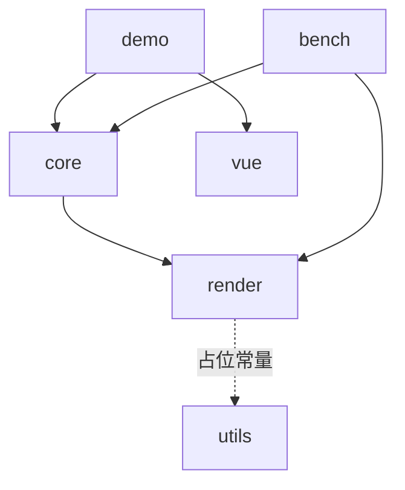

# 架构梳理 第 1 轮（architecture-round-1）

> 本文是第 1 轮优化（P2）的唯一依据：第 1 轮的全部代码改动只允许出自本文，尤其是文末「第 1 轮优化清单」。
> 范围：`packages/render`、`packages/core`、`packages/utils`、`apps/demo`、`apps/bench` 全量源码通读（2026-09-18 快照）。
> 背景：`.agents/analysis/layer-architecture.md` 与 `ultra-ui-sheet-gap.md` 仅作参考，未修改。两文中已过时的两处结论在本文按当前代码修正（见 §3.1 注① 与 §6.9）。

## 1. 总览

多包单体的 canvas 表格引擎。分层为「自研渲染引擎（render）→ 表格主体（core）→ 应用（demo/bench）」，包间只经显式公共入口（`src/index.ts`）与窄接口（`RenderHost`/`LayerHandle`/`SceneNode`/`SceneEvent`）耦合。代码量：render 约 1.1k 行（13 文件）、core 约 5.4k 行源码（27 文件，另有 29 个测试文件）、utils 骨架（1 文件）、demo Vue 应用（sections 装配 + views 薄壳 + 页内冒烟）、bench headless/浏览器双入口基准。

核心设计决策（阅读确认）：

1. **场景树整建 + 三档失效**：core 只在可视窗口内建场景节点，变更经 cell/band/full 三档失效登记，帧末单帧收敛后按层消费脏区增量补画或整层重绘，由浏览器合成上屏。
2. **ScrollManager 唯一滚动状态源**：全部滚动入口（滚轮宿主接线/触控/惯性/键盘跟随/程序化 API）收敛到一个 clamp 后广播 `(state, delta)` 的状态机，`ListTable` 订阅它驱动窗口重建。
3. **结构化最小接口**：render 的 `RenderContext`/`RenderCanvas`、事件的 `DomEventLike`/`EventTargetLike`、编辑的 `TextEditorHost`/`TextEditorDoc` 全部是结构化类型（真实 DOM 类型天然满足），换取测试/headless 可注入假实现，不引 DOM 依赖。
4. **数据供给三形态叠加**：`records/columns` 数组、按格 hook（纯函数同步 O(1)）、模型事件订阅（`TableModel` + `ModelBinding` echo 防回环），经 `CellValuePipeline` 统一取值。
5. **图片无闪协议**：cell 级 `MediaCache` LRU + URL 级 `ImageService` 窗口化加载，就绪位图同步可查，首帧直接画位图；未就绪且在占位延迟内连占位都不画。

## 2. 模块划分

### 2.1 packages/render —— 自研 canvas 渲染引擎

公共入口 `src/index.ts`：仅显式导出 `createRenderHost`、`SceneNode`、类型（`RenderHost`/`LayerHandle`/`LayerKind`/`Invalidation`/`Region` 等）与占位常量。对 core 暴露的全部面就是「建层、提交失效、请求帧、文本测量、销毁」。

| 文件 | 职责 | 关键点 |
| --- | --- | --- |
| `src/render-host.ts` | `CanvasRenderHost`：`RenderHost` 窄接口唯一实现 | `createLayer` 幂等（同 kind 复用）；`flush()` 按 `LAYER_ORDER`（ground→body→media→sky）逐层消费；`mount()` 按 `LAYER_ORDER` 用 `insertBefore` 插到首个已挂载的更上层之前，惰性创建的层 DOM 叠放与声明 z 序一致（layer-architecture 文中记录的叠放缺陷已修复）；`measure` 缺省用惰性测量画布；`destroy` 取消挂起帧、解绑事件、清池、摘 canvas |
| `src/frame-scheduler.ts` | 帧调度：多次 `requestFrame` 收敛到同一帧 | `Set<FrameTask>` 去重 + 单 handle；宿主用稳定引用 `flushTask` 保证同帧多次失效只 flush 一次；非浏览器环境退化 `setTimeout(16)` |
| `src/invalidation/invalidation-queue.ts` | 失效队列：按层收集三档失效并合并，帧末 `drain` 出重绘计划 | 常量 `CELL_SPREAD=10`（cell 失效四边外扩防残影）、`MAX_BANDS=8`（超限升级 full）；`LAYER_CONSUMPTION`：ground `band-full-only`、body/media `regions`、sky `always-full`，`Record<LayerKind,…>` 让 TS 强制补全新层 |
| `src/layers/canvas-layer.ts` | 单层 canvas：一棵场景树 + 一个失效队列 | `flush()` → `render(plan)`：full 时 `clearRect` + `paintTree`；regions 时逐 region `clip` + `clearRect` + `paintTree(root, ctx, dirty)`（cull 裁剪跳过不相交子树）；`translateBy` blit 快路径（池化临时画布自拷贝 + L 形暴露带拆两条 band）**core 无调用方，是预留能力**；`setSize` 只被测试调用，core 未接入 |
| `src/pool/canvas-pool.ts` | 离屏 canvas 池：按物理像素宽高分桶复用 | `maxSize=16`，供 blit 自拷贝等短生命周期离屏画布，避免滚动帧反复分配 |
| `src/scene/scene-node.ts` | 场景树节点：局部坐标 + children 顺序绘制 | `visible`/`pickable`（false 时命中穿透、子节点仍可命中）；`paint` 是子类覆盖点（绘制时 ctx 已平移到局部原点）；`on/off/handleEvent` 场景事件监听（Set，派发期退订安全） |
| `src/scene/paint.ts` | 绘制遍历 `paintTree` | 先绘自身再按 children 顺序（后画在上）；cull 提供时整棵子树包围盒不相交即跳过 |
| `src/scene/hit-test.ts` | 命中测试 | 从 children 末尾倒序递归，返回最深层、绘制最靠上的可拾取节点 |
| `src/events/event-system.ts` | 事件系统：DOM 事件归一化为场景事件 | 指针/滚轮/键盘/触摸 11 类；坐标减 `getBoundingClientRect`；触摸取 `changedTouches[0]`；命中自顶向下跨层（sky→media→body→ground 的 root 序），命中后沿 parent 链冒泡；键盘不命中，从最顶层根派发 |
| `src/region.ts` | 矩形代数 | `intersects`/`union`/`spread`（外扩）/`ceil`（像素对齐：左上向下取整、右下向上取整）/`clip`/`equals`，纯函数 |
| `src/types.ts` | 公共类型 | `LayerKind = 'ground'|'body'|'media'|'sky'`；`Invalidation` 三档（cell 可带 `prevRegion` 双包围盒）；`RenderContext`/`RenderCanvas` 结构化最小子集 |

测试在 `tests/`（镜像 src 结构），`fake-canvas.ts` 提供假画布。

### 2.2 packages/core —— 表格主体

公共入口 `src/index.ts`：显式导出 `ListTable`、`ScrollManager`、`SheetModel`、`ModelBinding`、取值/样式/布局/主题/选区/交互/编辑/图片/浮动对象全量公共 API 与类型。子模块按域分文件，纯逻辑（几何/选区/键盘/resize/填充柄）与状态（ScrollManager/SelectionState/HoverState/EditManager）和渲染接线（list-table）分离。

**主类与接线**

| 文件 | 职责 | 关键点 |
| --- | --- | --- |
| `src/list-table.ts`（1679 行，最大文件） | ListTable：布局计算、虚拟滚动窗口、冻结/合并、行列头、交互接线、图片与浮动层、编辑接线、几何变更 | 构造顺序：主题 → 几何（colWidths/offsets）→ `CellValuePipeline` → 冻结数 clamp + 合并区校验（跨冻结边界抛错）→ host（注入或缺省创建，`ownHost` 记归属）→ body/sky 两层 → `ImageService` → `InertiaScroller` → `InteractionOverlay` → ScrollManager 视口/内容尺寸（滚动位置定义在扣除冻结区的可滚动内容上）→ `onScroll` 订阅 → 图片窗口先就位 → `ModelBinding` → `EditManager` → 事件接线 → `rebuildScene` + body full 失效 → 插件注册。公开 API 面：查询（`getCellText`/`getVisibleRange`/`getCellRelativeRect`/`getCellAtRelativePosition`/`scrollToCell`/`getDrawRange`/`getBodyVisibleCellRange`/`isSeriesNumber`/`getHeaderLevelCount`）、选区（含 `selectCells` 多段/`applyExternalSelection` 防回环）、resize（`set/getColWidth/RowHeight` + `onColResizeEnd/onRowResizeEnd`）、冻结与合并运行时可变（`setFrozenColCount/setFrozenRowCount/setMergeCells/addMergeCell/removeMergeCell`，校验失败抛错保持原状）、编辑（`startEdit/commitEdit/cancelEdit/isEditing/onCellChange`）、事件（`onContextMenu/onScrollFrame/onFillHandleDown/onFillDragEnd`）、`batchUpdate`、`refreshCell`、`use(plugin)`、`floatObjects` 惰性访问器、`destroy` |

**状态与纯逻辑**

| 文件 | 职责 | 关键点 |
| --- | --- | --- |
| `src/scroll-manager.ts` | 唯一滚动状态源 | `scrollTo` clamp 到 `[0, max]`，位置未变不广播；`setContentSize/setViewportSize` 后自动回夹 |
| `src/grid-layout.ts` | 网格几何纯函数 | 行/列前缀和 offsets（`computeColOffsets/computeRowOffsets`，支持逐行高覆盖）；等行高窗口 `computeRowWindow` 与 offsets 版；冻结可滚动区窗口 `computeScrollableRowWindow(FromOffsets)/computeScrollableColWindow`（滚动位置换算回全量坐标后夹到滚动区）；命中 `findRowAt/findColAt`（**线性扫描**）；层坐标 `resolveCellX/resolveCellY(FromOffsets)`（冻结区不减滚动量）；`unionRegions` |
| `src/cell-value.ts` | `CellValuePipeline` 取值管线 | 基础值优先级 model > records[field] > undefined（rowCount 兜底）；`resolveText` 末端过 `resolveDisplayValue`；`resolveValue` 不过 hook（checkbox 态、编辑初值口径） |
| `src/selection.ts` | `SelectionState` 选区状态机 | `ranges[]`（start 锚点/end 焦点，可反向）+ `focus`；拖选/整行整列/全选/多段 `selectCells`/`addRange`（Ctrl 加选）；`emitDepth` 防重入广播；`applyExternal` 不广播防回环；shift 扩展锚点取末段 start、焦点同步到扩展目标 |
| `src/hover-state.ts` | `HoverState` | 悬停格跟踪，地址未变不广播 |
| `src/keyboard-navigation.ts` | 键盘导航纯函数 | `nextActiveCell`（方向/Tab，越界夹取）；`revealAxis` 单轴滚动跟随最小位移 |
| `src/resize.ts` | 行列 resize 纯逻辑 | `hitResizeHandle`（列头右缘/行号下缘 4px 阈值命中，**线性扫描 offsets**）；`ResizeSession` 起始尺寸 + 位移夹取（MIN 20）；能力开关 `canResizeCol/canResizeRow` |
| `src/touch-scroll.ts` | 触控滚动 | `TouchScrollTracker` 最近 4 点采样，`end` 按首末点求初速度；`InertiaScroller` 16ms 基准摩擦 0.95 幂次衰减，双轴低于 0.05px/ms 停止；帧调度与时间源可注入 |
| `src/fill-handle.ts` | 填充柄交互原语 | 焦点段解析（`resolveFocusRange`，焦点不在任何段取末段）、柄方点几何（8px 骑角点）、命中；事件载荷 `FillHandleDownEvent`/`FillDragEndEvent`（anchor+target，内核不产生填充值） |
| `src/cell-range.ts` | 合并区间数据结构 | `CellRange` 闭区间归一化/包含/跨冻结边界判定；`MergeCellMap` 构造时归一化 + 重叠抛错，`byCoord` Map 逐格索引到所属区间，`masterOf` 主格判定 |

**渲染内容与样式**

| 文件 | 职责 | 关键点 |
| --- | --- | --- |
| `src/cell-node.ts` | `CellNode` 场景节点 | paint 顺序：背景 → 内容（自定义 renderer 或 `BUILTIN_CELL_RENDERERS[cellType]`）→ 逐边边框（后画压内容）；文本测量宽缓存（`font\0text` 键，`setContent` 失效）；`textMaxX` 溢出右界；边框 `paintEdge` 支持 solid/dashed/dotted/double（fillRect 保证像素对齐） |
| `src/cell-renderer.ts` | 内置渲染器 | `renderTextCell`：对齐（left/center/right）× 垂直（top/middle/bottom）、padding 内缩内容盒、`textOverflow` ellipsis（二分找最长前缀+省略号）/clip、未设置时 Excel 式溢出（仅左对齐溢出，clip 到 textMaxX）、`textWrap` 逐字贪心断行（`\n` 强制分段叠加，CJK 无空格断点统一逐字）、下划线/删除线修饰；`renderCheckboxCell` 方框+勾选实心块，位置随 textAlign/padding |
| `src/cell-style.ts` | 结构化样式与投影 | `CellStyle`：background/color/font 简写 + 结构化字体四字段（weight/style/size/family）+ 对齐 + 修饰线 + textWrap/textOverflow/padding + 逐边 border（width/color/style）；`projectCellStyle` 逐字段覆盖、边框逐边独立合并、返回新对象；`cellStyleFont` 组装 CSS font 串（与测量侧同规则） |
| `src/theme.ts` | 主题系统 | `defaultTheme`（几何 + body/header 两分区 `CellStyleTokens`）；`extendsTheme(override, base)` token 全可选、分区按键浅展开深覆盖 |

**编辑链路**

| 文件 | 职责 | 关键点 |
| --- | --- | --- |
| `src/editing/edit-manager.ts` | `EditManager` 编辑状态唯一源 | 可编三级判定：editor 声明/路由 ∧ `resolveEditable` ∧ `writeTarget.canWrite`；同格幂等、异格先提交；提交顺序：取值 → 关浮层 → 写回 → `refreshCell` → `emitChange` → 选区移动（Enter 下移/Tab 右移）→ 焦点归还；构造时订阅滚动帧，`followAnchor` 逐帧对齐锚定格、滚出视口（cellRect null）按 Enter 语义自动提交不丢内容；`detachedHost` 离屏兜底（无容器只留会话状态） |
| `src/editing/text-editor.ts` | DOM 浮层文本编辑器 | 单行 input/多行 textarea；DOM 依赖收敛在 `TextEditorElement/Host/Doc` 最小结构接口；open/moveTo（不重挂载不抢焦点）/getValue/close（幂等）；Esc 取消/Enter commitDown/Tab commitRight 拦截默认与冒泡后回调 |
| `src/editor-registry.ts` | `EditorRegistry` | 注册表 + 格级路由（route hook 优先于列定义 editor，未注册名解析 undefined）；`CellEditor` 接口目前是占位（MVP 编辑器由 `createTextEditor` 直接提供） |
| `src/model-binding.ts` | `ModelBinding` | 订阅外部模型变更 → 局部刷新；`writeBack` 期间 `echoDepth` 吞 echo 事件防回环；重入/无 setCellValue 拒写 |
| `src/sheet-model.ts` | `SheetModel` | 内置内存坐标模型（`TableModel` 实现）：二维数组存取、写值同步广播、`setRowCount` 扩缩 |

**图片与浮动对象**

| 文件 | 职责 | 关键点 |
| --- | --- | --- |
| `src/media/image-service.ts` | `ImageService` URL 级资源服务 | 状态机 idle→loading→ready/error；`request` 登记 cell 引用（`refs` Map），ready 同步返回；`updateWindow(谓词)` 窗口化调度：窗口内 idle 提权、滚出 loading 取消降级（`generation` 代际丢弃迟到结果）；并发槽 `pump`（默认 10）按 LRU 序补位；LRU 双预算（256MB/1000 条）逐出，优先逐出窗口外；`hasResource` 纯查询不动 LRU 序；`placeholderDelay` 80ms；`setUrlResolver` 鉴权钩子；error 必触发 `onImageError` |
| `src/media/media-cache.ts` | `MediaCache` cell 级位图 LRU | 泛型，key→value+bytes，Map 迭代序即 LRU 序，bytes/count 双预算逐出；core 侧 key 为 `image:col:row:宽x高`（含尺寸，resize 后自然 miss） |
| `src/media/image-cell-node.ts` | `ImageCellNode` media 层节点 | 无闪协议执行点：无位图且未到 `placeholderAfter` 本帧不画（连占位都没有）；有位图画白底+fit 位图（fill/contain 等比居中）；超时画确定性灰底占位；`viewportClip` 与 body 视口求交裁剪（边缘半格图片不越界盖表头/行号列） |
| `src/media/draw-image.ts` | media 共享绘制助手 | `paintImagePlaceholder` 确定性占位、`drawFittedImage` fit 语义（图片格与浮动对象共用） |
| `src/float/float-object-layer.ts` | `FloatObjectLayer` 格上浮动对象 | 承载容器挂 sky root 末尾（最后挂载=层内最顶，事实虚拟层）；独立对象树 `nodes` Map；锚点（from 格+偏移→to 格）经注入 `FloatGeometry` 换算层坐标，`syncPositions` 滚动/结构变更后帧级重排 + sky full 失效；add/remove/update cell 定向失效（update 带 prevRegion 双包围盒）；图片经共享 `ImageService`（`onSettled` 回调链路）；`onChange` 抛变更（undo/入库归宿主）；`getAt` 倒序命中 |
| `src/plugin.ts` | `TablePlugin` 接口 | `mount(table)`/`unmount?`，注册即生效、销毁逆序卸载；实现在规划包 packages/plugins |

**交互浮层**

| 文件 | 职责 | 关键点 |
| --- | --- | --- |
| `src/interaction-overlay.ts` | `InteractionOverlay` sky 浮层 | `OverlayNode`（pickable:false 穿透到 body 层）paint：整体 clip 到 bodyViewport → hover（行带/列带/格三级）→ 选区（多段，每段裁剪到可视窗口，四边细条填充）→ 填充柄 → resize 指示线；`update(content)` 返回是否有内容，调用方仅在（或曾在）有内容时提交 sky full 失效（空浮层零开销）；选区/hover 颜色为模块内常量（非主题 token） |

### 2.3 packages/utils —— 表格域专用工具

`src/index.ts` 仅导出 `UTILS_PACKAGE_NAME` 常量，是骨架包。注释声明「通用工具优先 @cat-kit/core」，但当前无任何表格域工具落地，也无任何包真实 import @cat-kit/*（见 §3 依赖核查）。

### 2.4 apps/demo —— 浏览器演示与冒烟

Vue 3 应用（`vite-plus` 构建，`@vitejs/plugin-vue`）。结构：`App.vue`（hash 路由左侧菜单 7 项 + `?smoke=1` 冒烟模式直挂五演示区并跑 `runSmoke`）→ `views/*.vue` 薄壳（标题卡片 + 挂载点）→ `sections/*.ts` 演示装配（真实逻辑所在）：`data-forms`（三形态 + DemoModel 防回环计数）、`display`（10 万行/冻结/合并/逐边边框/自定义渲染/checkbox/主题 extends，像素锚点常量集中顶部）、`interaction`（拖选/hover/resize/键盘/触控/批量更新/contextmenu/onScrollFrame）、`media`（格内图片 + 浮动对象，`demoLoadImage` 本地 40ms 假加载）、`editing`（SheetModel 编辑闭环 + API 按钮）、`sheet`（样式三级覆盖链矩阵/\n 多行合并区/填充柄预置选区/运行时冻结合并切换/editCellOnEnter 重建/`window.__SHEET_DEMO__` 调试句柄）。

公共件：`mount.ts` 的 `mountTable`（容器 + ListTable + **滚轮由宿主接线到 `scrollBy`**，dpr 冒烟模式锁 1）、`addButton/addStatus/createSection`。`components/InfiniteTable.vue` 是 Vue 包装组件（`options` prop → ListTable 实例 + 滚轮接线 + `ready` 事件）。

`smoke.ts` 页内冒烟：对五演示区逐项断言（20+ 项）——层 canvas 就位与首帧像素、三形态取值、防回环计数、像素级显示能力（冻结/合并/边框/自定义渲染/checkbox/主题）、合成事件交互全链路、图片加载与无闪回滚、浮动对象跟随、编辑闭环（双击/键盘/API/滚动跟随/滚出提交）；结果写 `window.__SMOKE__` 与 `document.title`。`scripts/smoke.mjs`：vp build → preview（固定端口 54173）→ playwright-cli 打开 `?smoke=1` → 轮询结果 → 退出码。

### 2.5 apps/bench —— 量化基准

headless（`bun src/headless.ts`：`NoopCanvas`/`NoopContext` 绘制 no-op、手动帧泵数组、`FakeEventTarget` 手工派发 pointermove）与 browser（`src/main.ts`：真实 canvas + rAF，报告上页面 + `window.__BENCH_REPORT__`）双入口**共用同一份场景逻辑**（`scenarios.ts` 只依赖 `BenchEnv` 抽象）。三个场景：TTFF（构造+首帧 flush，P50 ≤ 80ms）、稳态滚动 FPS（10 万行 × 300 帧 × 120px，≥55fps）、失效面积收敛（稳态滚动/hover 并发 body 面积 ≤ 1× 视口、full 次数必须为 0；快跳无 full）。`invalidation-meter.ts` 用装饰器包装 `RenderHost` 拦截 `submitInvalidation` 按层计量（full/band/cell 次数 + 面积），帧间 `drain`。`thresholds.ts` 集中达标口径，报告 JSON 落档 `results/` 作防回归基线，未达标非零退出。

### 2.6 规划位

`packages/formulas`（公式引擎）、`packages/plugins`（官方插件）为规划目录，无代码。根 `vite.lib.config.ts` 统一库构建（ESM，`@infinite-table/*` 外部化）；`scripts/check-core-deps.ts` 扫描 core 的 @visactor 依赖（import 正则 + package.json 声明双向）。

## 3. 依赖关系

### 3.1 代码实际依赖边（以 package.json 声明 + src 实际 import 双重核实）



- **core → render**：唯一真实的包间代码边。core 全部经 `@infinite-table/render` 公共入口触达：`createRenderHost`（list-table 构造）、`SceneNode`（cell-node/image-cell-node/interaction-overlay/float-object-layer）、类型（`Region`/`RenderContext`/`LayerHandle`/`SceneEvent`/`RenderImageSource` 等）。render 对 core 零感知，方向单向。
- **render → utils**：仅 `src/index.ts` 一行 `import { UTILS_PACKAGE_NAME }`，用于拼 `RENDER_DEPENDENCY_CHAIN` 占位常量；render 其余源码对 utils 零引用。这条边是「依赖边占位」的展示品，不是功能依赖。
- **core → utils**：package.json 声明了 `@infinite-table/utils`，但 `packages/core/src` 无一处 import（核实：grep 仅 render/src/index.ts 命中）。声明未消费。
- **utils**：无依赖、无人消费其内容（除上述占位）。
- **@cat-kit/core**：全仓零 import、零 package.json 声明。CODE-MAP 依赖图中的 cat-kit 三条边与仓库现状不符（文档偏差，非本轮改动造成，建议走 sync-docs；本文以实际代码为准）。

### 3.2 禁止依赖核查（本节为 P1 任务要求的实际核查结论）

1. **core 无 `@visactor/*` 引用**：`grep -rn "@visactor" packages apps scripts` 全仓仅命中 `scripts/check-core-deps.ts` 自身的禁用正则字符串；`bun run check:deps` 通过（输出「check:deps 通过：packages/core 对 @visactor/* 零依赖」）。DEV-STANDARDS「零 vrender」在源码与依赖声明两侧均成立。
2. **无 `export *` 转售公共 API**：`grep -rn "export \*" packages/*/src apps/*/src` 零命中（唯一命中是 core/index.ts 的禁令注释）。三个包入口全部显式逐名导出，符合 DEV-STANDARDS。

### 3.3 层内耦合结构

- render 包内：`render-host` 是唯一组合根（持 scheduler/pool/eventSystem/layers 表）；`CanvasLayer` 依赖 `InvalidationQueue`/`CanvasPool`/`paintTree`/region 工具；事件系统经 `rootsTopDown` 回调取层根，与层集合解耦。层集合扩散点三处：`LayerKind`（types）、`LAYER_ORDER`（render-host）、`LAYER_CONSUMPTION`（invalidation-queue），`Record` 类型让编译器强制补全。
- core 包内：`list-table.ts` 是唯一组合根，其余模块要么是被调用的纯逻辑/状态机（不反向依赖 list-table），要么经构造期闭包注入（`EditManagerInit`/`OverlayGeometry`/`FloatGeometry`/`EditWriteTarget` 全部是注入式回调，模块不 import list-table）。`plugin.ts` 是唯一 import list-table 类型的模块（`TablePlugin.mount(table: ListTable)`）。
- 应用侧：demo/bench 只触达 core 公共入口 + render 的 `createRenderHost`；bench 经 `InvalidationMeter.wrap` 装饰 `RenderHost` 计量，是窄接口可装饰性的实例。

## 4. 核心数据流

### 4.1 滚动主链路（ScrollManager → 窗口重建 → 分层 band 失效）

```text
入口（多归一）                        状态收敛                          渲染后果
滚轮（宿主 mountTable 接线）   ┐
触控 touchmove（TouchScrollTracker）├─→ ScrollManager.scrollBy/scrollTo
惯性 InertiaScroller 每帧       │      （clamp 到可滚动内容；位置未变不广播）
键盘 revealAxis 跟随           │              │ (state, delta) 广播
程序化 scrollTo/setScrollTop…  ┘              ▼
                                    ListTable.onScroll(delta)
                                    1. rebuildScene()：
                                       清空 body root 与 imageCellNodes →
                                       computeScrollableRowWindowFromOffsets / computeScrollableColWindow
                                       （滚动位置 + 视口-冻结区 → [start,end) 窗口）→
                                       分带建 CellNode：滚动带 → 部分可见合并区补建 → 冻结列带 → 冻结行带 →
                                       冻结角 → 行列头（同带内列降序建、表头最后建=后画在上）
                                    2. delta.dy≠0：body（及已建的 media）提交一条横带 band
                                       （y 从 列头高+冻结行高 起，覆盖行号列/冻结列/滚动区）
                                       delta.dx≠0：纵带（x 从 行号列宽+冻结列宽 起）
                                       ——冻结角与对侧冻结区永不重绘
                                    3. updateImageWindow()：窗口化加载调度（划入提权/滚出取消）
                                    4. floatLayer.syncPositions()（有浮动对象时，sky full）
                                    5. refreshOverlay()（sky：选区/hover 随新窗口几何重算）
                                    6. scrollFrameListeners 非空 → requestFrame(scrollFrameTask)
                                       （稳定引用，同帧多次滚动只广播一次）
```

滚动位置语义：定义在「可滚动内容」（总内容扣除冻结区）上；`toContentX/Y` 做视口→内容换算（冻结区内不加滚动量）。

### 4.2 多 region 失效与重绘（render 主循环）

```text
core（各处）submitInvalidation(kind, inv)
  → InvalidationQueue.push：
      full：清空队列置 full 位
      cell：双包围盒 union（有 prevRegion）→ spread(10px) → ceil 像素对齐 →
            被既有 band 覆盖则丢弃 → 与既有 cell 去重后登记
      band：吸收并删除相交 cell → 去重登记 → 数量 >8 升级 full
  → CanvasLayer.invalidate → scheduleFlush（宿主稳定 flushTask）→
FrameScheduler（单帧收敛：Set 去重任务，一帧一次）
  → flush：按 LAYER_ORDER 逐层 CanvasLayer.flush()
      → queue.drain() 出 RepaintPlan：
          sky 恒整层（always-full）；ground 只出 band；body/media 出 band+cell regions
      → render(plan)：full：setTransform(dpr) + clearRect + paintTree
                      regions：逐 region clip + clearRect + paintTree(root, ctx, dirty)
                               （cull：子树包围盒不相交整棵跳过）
  → 分层 canvas 由浏览器合成上屏
```

同帧多源失效（如多张图片同帧加载完成、批量更新）天然被队列收敛；`batchUpdate` 在 core 侧先把多次 `refreshCell` 的 region 收集合并为一次 band 提交，再经队列二次收敛。

### 4.3 编辑提交回写

```text
触发：双击/双触（pointerup 事件流 detectDoubleTap：同格、≤400ms、≤10px）
      或 API startEdit / editCellOnEnter 下的 Enter
  → ListTable.startEdit：选区落格 + ensureCellVisible → EditManager.startEdit
      可编三级判定：EditorRegistry.resolveEditor（route hook → 列 editor 声明）
                    ∧ options.resolveEditable(col,row)
                    ∧ writeTarget.canWrite（model 形态恒可写；records 需列有 field 且行对象存在）
  → createTextEditor（input/textarea）open：挂 container、按 cellRectInViewport 定位、
      初值 = pipeline.resolveValue（基础值口径，不过 resolveDisplayValue）、聚焦
  → 编辑中滚动：onScrollFrame → followAnchor 逐帧 moveTo 对齐锚定格；
      锚定格滚出视口（cellRect null）→ commitEdit('down') 自动提交不丢内容
  → 提交 Enter/Tab（Esc 取消：close 不回写不抛事件）
      commitEdit：editor.getValue → writeTarget.write
        ├─ model 形态：ModelBinding.writeBack（echoDepth++ 吞模型 echo 防回环）
        └─ records 形态：record[field] = value
      → refreshCell（cell 级失效，含溢出新旧区与来源格联动）→ emitChange(onCellChange,
        col/row/oldValue/newValue) → moveSelection（Enter 下移 / Tab 右移）→ 焦点归还容器
外部模型变更（不经表格）：model.onCellChange → ModelBinding（非 echo 期放行）
  → refreshCell 局部刷新；表格回驱 updateCell 同走 writeBack + refreshCell
```

### 4.4 图片窗口化加载（无闪协议）

```text
rebuildScene → appendCell：resolveCellImage(col,row) 命中
  → body 节点只画背景/边框（文本留空，不参与溢出）
  → appendImageCell：media 层惰性创建（首个图片格出现时）→ 建 ImageCellNode
      （placeholderAfter = now + placeholderDelay；bodyViewport 裁剪传入）
  → 取图序：MediaCache.get("image:col:row:WxH") → ImageService.getBitmap(url)
      ├─ 命中：setBitmap 首帧直接画位图（滚动回访无闪；cache miss 时回填 MediaCache）
      └─ 未命中：imageService.request(url, cell) 登记引用
  → 每次滚动 updateImageWindow：窗口 = 可视区域外扩 240px
      窗口内 idle 提权加载（并发 ≤10）；滚出的 loading 取消降级（generation 丢弃迟到结果）
  → 加载完成：startLoad 回调（代际校验）→ ready 入 LRU（bytes 估算 W×H×4，
      双预算 256MB/1000 条，优先逐出窗口外）→ onImageLoad(e)
  → ListTable.onImageServiceLoad：写回引用该 URL 的可见格节点 + 回填 MediaCache
      → media 提交 cell 级失效（node 全包围盒；同帧多图由失效队列收敛）
```

浮动对象图片走同一 `ImageService`（`request` 的 `onSettled` 回调链），加载完成只定向失效该对象区域。

### 4.5 交互浮层与事件

```text
DOM 事件（container）→ EventSystem 归一化（场景坐标 + 触点/键位）
  → 命中：sky→media→body 逐层 hitTest（浮层节点 pickable:false 穿透，实际总命中 body）
  → 命中节点沿 parent 链冒泡 → body root 监听器分派：
      pointerdown：编辑中点外先提交 → resize 手柄命中（4px 阈值）开 ResizeSession
                  → 填充柄命中开 fillDrag 会话 → 左上角全选 / 列头整列 / 行号整行 /
                  数据格 beginDrag（ctrlMultiSelect 开启且 Ctrl/Cmd 时 addRange）
      pointermove：resize 拖拽只更新 sky 指示线（提交在 pointerup 一次生效）
                  → fillDrag 跟踪终点格 → 拖选 updateDrag + ensureCellVisible
                  → 其余 hoverState.set（地址未变不广播）
      pointerup：resize 落地（setColWidth/setRowHeight → applyGeometryChange 全量重建
                  + onCol/RowResizeEnd）→ fillDrag 抛 onFillDragEnd（内核不写值）
                  → detectDoubleTap
      contextmenu / touch* / keydown（sky root 监听，编辑中让位给编辑器）
  → selection/hoverState onChange → refreshOverlay → InteractionOverlay.update
      （有内容→sky full；曾有过内容现在没有→补一次 full 清残影；全程零 body 重绘）
```

### 4.6 几何变更（resize/冻结/合并运行时）

`setColWidth/setRowHeight/setFrozen*/setMergeCells` → 重算 offsets 与冻结区尺寸 → `applyGeometryChange`：ScrollManager 视口/内容尺寸重设（自动回夹）→ `rebuildScene` + body full（media 已建则同样 full）→ `updateImageWindow` → float 同步 → overlay 刷新。合并区/冻结数变更先过 `assertMergesWithinBoundary` 校验（跨冻结边界抛错保持原状）。

## 5. 关键实现细节

1. **四层 canvas 与实际用量**：`LayerKind` 四层，core 只创建 body、sky，media 惰性（首个图片格出现时），ground 全仓从未创建——实际 2~3 个 canvas。sky 独立 backing store 的收益被真实消费：hover/选区/resize/填充柄全走 sky 整层重绘，body 零牵连（bench 场景 3 断言此性质）；media 收益真实（图片 onload 只重绘引用格）。`mount()` 已按 `LAYER_ORDER` `insertBefore`，惰性创建的 media 正确插到 sky 之前（layer-architecture 文中「叠放缺陷」已修复，本文核实于 `render-host.ts` mount 实现）。
2. **失效合并三档**：cell 归一化（双包围盒 union + 10px 外扩 + 像素对齐去重）、band 吸收相交 cell、band > 8 升 full、full 吸收一切；按层消费策略差异（ground 只 band、sky 恒 full、body/media 逐 region）。cell 失效外扩 10px 与 `paintTree` cull 配合防增量补画边缘残影。
3. **单帧收敛的稳定引用模式**：FrameScheduler 用 `Set<FrameTask>` 去重，宿主与 core 各持稳定任务引用（`flushTask`/`scrollFrameTask`），同帧多次触发只执行一次；这是「滚动中每帧一次重建+一次 flush+一次广播」的机制基础。
4. **MediaCache LRU 双缓存体系**：URL 级（ImageService 内嵌，服务并发/取消/预算）+ cell 级（MediaCache，key 含格尺寸，滚动重建时命中即首帧无闪）。两层 LRU 均利用 Map 迭代序实现，`get`/`touch` 删后重插移到队尾。cell 级 key 含 `WxH`：格尺寸变化自然 miss 重算，避免拉伸旧位图。
5. **主题 extends 派生与三级覆盖链**：`extendsTheme(override, base)` 基于 base（缺省 defaultTheme）按键覆盖，body/header 分区浅展开；落到格样式经 `resolveStyle` 三级投影：主题分区 token → 列级 `style` 片段（textWrap 旗标并入主题层）→ 按格 `resolveCellStyle`，`projectCellStyle` 逐字段覆盖、边框逐边独立合并、返回新对象不改入参。
6. **Excel 式文本溢出**：未设 textOverflow/textWrap 的左对齐 text 格向右溢出到相邻空格（`textOverflowLimitX` 扫 `isEmptyTextCell` 确定右界；冻结带不越带界）；`refreshCell` 对新旧 `textMaxX` 双包围盒失效，并联动左侧溢出来源格（本格变空/变非空/保持为空三种情形重算来源格右界），防文字变短残影与擦除。
7. **无闪协议三条件**：`hasResource/getBitmap` 同步可查（就绪当帧画位图）；未就绪在 `placeholderDelay`（80ms）内连占位都不画（快速滚过无占位闪烁）；加载完成 cell 定向失效单帧切换。error 态必触发 `onImageError`（无「永远 loading」）。
8. **防回环三处**：ModelBinding `echoDepth`（回驱吞模型 echo）；SelectionState `emitDepth`（监听内重入不再广播）+ `applyExternal` 不广播；InteractionOverlay `overlayHadContent`（浮层清空时补一次 full 后不再空转重绘）。
9. **合并区布局**：`MergeCellMap` 逐格索引 O(1) 查所属区间；被覆盖格不建节点，主格按覆盖带取完整尺寸（可越出视口，绘制由 cull 裁掉）；主格在窗口外但区间部分可见时补建（`appendPartiallyVisibleMerges`）；合并格取值/命中/失效全部路由到主格；重叠配置构造期抛错、跨冻结边界构造期与运行时一致拒绝。
10. **结构化最小接口与测试注入**：render `RenderContext/RenderCanvas`、事件 `DomEventLike/EventTargetLike`、编辑 `TextEditorElement/Host/Doc`、bench `BenchEnv`、各模块 `ImageLoader/measureText/scheduleFrame/now` 等全部可注入。core 29 个测试文件不依赖真实 canvas/DOM（`stub-host`/`fake-editor-dom`/`recording-context`）；bench headless 同理跑完整表格逻辑。
11. **blit 预留与死支持**：`CanvasLayer.translateBy`（池化自拷贝 + L 形暴露带）与 `setSize` 已实现且测试覆盖，但 core 无调用方（滚动走重建+band 路线）；ground 层注册路径存在但从未使用。两者是当前架构的预留面/死支持面（见优化清单 8）。
12. **事件坐标与 DOM 解耦**：EventSystem 每次派发 `getBoundingClientRect` 换算；触摸取 `changedTouches[0]`；键盘不命中直接从最顶层根派发——headless 的 `FakeEventTarget` 仅需实现 add/remove/getBoundingClientRect 三成员即可驱动全部交互逻辑。

## 6. 第 1 轮优化清单

> 每项含改动范围与预期正向论证（性能/结构/可维护性至少一项）。P2 实施时逐项落地、逐项用 §6.11 验证手段证明无退化；发现退化即回滚并记录。排序不代表实施顺序，P2 按风险从低到高推进（先 5/9/4 等低风险项，再 1/2 等热点项）。

### 6.1 行列命中与 resize 手柄命中线性扫描 → 二分查找

- **现状**：`grid-layout.ts` 的 `findRowAt/findColAt` 从 0 起线性推进；`resize.ts` 的 `hitResizeHandle` 行分支对 `rowOffsets` 全表线性扫。`ListTable.onPointerMove` 每次 pointermove 无条件调 `cellAt` → `findRowAt`：鼠标在 10 万行表中下部悬停/移动时每事件 O(行号) 次迭代（5 万行附近约 5 万次）；行号列带内移动还叠加 `hitResizeHandle` 的 O(全行数) 扫描。bench 场景 hover 采样点在视口顶部（行号小），未暴露此项。
- **改动范围**：`packages/core/src/grid-layout.ts`（findRowAt/findColAt 改二分）、`packages/core/src/resize.ts`（hitResizeHandle 用二分定位边缘行/列）；对应单测补充 `packages/core/tests/grid-layout*.test.ts`、`packages/core/tests/resize.test.ts`。
- **正向论证**：性能——pointermove 为最高频事件，命中计算降为 O(log n)，10 万行场景消除与视口位置成正比的每事件开销；行为完全等价（前缀和单调），无结构改动。
- **实施记录（P2，2026-09-18）**：
  - 实际改动范围：`packages/core/src/grid-layout.ts`（findRowAt/findColAt 收敛到共享二分内核 findIndexAt，含并列前缀和取右端语义）、`packages/core/src/resize.ts`（hitResizeHandle 行/列分支改 firstEdgeAtLeast 二分下界，与线性「首个命中边缘」逐点等价）；补测试 `packages/core/tests/grid-layout.test.ts`（3 项：边界/越界、10 万行深处命中、零宽并列）、`packages/core/tests/resize.test.ts`（2 项：大偏移表深处命中、零宽并列列阈值带）。
  - 正向论证：性能——pointermove 命中与 resize 手柄命中从 O(n) 降为 O(log n)；结构——命中语义收敛到单一内核函数，消除两处重复线性扫描。
  - 无退化说明：命中结果与原线性扫描逐点等价（含零宽并列前缀和取最右索引、阈值带首个命中边缘），现有交互/resize/查询测试全部通过，无行为差异。
  - 验证命令及结果：`bun run typecheck` 退出 0；`bun run test` 337 项全过（含新增 5 项）；`bun run lint` 0 告警 0 错误。

### 6.2 rebuildScene 滚动帧整树重建 → 节点复用的增量窗口

- **现状**：`list-table.ts` 每次滚动 `rebuildScene` 清空 body root 全量重建：每个可见格 `new CellNode` + `resolveStyle`（两级 `projectCellStyle` 对象分配）+ `resolveText/resolveValue` + 模板串 key + `textOverflowLimitX` 邻格扫描；表头/行号格同样每帧重建。稳态滚动每帧数百节点 × 300 帧/s 的分配压力全部落在 GC（bench headless JS 帧 P95 约 0.6ms，分配占比可观）。
- **改动范围**：`packages/core/src/list-table.ts`（rebuildScene/appendCellBand/cellNodes 索引改为窗口滑动的增删补：滚出行/列摘除节点、滚入行/列建节点或从池复用；表头格按列/行复用更新位置）。保持 band 失效语义不变。
- **正向论证**：性能——滚动帧节点分配与样式投影次数从 O(窗口格数) 降到 O(滚入格数)；无退化验证依赖 bench 场景 2/3（FPS 与失效面积）+ 全量单测。风险最高的一项，单独实施、单独验证。
- **实施记录（P2，2026-09-18）**：
  - 实际改动范围：`packages/core/src/list-table.ts`（新增 updateSceneWindow/sweepWindowNodes：滚动帧只摘除滚出行列、补建滚入行列、存活节点原地平移；appendCell 加已存在守卫并返回是否新建；表头节点入 colHeaderNodes/rowHeaderNodes/cornerNode 索引做增量维护；onScroll 由 rebuildScene 改调 updateSceneWindow，band 失效提交不变；构造与 applyGeometryChange 仍走全量 rebuildScene）；补测试 `packages/core/tests/list-table-text-overflow.test.ts`（1 项：横向滚动增量补建保持溢出 z 序——溢出格后画于新滚入格背景、存活格溢出右界平移不变）。
  - 正向论证：性能——bench headless 场景 2 JS 侧帧耗时 P95 0.13ms → 0.07ms（-46%）、稳态滚动平均 FPS 8408 → 19543；每帧仅新增 O(滚入格数) 次节点构造，存活节点只做属性平移。
  - 无退化说明：z 序等价性由「整行列降序补建 + 左侧溢出存活格升序重挂 + 新建数据格后重挂表头」三条规则保持（合并主格上缘可伸进列头带的场景由表头重挂覆盖）；失效面积/视口（0.950）与 body full 次数（稳态/快跳/hover 全 0）与改动前完全一致；全量单测、页内冒烟 32 项像素级断言通过。
  - 验证命令及结果：`bun run typecheck` 退出 0；`bun run test` 337→338 项全过（含新增用例）；`bun src/headless.ts`（apps/bench）三场景全部达标（对比基线报告 results/bench-2026-09-17T19-01-08-309Z.json，本轮报告 results/bench-2026-09-17T19-21-59-756Z.json）；`bun run smoke`（apps/demo）32 项断言全部通过。

### 6.3 列级样式投影缓存

- **现状**：`resolveStyle` 每格执行 `projectCellStyle(projectCellStyle(themeToken, column.style), hook?)`：无列级样式、无按格 hook 命中的格也各分配两层投影对象；同一列全部数据行的 token+列级投影结果完全相同却被逐行重算。
- **改动范围**：`packages/core/src/list-table.ts`（`resolveStyle` 拆两级：token+列级结果按列缓存（几何/主题不可变期间有效），仅 hook 返回非 null 时再做第二级投影）；`packages/core/tests/list-table-display.test.ts` 补投影等价断言。
- **正向论证**：性能——rebuildScene 与 refreshCell 的对象分配显著减少（与 6.2 叠乘）；结构上把「三级覆盖链」的执行显式化，可读性不降。
- **实施记录（P2，2026-09-18）**：
  - 实际改动范围：`packages/core/src/list-table.ts`（resolveStyle 拆两级：token+列级合成按列缓存 columnStyles，仅 hook 返回非空才做第二级投影）；补测试 `packages/core/tests/list-table-display.test.ts`（新增「列级样式投影缓存」describe，2 项投影等价断言：同列未命中 hook 共享同一投影对象、hook 命中才走二级投影且值与三级链逐字段等价）。
  - 正向论证：性能——同列全部数据行复用一次列级投影，滚动帧与 refreshCell 每格两层投影对象分配降为 0～1 层（与 6.2 叠乘）；结构——三级覆盖链的两级执行显式化。
  - 无退化说明：CellStyle 全仓按不可变约定使用（核实无就地写入点），共享缓存对象与逐格新建深值等价；列定义为构造期快照（既有契约），缓存不引入新失效面。投影等价断言与全部样式/显示测试通过。
  - 验证命令及结果：`bun run typecheck` 退出 0；`bun run test` 全过（含新增 2 项）；`bun run lint` 0 告警 0 错误。

### 6.4 格索引字符串 key → 数值 key

- **现状**：`cellNodes`/`imageCellNodes` 以 `${col}:${row}` 模板串为 key，每次重建窗口对每格分配字符串；`MergeCellMap.byCoord`、`ImageService.refs` 同模式。
- **改动范围**：`packages/core/src/list-table.ts`（两处索引）、`packages/core/src/cell-range.ts`（byCoord）；如收益过小可只做 list-table 两处。
- **正向论证**：性能（次要）——消除滚动热路径上的字符串分配与哈希；改动局部、行为等价（key 编码 `row * 2^21 + col` 一类需要注释边界）。
- **实施记录（P2，2026-09-18）**：
  - 实际改动范围：`packages/core/src/list-table.ts`（cellNodes/imageCellNodes 两处索引改数值 key）、`packages/core/src/cell-range.ts`（MergeCellMap.byCoord 改数值 key）；两处以共享 `cellKey`（`row * 2^21 + col`，边界注释：col < 2^21、row < 2^32 内唯一精确，坐标非负）实现，后随 6.6 收敛到 `list-table-internal.ts`。
  - 正向论证：性能（次要）——滚动热路径（增量窗口的清扫/补建/查询）与合并区逐格索引不再分配模板串。
  - 无退化说明：编码在边界内双射，非负数据格坐标全覆盖（表头 -1 坐标不入索引）；全量单测与冒烟通过，无行为差异。
  - 验证命令及结果：`bun run typecheck` 退出 0；`bun run test` 全过；`bun run lint` 0 告警 0 错误。

### 6.5 依赖面真实化：移除未消费声明与占位边

- **现状**：core package.json 声明 `@infinite-table/utils` 但 src 零 import；render → utils 仅剩 `RENDER_DEPENDENCY_CHAIN`/`UTILS_PACKAGE_NAME` 占位常量一条人为 import 边（utils 本身无内容可依赖）。
- **改动范围**：`packages/core/package.json`（删 utils 声明）；`packages/render/src/index.ts`、`packages/core/src/index.ts`、`packages/utils/src/index.ts`（删 `*_DEPENDENCY_CHAIN`/`*_PACKAGE_NAME` 占位导出；若担心公共 API 破坏可保留常量但把 render→utils 的 import 改为本地字面量）；根 `bun run check:deps`、`tsc -b`、全量测试回归。注意：CODE-MAP 依赖图与此相关的行需随动（见 §7）。
- **正向论证**：结构——包依赖图如实反映功能耦合（render 成为真正的零依赖底层），降低 utils 未来演进对 render 的牵连面；删除的是纯展示性死代码（SMELLS：死代码）。
- **实施记录（P2，2026-09-18）**：
  - 实际改动范围：`packages/core/package.json`（删 `@infinite-table/utils` 依赖声明）；`packages/render/src/index.ts`（删 UTILS_PACKAGE_NAME 导入与 RENDER_PACKAGE_NAME/RENDER_DEPENDENCY_CHAIN 占位导出）；`packages/core/src/index.ts`（删 RENDER_PACKAGE_NAME 导入与 CORE_PACKAGE_NAME/CORE_DEPENDENCY_CHAIN 占位导出）；`packages/utils/src/index.ts`（按本文预留的回退案保留 utils 自身 `UTILS_PACKAGE_NAME` 常量——纯注释空入口触发 lint no-empty-file）；`packages/core/tests/index.test.ts`（占位常量断言改为「core/render 公共入口可解析」冒烟）。唯二消费方核实：三个常量全仓仅 `tests/index.test.ts` 与 dist 产物引用，无应用/公共 API 消费。
  - 正向论证：结构——core 对 render 之外零依赖声明、render 对 utils 零 import，包依赖图与功能耦合一致；删除展示性死代码。
  - 无退化说明：被删导出无任何真实消费方（grep 全仓核实）；测试改为等价的入口可解析断言；构建产物 core.js 69.66 kB → 69.53 kB。
  - 验证命令及结果：`bun run typecheck`（tsc -b）退出 0；`bun run build` 退出 0；`bun run test` 330 项全过；`bun run lint`（vp lint + check:deps）0 告警 0 错误（首次运行报 utils 空文件 1 错，按回退案保留常量后归零）。

### 6.6 list-table.ts 按职责拆分

- **现状**：1679 行单文件承载场景重建、溢出联动、图片窗口、浮动层、选区/hover/resize/填充柄/触控/键盘交互接线、编辑接线、几何变更、运行时冻结合并——至少六类变更理由汇聚（SMELLS：巨型文件、发散式变化）。
- **改动范围**：`packages/core/src/list-table.ts` 拆出内聚协作模块（建议：场景重建与溢出（rebuildScene/appendCell*/textOverflow*/refreshCell 支撑）、媒体集成（media/imageService 接线）、交互接线（pointer/touch/key/resize/fill 事件处理）），以「接受 ListTable 实例或内部上下文为参数的模块文件」形式纯移动，不改行为、不改公共 API；全量单测与冒烟回归。
- **正向论证**：可维护性——每模块单一变更理由，后续轮次优化（尤其 6.2）的改动面收窄；无行为差异。
- **实施记录（P2，2026-09-18）**：
  - 实际改动范围：`packages/core/src/list-table.ts` 拆出四个包内协作模块（均为「以 ListTable 实例为参数的函数」纯移动，不改行为、不改公共入口导出）：`list-table-scene.ts`（场景全量重建与滚动帧增量窗口、分带建格、行列头装配、溢出右界支撑）、`list-table-media.ts`（media 层与 ImageService 接线）、`list-table-interaction.ts`（指针/触摸/键盘/contextmenu 接线、命中与坐标换算、sky 浮层刷新）、`list-table-internal.ts`（共享常量与纯辅助：cellKey/HEADER_COORD/合并边界校验）。主类保留公共 API、装配（构造/几何变更/滚动主循环）与 refreshCell；协作模块触达的内部成员统一标注 `@internal`（公共 API 以 src/index.ts 导出为准）。
  - 正向论证：可维护性——主类从约 1930 行降到约 1000 行（API 与装配），场景/媒体/交互各自单一变更理由；本轮 6.2/6.3/6.4 的热点改动先行完成，拆分按最终形态纯移动。
  - 无退化说明：纯移动无行为改动，全量单测、bench 三场景、页内冒烟 32 项全部通过。
  - 验证命令及结果：`bun run typecheck` 退出 0；`bun run test` 338 项全过；`bun run lint` 0 告警 0 错误；`bun run build` 退出 0；`bun src/headless.ts` 三场景全部达标（results/bench-2026-09-17T19-34-25-089Z.json）；`bun run smoke`（apps/demo）32 项断言全部通过。

### 6.7 ImageService.pump 与 evictWithinBudget 全表扫描 → 就绪队列

- **现状**：`pump()` 每次补位遍历全部 entries 找「窗口内 idle」；`updateWindow`/`invalidate`/每次加载完成后都触发。图片条目数大（长列表滚动累计）时单次 O(n) 且高频。
- **改动范围**：`packages/core/src/media/image-service.ts`（维护窗口内 idle 队列/索引，updateWindow 增量修正）；`packages/core/tests/media/image-service.test.ts` 保持语义断言（并发上限、LRU 序、取消降级）不变。
- **正向论证**：性能——图片密集场景的调度开销从 O(n)/事件降到均摊 O(1)；行为语义（并发、优先级、代际）不变。
- **实施记录（P2，2026-09-18）**：
  - 实际改动范围：`packages/core/src/media/image-service.ts`（新增 idleQueue：窗口内 idle 待加载队列；pump 按登记序消费队列补位，出队时惰性清理失效成员；request 入队、updateWindow 单趟重估全条目同步队列成员并降级滚出 loading、invalidate/dispose 出队清空）；语义断言测试 `packages/core/tests/media/image-service.test.ts` 未改、全部通过。
  - 正向论证：性能——加载完成/请求/invalidate 触发的补位从全表扫描 O(n) 降到队列消费均摊 O(1)；updateWindow 的全条目重估与原 pump 扫描合并为单趟，高频滚动路径少一趟 O(n)。
  - 无退化说明：并发上限、窗口内外进出队、代际取消、LRU 逐出语义不变（idle 队列只影响补位遍历来源，登记序与原 LRU 序在连续请求场景一致）；image-service 15 项语义断言（并发排队补发、窗口提权/取消降级、LRU 预算逐出、invalidate/dispose）全部通过。
  - 验证命令及结果：`bun run typecheck` 退出 0；`bun run test` 全过；`bun run lint` 0 告警 0 错误。

### 6.8 render 预留面处置：translateBy/setSize 接入或显式标记

- **现状**：`CanvasLayer.translateBy`、`LayerHandle.setSize` 实现完整、测试覆盖，但 core 无调用方；ground 层全仓未创建。预留能力无消费方时是维护税（每次改失效逻辑都要兼顾 blit 路径）。
- **改动范围**（二选一，P2 决策）：a) 保持预留但在 `types.ts`/`canvas-layer.ts` 注释显式标注「预留，当前无调用方」；b) 若第 1 轮实施了 6.2 且滚动路线改为平移复用，则接入 translateBy 作为 body 层滚动快路径。删除 ground kind 是更激进的选项，涉及「四层」设计承诺与 CODE-MAP/ARCHITECTURE 叙述，**本轮不做**，仅记录。
- **正向论证**：可维护性——a) 消除「这段代码是否有人用」的排查成本；b) 性能——滚动帧 body 层免整带重绘（blit + 暴露带补画）。
- **实施记录（P2，2026-09-18）**：选 a)（6.2 实施后滚动路线仍为重建/增量窗口 + band 失效，b) 的接入前提不成立）。实际改动范围：`packages/render/src/types.ts`（LayerHandle.setSize/translateBy 补「预留能力：当前 core 无调用方」注释，translateBy 注明为未来滚动快路径接入点）、`packages/render/src/layers/canvas-layer.ts`（setSize/translateBy 同步标注）；删除 ground kind 的激进选项按本文记录不做。无退化说明：纯注释无行为改动。验证命令及结果：`bun run typecheck` 退出 0；`bun run test` 全过；`bun run lint` 0 告警 0 错误。

### 6.9 demo Vue 包装组件缺 destroy

- **现状**：`apps/demo/src/components/InfiniteTable.vue` 的 `onUnmounted` 只置空引用，未调 `table.destroy()`：组件卸载后 RenderHost canvas、场景事件监听、ImageService 全部泄漏（视图切换/重复挂载场景持续累积）。
- **改动范围**：`apps/demo/src/components/InfiniteTable.vue`（onUnmounted 调 `tableInstance?.destroy()`）。
- **正向论证**：可维护性/正确性——修复资源泄漏，对齐 core `destroy` 的设计契约；演示应用行为变化仅为泄漏消失。
- **实施记录（P2，2026-09-18）**：
  - 实际改动范围：`apps/demo/src/components/InfiniteTable.vue`（onUnmounted 调 `tableInstance?.destroy()`；同点移除组件自接的容器 wheel 监听）。
  - 正向论证：正确性/可维护性——组件卸载后 RenderHost canvas、场景事件监听、ImageService 随 destroy 释放，对齐 destroy 设计契约。
  - 无退化说明：卸载语义仅为「泄漏消失」；演示应用行为不变（视图切换/冒烟模式挂载-卸载路径回归通过）。
  - 验证命令及结果：`bun run typecheck` 退出 0；`bun run test` 全过；`bun run lint` 0 告警 0 错误；`bun run smoke`（apps/demo，收尾统一跑）32 项断言全部通过。

### 6.10 EventSystem 每派发分配 roots 数组

- **现状**：`EventSystem.dispatch` 每个事件调 `rootsTopDown()` 新建数组；pointermove 高频下为纯垃圾。
- **改动范围**：`packages/render/src/events/event-system.ts`（缓存 roots 列表，层集合变化时失效——经 RenderHost 建层时通知，或每次派发复用预分配数组）。
- **正向论证**：性能（次要）——高频事件路径零分配；改动局限于单文件。
- **实施记录（P2，2026-09-18）**：
  - 实际改动范围：`packages/render/src/events/event-system.ts`（rootsCache 缓存层根数组，dispatch 复用；新增 invalidateRoots）、`packages/render/src/render-host.ts`（createLayer 建层时调 `eventSystem?.invalidateRoots()` 失效缓存，即本文「经 RenderHost 建层时通知」变体）；事件测试 `packages/render/tests/events/event-system.test.ts` 未改、全部通过。
  - 正向论证：性能（次要）——pointermove 等高频派发路径不再每次分配 roots 数组。
  - 无退化说明：缓存只在层集合变化时失效（建层通知、destroy 随宿主销毁），命中遍历的层序与内容实时性不变（场景树节点变化不经此缓存）；event-system 7 项归一化/命中/冒泡/退订断言全部通过。
  - 验证命令及结果：`bun run typecheck` 退出 0；`bun run test` 全过；`bun run lint` 0 告警 0 错误。

### 6.11 每项优化的统一验证手段（无退化证明口径）

- 全量单测：`bun run test`（vitest，render 6 + core 29 个测试文件）。
- 类型与构建：`bun run typecheck`（tsc -b）、`bun run build`。
- 静态检查：`bun run lint`（vp lint + check:deps）。
- 性能防回归：`apps/bench` headless（`bun src/headless.ts`，三场景阈值：TTFF P50 ≤ 80ms、滚动 ≥55fps、body 失效面积 ≤1× 视口、full=0）+ 浏览器入口；demo 冒烟 `bun run smoke`（apps/demo 下，页内 20+ 项断言含像素级）。
- 每项优化记录：改动 diff、上述命令结果、与改动前 bench 报告对比；退化即回滚并记入轮次文件。

### 6.12 P2 实施总结（2026-09-18）

- 第 1 轮优化清单 6.1～6.10 全部实施，无退化项、无回滚。实施顺序按本文建议从低风险到高风险：6.5 → 6.9 → 6.4 → 6.10 → 6.8 → 6.7 → 6.3 → 6.1 → 6.2 → 6.6（6.6 按 6.2/6.3/6.4 落地后的最终形态纯移动）。
- 基线（改动前）bench headless：TTFF P50 1.0ms、稳态滚动 8408 fps、JS 帧 P95 0.13ms、失效面积/视口 0.950、full 0/0/0（results/bench-2026-09-17T19-01-08-309Z.json）。收尾复测全部达标，热点项（6.2/6.3/6.4）后 JS 帧 P95 0.07ms、FPS 19543（results/bench-2026-09-17T19-21-59-756Z.json），6.6 拆分后无退化（results/bench-2026-09-17T19-34-25-089Z.json）。
- 收尾验证：`bun run typecheck` 0、`bun run build` 0、`bun run test` 35 文件 338 项全过、`bun run lint`（vp lint + check:deps）0 告警 0 错误、`bun run smoke`（apps/demo）32 项断言全过。
- 随动文档：6.5 实施后 CODE-MAP「依赖」节已同步修正（@cat-kit 三条既有偏差边一并按仓库实况修正，见 §7）。

## 7. 与既有文档/规划包的关系（P2 实施时的随动项）

- 本轮**不修改** `layer-architecture.md` 与 `ultra-ui-sheet-gap.md`（P1 完成标准）；其中已过时或已被修正的事实，以本文为准：mount 叠放缺陷已修复（§5.1）、ImageCellNode 已带 bodyViewport 裁剪（§2.2）、ultra-ui-gap P0 清单中的文本样式管线/多选区/填充柄/运行时冻结合并/几何查询 API/editCellOnEnter/resize end 事件均已落地（§2.2/§4）。
- 6.5 若实施，CODE-MAP「依赖」节与模块表中 cat-kit/相关边需同步修正；CODE-MAP 当前把 @cat-kit/core 画进依赖图与仓库现状不符（零 import 零声明），属既有文档偏差，建议随 sync-docs 一并处理，本文不代改。
- `packages/formulas`、`packages/plugins` 仍为规划目录，本轮优化不涉及。
