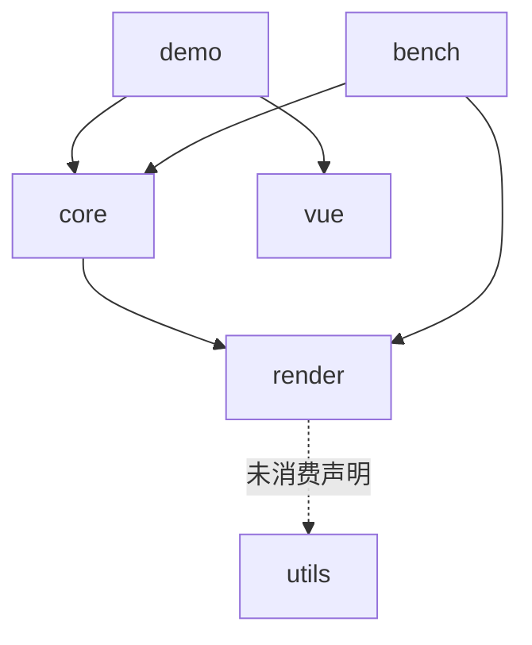

# 架构梳理 第 2 轮（architecture-round-2）

> 本文是第 2 轮优化（P4）的唯一依据：第 2 轮的全部代码改动只允许出自本文，尤其是文末「第 2 轮优化清单」。
> 范围：`packages/render`、`packages/core`、`packages/utils`、`apps/demo`、`apps/bench` 全量源码通读（2026-09-18 快照，第 1 轮优化全部落地后的代码现状）。
> 背景：`.agents/analysis/layer-architecture.md` 与 `ultra-ui-sheet-gap.md` 仅作参考，未修改；`architecture-round-1.md` 用于定位第 1 轮优化前后的差异，同样未修改。第 1 轮（P2）10 项优化（round-1 §6.1～6.10）已全部落地并评审通过，本文按优化后的现状独立完整固化，与 round-1 的差异在相应小节以「第 1 轮后：」标注。
> 评审输入：P2 评审留有 4 条非阻塞建议（cellKey 双份实现、render/package.json 未消费的 utils 声明、resolveStyle 缺 @internal 标注、6.2 溢出重挂扫描口径差异），已作为候选核查点纳入本文 §6 优化清单（R2-2/R2-3/R2-4/R2-6）。

## 1. 总览

多包单体的 canvas 表格引擎。分层为「自研渲染引擎（render）→ 表格主体（core）→ 应用（demo/bench）」，包间只经显式公共入口（`src/index.ts`）与窄接口（`RenderHost`/`LayerHandle`/`SceneNode`/`SceneEvent`）耦合。代码量（第 1 轮后）：render 约 1.1k 行源码（12 文件）、core 约 5.6k 行源码（33 文件，其中 list-table.ts 拆分后主类 940 行 + 4 个协作模块）、utils 骨架（1 文件）、demo Vue 应用（sections 装配 + views 薄壳 + 页内冒烟 659 行）、bench headless/浏览器双入口基准（8 文件约 0.7k 行）。测试 35 个文件（render 5 + core 30），P2 收尾 338 项全过。

核心设计决策（阅读确认，第 1 轮后仍成立）：

1. **场景树窗口内建 + 三档失效**：core 只在可视窗口内建场景节点，变更经 cell/band/full 三档失效登记，帧末单帧收敛后按层消费脏区增量补画或整层重绘，由浏览器合成上屏。
2. **ScrollManager 唯一滚动状态源**：全部滚动入口收敛到一个 clamp 后广播 `(state, delta)` 的状态机，`ListTable` 订阅它驱动窗口更新；滚动帧不再整树重建，而是增量窗口（第 1 轮后）：滚出行列摘除、滚入行列补建、存活节点原地平移。
3. **结构化最小接口**：render 的 `RenderContext`/`RenderCanvas`、事件的 `DomEventLike`/`EventTargetLike`、编辑的 `TextEditorHost`/`TextEditorDoc` 全部是结构化类型（真实 DOM 类型天然满足），换取测试/headless 可注入假实现，不引 DOM 依赖。
4. **数据供给三形态叠加**：`records/columns` 数组、按格 hook（纯函数同步 O(1)）、模型事件订阅（`TableModel` + `ModelBinding` echo 防回环），经 `CellValuePipeline` 统一取值。
5. **图片无闪协议**：cell 级 `MediaCache` LRU + URL 级 `ImageService` 窗口化加载（idleQueue 就绪队列补位，第 1 轮后），就绪位图同步可查，首帧直接画位图；未就绪且在占位延迟内连占位都不画。

第 1 轮优化后的量化基线（headless，`apps/bench/results/bench-2026-09-17T19-34-25-089Z.json`）：TTFF P50 0.6ms、稳态滚动平均 FPS 18891.8、JS 侧帧耗时 P95 0.07ms、稳态/hover 单帧 body 失效面积/视口 0.950、body full 次数 0/0/0。第 2 轮任何优化以此基线对照防退化。

## 2. 模块划分

### 2.1 packages/render —— 自研 canvas 渲染引擎

公共入口 `src/index.ts`：仅显式导出 `createRenderHost`、`SceneNode`、类型（`RenderHost`/`LayerHandle`/`LayerKind`/`Invalidation`/`Region`/`RenderHostOptions`/`SceneNodeInit`/`SceneEventListener`/`SceneEvent` 等）。对 core 暴露的全部面就是「建层、提交失效、请求帧、文本测量、销毁」。package.json 的 dependencies 仍声明 `@infinite-table/utils`，但 src 零 import（第 1 轮 6.5 删除了占位常量 import，声明侧遗留，见 §6 R2-3）。

| 文件 | 职责 | 关键点 |
| --- | --- | --- |
| `src/render-host.ts` | `CanvasRenderHost`：`RenderHost` 窄接口唯一实现 | `createLayer` 幂等（同 kind 复用），建层同时调 `eventSystem.invalidateRoots()` 失效层根缓存（第 1 轮 6.10）；`flush()` 按 `LAYER_ORDER`（ground→body→media→sky）逐层消费；`mount()` 按 `LAYER_ORDER` 用 `insertBefore` 插到首个已挂载的更上层之前，惰性创建的层 DOM 叠放与声明 z 序一致；`measure` 缺省用惰性测量画布；`destroy` 取消挂起帧、解绑事件、清池、摘 canvas |
| `src/frame-scheduler.ts` | 帧调度：多次 `requestFrame` 收敛到同一帧 | `Set<FrameTask>` 去重 + 单 handle；宿主用稳定引用 `flushTask` 保证同帧多次失效只 flush 一次；非浏览器环境退化 `setTimeout(16)` |
| `src/invalidation/invalidation-queue.ts` | 失效队列：按层收集三档失效并合并，帧末 `drain` 出重绘计划 | 常量 `CELL_SPREAD=10`（cell 失效四边外扩防残影）、`MAX_BANDS=8`（超限升级 full）；`LAYER_CONSUMPTION`：ground `band-full-only`、body/media `regions`、sky `always-full`，`Record<LayerKind,…>` 让 TS 强制补全新层 |
| `src/layers/canvas-layer.ts` | 单层 canvas：一棵场景树 + 一个失效队列 | `flush()` → `render(plan)`：full 时 `clearRect` + `paintTree`；regions 时逐 region `clip` + `clearRect` + `paintTree(root, ctx, dirty)`（cull 裁剪跳过不相交子树）；`translateBy` blit 快路径与 `setSize` 均带「预留能力：当前 core 无调用方」显式注释（第 1 轮 6.8），仅测试覆盖 |
| `src/pool/canvas-pool.ts` | 离屏 canvas 池：按物理像素宽高分桶复用 | `maxSize=16`，供 blit 自拷贝等短生命周期离屏画布 |
| `src/scene/scene-node.ts` | 场景树节点：局部坐标 + children 顺序绘制 | `visible`/`pickable`（false 时命中穿透、子节点仍可命中）；`paint` 是子类覆盖点；`on/off/handleEvent` 场景事件监听（Set，派发期退订安全）；`removeChild` 用 `indexOf+splice`（O(n)，见 §6 R2-5 的重挂成本来源） |
| `src/scene/paint.ts` | 绘制遍历 `paintTree` | 先绘自身再按 children 顺序（后画在上）；cull 提供时整棵子树包围盒不相交即跳过 |
| `src/scene/hit-test.ts` | 命中测试 | 从 children 末尾倒序递归，返回最深层、绘制最靠上的可拾取节点 |
| `src/events/event-system.ts` | 事件系统：DOM 事件归一化为场景事件 | 指针/滚轮/键盘/触摸 11 类；坐标减 `getBoundingClientRect`；触摸取 `changedTouches[0]`；命中自顶向下跨层（sky→media→body→ground 的 root 序），命中后沿 parent 链冒泡；键盘不命中，从最顶层根派发；`rootsCache` 缓存层根数组、`invalidateRoots` 由宿主建层时通知失效（第 1 轮 6.10，高频派发零数组分配）。注：`wheel` 在归一化派发面内但全仓无场景级订阅（滚轮由宿主直接接容器，见 §6 R2-9） |
| `src/region.ts` | 矩形代数 | `intersects`/`union`/`spread`/`ceil`/`clip`/`equals`，纯函数 |
| `src/types.ts` | 公共类型 | `LayerKind` 四层；`Invalidation` 三档（cell 可带 `prevRegion` 双包围盒）；`RenderContext`/`RenderCanvas` 结构化最小子集；`LayerHandle.setSize/translateBy` 带预留标注 |

测试在 `tests/`（镜像 src 结构），`fake-canvas.ts` 提供假画布。

### 2.2 packages/core —— 表格主体

公共入口 `src/index.ts`：显式导出 `ListTable`、`ScrollManager`、`SheetModel`、`ModelBinding`、取值/样式/布局/主题/选区/交互/编辑/图片/浮动对象全量公共 API 与类型。package.json 仅声明 `@infinite-table/render`（第 1 轮 6.5 删除了未消费的 utils 声明）。

**主类与协作模块（第 1 轮 6.6 拆分后的形态）**

| 文件 | 职责 | 关键点 |
| --- | --- | --- |
| `src/list-table.ts`（940 行） | ListTable：公共 API、装配（构造/几何变更/滚动主循环）、refreshCell、样式投影 | 构造顺序：主题 → 几何 → `CellValuePipeline` → 冻结数 clamp + 合并区校验 → host（注入或缺省创建，`ownHost` 记归属）→ body/sky 两层 → `ImageService` → `InertiaScroller` → `InteractionOverlay` → ScrollManager 视口/内容尺寸 → `onScroll` 订阅 → 图片窗口先就位 → `ModelBinding` → `EditManager` → `bindInteractionEvents` → `rebuildScene` + body full → 插件注册。内部成员统一标注 `@internal`（公共 API 以 src/index.ts 导出为准）；协作模块以 ListTable 实例为参数只触碰 `@internal` 成员。`resolveStyle` 为列级缓存的两级投影（见下），被 list-table-scene 逐格调用但未标 `@internal`（§6 R2-4） |
| `src/list-table-scene.ts`（476 行） | 场景全量重建与滚动帧增量窗口 | `rebuildScene`（清树重算窗口、分带建格：滚动带 → 部分可见合并区 → 冻结列带 → 冻结行带 → 冻结角 → 行列头）；`updateSceneWindow`（第 1 轮 6.2 增量窗口五步：① sweepWindowNodes 摘滚出/存活平移 → ② 新滚入行整行降序补建 → ③ 存活行补建滚入列（降序）+ 左侧溢出存活格升序重挂 → ④ 主格窗外但区间部分可见的合并主格补建 → ⑤ 表头增量维护，bodyChanged 时表头整体重挂树尾保「表头最上」）；`textOverflowLimitX`/`overflowSourceCol` 溢出右界支撑；`appendCell` 带已存在守卫并返回是否新建 |
| `src/list-table-interaction.ts`（430 行） | 交互接线 | 指针/触摸/键盘/contextmenu 场景事件接线（双击进编辑走指针事件流 detectDoubleTap）、拖选/resize 会话/填充柄、`cellAt`/`cellRectInViewport`/`ensureCellVisible` 命中与跟随、`refreshOverlay`（空浮层零开销） |
| `src/list-table-media.ts`（142 行） | media 层与 ImageService 接线 | media 层惰性创建、`appendImageCell`（无闪协议执行点）、`refreshImageCell`、`onImageServiceLoad`（位图写回 + MediaCache 回填 + cell 定向失效）、`updateImageWindow`（视口外扩 240px 谓词） |
| `src/list-table-internal.ts`（34 行） | 共享常量与纯辅助 | `HEADER_COORD=-1`、数值 `cellKey`（`row * 2^21 + col`，边界注释）、`assertMergesWithinBoundary`。注意：`cell-range.ts` 另有一份私有同实现 cellKey（第 1 轮 6.4 实施时因 import 方向未收敛，见 §6 R2-2） |

**状态与纯逻辑**

| 文件 | 职责 | 关键点 |
| --- | --- | --- |
| `src/scroll-manager.ts` | 唯一滚动状态源 | `scrollTo` clamp 到 `[0, max]`，位置未变不广播；`setContentSize/setViewportSize` 后自动回夹 |
| `src/grid-layout.ts` | 网格几何纯函数 | 行/列前缀和 offsets（支持逐行高覆盖）；等行高窗口 `computeRowWindow`（O(1) 除法）与 offsets 版 `computeRowWindowFromOffsets`（线性推进，§6 R2-1）；冻结可滚动区窗口 `computeScrollable*(FromOffsets)`（滚动位置换算回全量坐标后夹到滚动区）；命中 `findRowAt/findColAt` 收敛到共享二分内核 `findIndexAt`（第 1 轮 6.1，含零宽并列取右端语义）；层坐标 `resolveCellX/resolveCellY(FromOffsets)`；`unionRegions`。`computeScrollableRowWindow`（等行高版）/`resolveCellY`（等行高版）当前仅公共出口与测试触达，无生产调用方 |
| `src/cell-value.ts` | `CellValuePipeline` 取值管线 | 基础值优先级 model > records[field] > undefined（rowCount 兜底）；`resolveText` 末端过 `resolveDisplayValue`；`resolveValue` 不过 hook（checkbox 态、编辑初值口径） |
| `src/selection.ts` | `SelectionState` 选区状态机 | `ranges[]`（start 锚点/end 焦点，可反向）+ `focus`；拖选/整行整列/全选/多段 `selectCells`/`addRange`（Ctrl 加选）；`emitDepth` 防重入广播；`applyExternal` 不广播防回环；shift 扩展锚点取末段 start |
| `src/hover-state.ts` | `HoverState` | 悬停格跟踪，地址未变不广播 |
| `src/keyboard-navigation.ts` | 键盘导航纯函数 | `nextActiveCell`（方向/Tab，越界夹取）；`revealAxis` 单轴滚动跟随最小位移 |
| `src/resize.ts` | 行列 resize 纯逻辑 | `hitResizeHandle` 阈值带内边缘二分定位（`firstEdgeAtLeast` 下界，第 1 轮 6.1，与线性「首个命中边缘」逐点等价）；`ResizeSession` 起始尺寸 + 位移夹取（MIN 20）；能力开关 `canResizeCol/canResizeRow` |
| `src/touch-scroll.ts` | 触控滚动 | `TouchScrollTracker` 最近 4 点采样；`InertiaScroller` 16ms 基准摩擦 0.95 幂次衰减，双轴低于 0.05px/ms 停止；帧调度与时间源可注入 |
| `src/fill-handle.ts` | 填充柄交互原语 | 焦点段解析、柄方点几何（8px 骑角点）、命中；`FillHandleDownEvent`/`FillDragEndEvent`（内核不产生填充值） |
| `src/cell-range.ts` | 合并区间数据结构 | `CellRange` 归一化/包含/跨冻结边界判定；`MergeCellMap` 构造时归一化 + 重叠抛错，`byCoord` 数值 key 逐格索引（本文件私有 cellKey，§6 R2-2） |

**渲染内容与样式**

| 文件 | 职责 | 关键点 |
| --- | --- | --- |
| `src/cell-node.ts` | `CellNode` 场景节点 | paint 顺序：背景 → 内容（自定义 renderer 或 `BUILTIN_CELL_RENDERERS[cellType]`）→ 逐边边框；文本测量宽缓存（`font\0text` 键，`setContent` 失效；每次 paint 仍需拼键比较，§6 R2-8）；边框 `paintEdge` 支持 solid/dashed/dotted/double |
| `src/cell-renderer.ts` | 内置渲染器 | `renderTextCell`：对齐 × 垂直、padding 内缩、textOverflow ellipsis（二分前缀）/clip、未设置时 Excel 式溢出、`textWrap` 逐字贪心断行（`\n` 强制分段）、下划线/删除线；`renderCheckboxCell` 方框+勾选实心块 |
| `src/cell-style.ts` | 结构化样式与投影 | `CellStyle` 全字段；`projectCellStyle` 逐字段覆盖、边框逐边独立合并、返回新对象；`cellStyleFont` 组装 CSS font 串 |
| `src/theme.ts` | 主题系统 | `defaultTheme`（几何 + body/header 两分区 token）；`extendsTheme(override, base)` 按键浅展开深覆盖 |

**编辑链路**

| 文件 | 职责 | 关键点 |
| --- | --- | --- |
| `src/editing/edit-manager.ts` | `EditManager` 编辑状态唯一源 | 可编三级判定；同格幂等、异格先提交；提交顺序：取值 → 关浮层 → 写回 → refreshCell → emitChange → 选区移动 → 焦点归还；`followAnchor` 逐帧对齐锚定格、滚出视口按 Enter 语义自动提交；`detachedHost` 离屏兜底 |
| `src/editing/text-editor.ts` | DOM 浮层文本编辑器 | 单行 input/多行 textarea；DOM 依赖收敛在最小结构接口；open/moveTo（不重挂载不抢焦点）/getValue/close（幂等）；Esc/Enter/Tab 拦截后回调 |
| `src/editor-registry.ts` | `EditorRegistry` | 注册表 + 格级路由（route hook 优先于列定义 editor）；`CellEditor` 接口目前是占位 |
| `src/model-binding.ts` | `ModelBinding` | 订阅外部模型变更 → 局部刷新；`writeBack` 期间 `echoDepth` 吞 echo 防回环 |
| `src/sheet-model.ts` | `SheetModel` | 内置内存坐标模型（`TableModel` 实现）：二维数组存取、写值同步广播、`setRowCount` 扩缩 |

**图片与浮动对象**

| 文件 | 职责 | 关键点 |
| --- | --- | --- |
| `src/media/image-service.ts` | `ImageService` URL 级资源服务 | 状态机 idle→loading→ready/error；`request` 登记 cell 引用（`refs` Map，字符串 key）；`idleQueue` 窗口内 idle 待加载队列，`pump` 按登记序消费补位、出队惰性清理（第 1 轮 6.7，补位从全表扫描降为均摊 O(1)）；`updateWindow(谓词)` 单趟重估全条目（仍 O(累计条目)，§6 R2-7）：窗口内 idle 入队、滚出 loading 取消降级（generation 代际丢弃迟到结果）；LRU 双预算（256MB/1000 条）逐出优先窗口外；`hasResource` 纯查询不动 LRU 序；`placeholderDelay` 80ms；`setUrlResolver` 鉴权钩子；error 必触发 `onImageError` |
| `src/media/media-cache.ts` | `MediaCache` cell 级位图 LRU | 泛型，Map 迭代序即 LRU 序，bytes/count 双预算逐出 |
| `src/media/image-cell-node.ts` | `ImageCellNode` media 层节点 | 无闪协议执行点：无位图且未到 `placeholderAfter` 本帧不画；有位图画白底+fit 位图；超时画确定性灰底占位；`viewportClip` 与 body 视口求交裁剪 |
| `src/media/draw-image.ts` | media 共享绘制助手 | 确定性占位、fit 语义（图片格与浮动对象共用） |
| `src/float/float-object-layer.ts` | `FloatObjectLayer` 格上浮动对象 | 承载容器挂 sky root 末尾（层内最顶）；独立对象树；锚点经注入 `FloatGeometry` 换算层坐标，`syncPositions` 滚动/结构变更后帧级重排 + sky full 失效；add/remove/update cell 定向失效（update 带 prevRegion）；图片经共享 `ImageService`（`onSettled` 回调链路）；`onChange` 抛变更；`getAt` 倒序命中 |
| `src/plugin.ts` | `TablePlugin` 接口 | `mount(table)`/`unmount?`，注册即生效、销毁逆序卸载；实现仍在规划包 packages/plugins |

**交互浮层**

| 文件 | 职责 | 关键点 |
| --- | --- | --- |
| `src/interaction-overlay.ts` | `InteractionOverlay` sky 浮层 | `OverlayNode`（pickable:false 穿透）paint：整体 clip 到 bodyViewport → hover 三级 → 选区多段裁剪 → 填充柄 → resize 指示线；`update(content)` 返回是否有内容，调用方仅在（或曾在）有内容时提交 sky full 失效；选区/hover 颜色为模块内常量（非主题 token） |

### 2.3 packages/utils —— 表格域专用工具

`src/index.ts` 仅导出 `UTILS_PACKAGE_NAME` 常量（第 1 轮 6.5 按回退案保留，避免 lint no-empty-file），是骨架包。无任何包 import 其内容；render/package.json 对它的声明是唯一残留引用（§6 R2-3）。

### 2.4 apps/demo —— 浏览器演示与冒烟

Vue 3 应用（vite-plus 构建）。结构：`App.vue`（hash 路由左侧菜单 7 项 + `?smoke=1` 冒烟模式直挂五演示区并跑 `runSmoke`）→ `views/*.vue` 薄壳 → `sections/*.ts` 演示装配（真实逻辑所在）：`data-forms`（三形态 + DemoModel 防回环计数）、`display`（10 万行/冻结/合并/逐边边框/自定义渲染/checkbox/主题 extends，像素锚点常量集中顶部）、`interaction`（拖选/hover/resize/键盘/触控/批量更新/contextmenu/onScrollFrame）、`media`（格内图片 + 浮动对象，`demoLoadImage` 本地 40ms 假加载）、`editing`（SheetModel 编辑闭环 + API 按钮）、`sheet`（样式三级覆盖链矩阵/\n 多行合并区/填充柄预置选区/运行时冻结合并切换/editCellOnEnter 重建/`window.__SHEET_DEMO__` 调试句柄）。

公共件：`mount.ts` 的 `mountTable`（容器 + ListTable + 滚轮接线到 `scrollBy`，dpr 冒烟模式锁 1）、`addButton/addStatus/createSection`。`components/InfiniteTable.vue` 是 Vue 包装组件（`options` prop → ListTable 实例 + 滚轮接线 + `ready` 事件；第 1 轮 6.9 后 `onUnmounted` 调 `table.destroy()` 并解绑 wheel）。`mountTable` 与 `InfiniteTable.vue` 的滚轮接线/dpr 锁定逻辑存在两份（§6 R2-10）。

`smoke.ts` 页内冒烟：五演示区逐项断言（32 项）——层 canvas 就位与首帧像素、三形态取值、防回环计数、像素级显示能力、合成事件交互全链路、图片加载与无闪回滚、浮动对象跟随、编辑闭环；结果写 `window.__SMOKE__` 与 `document.title`。`scripts/smoke.mjs`：vp build → preview（固定端口 54173）→ playwright-cli 打开 `?smoke=1` → 轮询结果 → 退出码。

### 2.5 apps/bench —— 量化基准

headless（`bun src/headless.ts`：`NoopCanvas`/`NoopContext` 绘制 no-op、手动帧泵数组、`FakeEventTarget` 手工派发 pointermove）与 browser（`src/main.ts`：真实 canvas + rAF，报告上页面 + `window.__BENCH_REPORT__`）双入口共用同一份场景逻辑（`scenarios.ts` 只依赖 `BenchEnv` 抽象）。三个场景：TTFF（构造+首帧 flush，P50 ≤ 80ms）、稳态滚动 FPS（10 万行 × 300 帧 × 120px，≥55fps）、失效面积收敛（稳态滚动/hover 并发 body 面积 ≤ 1× 视口、full 次数必须为 0；快跳无 full）。`invalidation-meter.ts` 装饰器包装 `RenderHost` 拦截 `submitInvalidation` 按层计量，帧间 `drain`。`thresholds.ts` 集中达标口径，报告 JSON 落档 `results/` 作防回归基线，未达标非零退出。

### 2.6 规划位与工程底座

`packages/formulas`（公式引擎）、`packages/plugins`（官方插件）为规划目录，无代码。根 `vite.lib.config.ts` 统一库构建（ESM，`@infinite-table/*` 外部化）；`scripts/check-core-deps.ts` 扫描 core 的 @visactor 依赖（import 正则 + package.json 声明双向）。

## 3. 依赖关系

### 3.1 代码实际依赖边（以 package.json 声明 + src 实际 import 双重核实）



- **core → render**：唯一真实的包间代码边。core 全部经 `@infinite-table/render` 公共入口触达：`createRenderHost`（list-table 构造）、`SceneNode`（cell-node/image-cell-node/interaction-overlay/float-object-layer）、类型（`Region`/`RenderContext`/`LayerHandle`/`SceneEvent`/`RenderImageSource` 等）。render 对 core 零感知，方向单向。
- **render -.-> utils（未消费声明）**：`packages/render/package.json` 仍声明 `@infinite-table/utils`，但 render/src 零 import（第 1 轮 6.5 删除的是代码侧占位 import 与常量导出，声明侧遗留）。实线图上这是唯一与功能耦合不符的边（§6 R2-3）。
- **core → utils**：无（声明与 import 双侧为零，第 1 轮 6.5 完成）。
- **utils**：无依赖、无消费方。
- **@cat-kit/core**：全仓零 import、零 package.json 声明。
- **应用侧**：demo 依赖 core + vue（devDep `@vitejs/plugin-vue`）；bench 依赖 core + render（经 `InvalidationMeter.wrap` 装饰 `RenderHost` 计量，窄接口可装饰性的实例）。

### 3.2 禁止依赖核查（本节为 P3 任务要求的实际核查结论）

1. **core 无 `@visactor/*` 引用**：`grep -rn "@visactor" packages apps scripts` 全仓仅命中 `scripts/check-core-deps.ts` 自身的禁用正则字符串；本轮实跑 `bun run check:deps` 输出「check:deps 通过：packages/core 对 @visactor/* 零依赖」。DEV-STANDARDS「零 vrender」在源码与依赖声明两侧均成立。
2. **无 `export *` 转售公共 API**：`grep -rn "export \*" packages/*/src apps/*/src` 零命中（唯一命中是 core/index.ts 与 utils/index.ts 的禁令注释）。三个包入口全部显式逐名导出，符合 DEV-STANDARDS。

### 3.3 层内耦合结构

- render 包内：`render-host` 是唯一组合根（持 scheduler/pool/eventSystem/layers 表）；`CanvasLayer` 依赖 `InvalidationQueue`/`CanvasPool`/`paintTree`/region 工具；事件系统经 `rootsTopDown` 回调取层根（缓存复用），与层集合解耦。层集合扩散点三处：`LayerKind`（types）、`LAYER_ORDER`（render-host）、`LAYER_CONSUMPTION`（invalidation-queue），`Record` 类型让编译器强制补全。
- core 包内：`list-table.ts` 是唯一组合根，其余模块要么是被调用的纯逻辑/状态机（不反向依赖 list-table），要么经构造期闭包注入（`EditManagerInit`/`OverlayGeometry`/`FloatGeometry`/`EditWriteTarget` 全部是注入式回调，模块不 import list-table）。协作四模块（scene/media/interaction/internal）以 ListTable 实例为参数、只触碰 `@internal` 成员、不进公共入口；`plugin.ts` 是唯一 import list-table 类型的非协作模块（`TablePlugin.mount(table: ListTable)`）。模块间 import 方向：scene → media（appendImageCell）、scene/interaction/media → internal、internal → cell-range（因此 cell-range 不能反向引用 internal 的 cellKey，这是 §6 R2-2 收敛方向约束）。
- 应用侧：demo/bench 只触达 core 公共入口 + render 的 `createRenderHost`。

## 4. 核心数据流

### 4.1 滚动主链路（ScrollManager → 增量窗口 → 分层 band 失效）

```text
入口（多归一）                        状态收敛                          渲染后果
滚轮（宿主 mountTable 接线）   ┐
触控 touchmove（TouchScrollTracker）├─→ ScrollManager.scrollBy/scrollTo
惯性 InertiaScroller 每帧       │      （clamp 到可滚动内容；位置未变不广播）
键盘 revealAxis 跟随           │              │ (state, delta) 广播
程序化 scrollTo/setScrollTop…  ┘              ▼
                                    ListTable.onScroll(delta)
                                    1. updateSceneWindow()（第 1 轮 6.2，替代整树重建）：
                                       computeScrollable*(FromOffsets) 求新窗口 →
                                       ① sweepWindowNodes：滚出行列节点摘除出索引，
                                         存活数据格/图片格原地平移（x/y 重算，零重建）
                                       ② 新滚入行整行补建（滚动区列降序 → 冻结列降序）
                                       ③ 存活行补建滚入列（降序）+ 可溢出进新列区的
                                         左侧存活格升序重挂（保「越靠左越后画」）
                                       ④ 主格窗外但区间部分可见的合并主格补建
                                       ⑤ 表头增量维护（平移/摘除/补建）；
                                         bodyChanged 时表头+corner 重挂树尾（保「表头最上」）
                                       构造与 applyGeometryChange 仍走全量 rebuildScene
                                    2. delta.dy≠0：body（及已建的 media）提交一条横带 band
                                       （y 从 列头高+冻结行高 起，覆盖行号列/冻结列/滚动区）
                                       delta.dx≠0：纵带（x 从 行号列宽+冻结列宽 起）
                                       ——冻结角与对侧冻结区永不重绘
                                    3. updateImageWindow()：窗口化加载调度（划入提权/滚出取消）
                                    4. floatLayer.syncPositions()（有浮动对象时，sky full）
                                    5. refreshOverlay()（sky：选区/hover 随新窗口几何重算）
                                    6. scrollFrameListeners 非空 → requestFrame(scrollFrameTask)
                                       （稳定引用，同帧多次滚动只广播一次）
```

滚动位置语义：定义在「可滚动内容」（总内容扣除冻结区）上；`toContentX/Y` 做视口→内容换算（冻结区内不加滚动量）。

### 4.2 多 region 失效与重绘（render 主循环）

```text
core（各处）submitInvalidation(kind, inv)
  → InvalidationQueue.push：
      full：清空队列置 full 位
      cell：双包围盒 union（有 prevRegion）→ spread(10px) → ceil 像素对齐 →
            被既有 band 覆盖则丢弃 → 与既有 cell 去重后登记
      band：吸收并删除相交 cell → 去重登记 → 数量 >8 升级 full
  → CanvasLayer.invalidate → scheduleFlush（宿主稳定 flushTask）→
FrameScheduler（单帧收敛：Set 去重任务，一帧一次）
  → flush：按 LAYER_ORDER 逐层 CanvasLayer.flush()
      → queue.drain() 出 RepaintPlan：
          sky 恒整层（always-full）；ground 只出 band；body/media 出 band+cell regions
      → render(plan)：full：setTransform(dpr) + clearRect + paintTree
                      regions：逐 region clip + clearRect + paintTree(root, ctx, dirty)
                               （cull：子树包围盒不相交整棵跳过）
  → 分层 canvas 由浏览器合成上屏
```

同帧多源失效（多张图片同帧加载完成、批量更新）天然被队列收敛；`batchUpdate` 在 core 侧先把多次 `refreshCell` 的 region 收集合并为一次 band 提交，再经队列二次收敛。

### 4.3 编辑提交回写

```text
触发：双击/双触（pointerup 事件流 detectDoubleTap：同格、≤400ms、≤10px）
      或 API startEdit / editCellOnEnter 下的 Enter
  → ListTable.startEdit：选区落格 + ensureCellVisible → EditManager.startEdit
      可编三级判定：EditorRegistry.resolveEditor（route hook → 列 editor 声明）
                    ∧ options.resolveEditable(col,row)
                    ∧ writeTarget.canWrite（model 形态恒可写；records 需列有 field 且行对象存在）
  → createTextEditor（input/textarea）open：挂 container、按 cellRectInViewport 定位、
      初值 = pipeline.resolveValue（基础值口径，不过 resolveDisplayValue）、聚焦
  → 编辑中滚动：onScrollFrame → followAnchor 逐帧 moveTo 对齐锚定格；
      锚定格滚出视口（cellRect null）→ commitEdit('down') 自动提交不丢内容
  → 提交 Enter/Tab（Esc 取消：close 不回写不抛事件）
      commitEdit：editor.getValue → writeTarget.write
        ├─ model 形态：ModelBinding.writeBack（echoDepth++ 吞模型 echo 防回环）
        └─ records 形态：record[field] = value
      → refreshCell（cell 级失效，含溢出新旧区与来源格联动）→ emitChange(onCellChange,
        col/row/oldValue/newValue) → moveSelection（Enter 下移 / Tab 右移）→ 焦点归还容器
外部模型变更（不经表格）：model.onCellChange → ModelBinding（非 echo 期放行）
  → refreshCell 局部刷新；表格回驱 updateCell 同走 writeBack + refreshCell
```

### 4.4 图片窗口化加载（无闪协议）

```text
rebuildScene/updateSceneWindow → appendCell：resolveCellImage(col,row) 命中
  → body 节点只画背景/边框（文本留空，不参与溢出）
  → appendImageCell：media 层惰性创建（首个图片格出现时）→ 建 ImageCellNode
      （placeholderAfter = now + placeholderDelay；bodyViewport 裁剪传入）
  → 取图序：MediaCache.get("image:col:row:WxH") → ImageService.getBitmap(url)
      ├─ 命中：setBitmap 首帧直接画位图（滚动回访无闪；cache miss 时回填 MediaCache）
      └─ 未命中：imageService.request(url, cell) 登记引用 + 入 idleQueue
  → 每次滚动 updateImageWindow：窗口 = 可视区域外扩 240px
      单趟重估全条目：窗口内 idle 入 idleQueue 提权；滚出的 loading 取消降级
      （generation 丢弃迟到结果）；pump 按 idleQueue 登记序补位（并发 ≤10）
  → 加载完成：startLoad 回调（代际校验）→ ready 入 LRU（bytes 估算 W×H×4，
      双预算 256MB/1000 条，优先逐出窗口外）→ onImageLoad(e)
  → ListTable.onImageServiceLoad：写回引用该 URL 的可见格节点 + 回填 MediaCache
      → media 提交 cell 级失效（node 全包围盒；同帧多图由失效队列收敛）
```

浮动对象图片走同一 `ImageService`（`request` 的 `onSettled` 回调链），加载完成只定向失效该对象区域。

### 4.5 交互浮层与事件

```text
DOM 事件（container）→ EventSystem 归一化（场景坐标 + 触点/键位；层根缓存复用）
  → 命中：sky→media→body 逐层 hitTest（浮层节点 pickable:false 穿透，实际总命中 body）
  → 命中节点沿 parent 链冒泡 → body root 监听器分派：
      pointerdown：编辑中点外先提交 → resize 手柄命中（4px 阈值，二分）开 ResizeSession
                  → 填充柄命中开 fillDrag 会话 → 左上角全选 / 列头整列 / 行号整行 /
                  数据格 beginDrag（ctrlMultiSelect 开启且 Ctrl/Cmd 时 addRange）
      pointermove：resize 拖拽只更新 sky 指示线（提交在 pointerup 一次生效）
                  → fillDrag 跟踪终点格 → 拖选 updateDrag + ensureCellVisible
                  → 其余 hoverState.set（地址未变不广播）
      pointerup：resize 落地（setColWidth/setRowHeight → applyGeometryChange 全量重建
                  + onCol/RowResizeEnd）→ fillDrag 抛 onFillDragEnd（内核不写值）
                  → detectDoubleTap
      contextmenu / touch* / keydown（sky root 监听，编辑中让位给编辑器）
  → selection/hoverState onChange → refreshOverlay → InteractionOverlay.update
      （有内容→sky full；曾有过内容现在没有→补一次 full 清残影；全程零 body 重绘）
```

### 4.6 几何变更（resize/冻结/合并运行时）

`setColWidth/setRowHeight/setFrozen*/setMergeCells` → 重算 offsets 与冻结区尺寸 → `applyGeometryChange`：ScrollManager 视口/内容尺寸重设（自动回夹）→ `rebuildScene` 全量重建 + body full（media 已建则同样 full）→ `updateImageWindow` → float 同步 → overlay 刷新。合并区/冻结数变更先过 `assertMergesWithinBoundary` 校验（跨冻结边界抛错保持原状）。

## 5. 关键实现细节

1. **四层 canvas 与实际用量**：`LayerKind` 四层，core 只创建 body、sky，media 惰性（首个图片格出现时），ground 全仓从未创建——实际 2~3 个 canvas。sky 独立 backing store 的收益被真实消费：hover/选区/resize/填充柄全走 sky 整层重绘，body 零牵连（bench 场景 3 断言此性质）；media 收益真实（图片 onload 只重绘引用格）。`mount()` 按 `LAYER_ORDER` `insertBefore`，惰性创建的 media 正确插到 sky 之前。
2. **失效合并三档**：cell 归一化（双包围盒 union + 10px 外扩 + 像素对齐去重）、band 吸收相交 cell、band > 8 升 full、full 吸收一切；按层消费策略差异（ground 只 band、sky 恒 full、body/media 逐 region）。cell 失效外扩 10px 与 `paintTree` cull 配合防增量补画边缘残影。
3. **单帧收敛的稳定引用模式**：FrameScheduler 用 `Set<FrameTask>` 去重，宿主与 core 各持稳定任务引用（`flushTask`/`scrollFrameTask`），同帧多次触发只执行一次。
4. **滚动帧增量窗口（第 1 轮 6.2，本架构最大热点路径）**：滚动帧节点分配与样式投影从 O(窗口格数) 降到 O(滚入格数)；存活节点只做 x/y 平移。z 序等价性由三条规则保持：整行列降序补建、左侧溢出存活格升序重挂、新建数据格后表头整体重挂树尾（合并主格上缘可伸进列头带）。bench headless 帧耗时 P95 0.13ms → 0.07ms 的主要来源。
5. **列级样式投影缓存（第 1 轮 6.3）**：`resolveStyle` 两级执行——token+列级合成按列缓存（`columnStyles`，主题构造期固定、列定义为构造期快照，缓存与表实例同生命周期），仅按格 hook 返回非空才做第二级投影；同列未命中 hook 的全部数据行共享同一投影对象（CellStyle 全仓按不可变约定使用）。
6. **数值格索引 key（第 1 轮 6.4）**：`cellNodes`/`imageCellNodes`/`MergeCellMap.byCoord` 均用 `row * 2^21 + col` 数值 key（边界：col < 2^21、row < 2^32 内唯一精确；表头 -1 坐标不入索引）。实现存在于 `list-table-internal.ts` 与 `cell-range.ts` 两处（§6 R2-2）；`ImageService.refs` 仍用 `${col}:${row}` 字符串 key（请求路径，非滚动热路径）。
7. **MediaCache LRU 双缓存体系**：URL 级（ImageService 内嵌，服务并发/取消/预算/idleQueue 补位）+ cell 级（MediaCache，key 含格尺寸，滚动重建时命中即首帧无闪）。两层 LRU 均利用 Map 迭代序实现。cell 级 key 含 `WxH`：格尺寸变化自然 miss 重算，避免拉伸旧位图。
8. **主题 extends 派生与三级覆盖链**：`extendsTheme(override, base)` 基于 base 按键覆盖，body/header 分区浅展开；落到格样式经 `resolveStyle` 三级投影：主题分区 token → 列级 `style` 片段（textWrap 旗标并入主题层）→ 按格 `resolveCellStyle`。
9. **Excel 式文本溢出**：未设 textOverflow/textWrap 的左对齐 text 格向右溢出到相邻空格（`textOverflowLimitX` 扫 `isEmptyTextCell` 确定右界；冻结带不越带界）；`refreshCell` 对新旧 `textMaxX` 双包围盒失效，并联动左侧溢出来源格（变空/变非空/保持为空三情形重算来源格右界）。
10. **无闪协议三条件**：`hasResource/getBitmap` 同步可查；未就绪在 `placeholderDelay`（80ms）内连占位都不画；加载完成 cell 定向失效单帧切换。error 态必触发 `onImageError`。
11. **防回环三处**：ModelBinding `echoDepth`；SelectionState `emitDepth` + `applyExternal` 不广播；InteractionOverlay `overlayHadContent`（浮层清空时补一次 full 后不再空转重绘）。
12. **合并区布局**：`MergeCellMap` 逐格索引 O(1) 查所属区间；被覆盖格不建节点，主格按覆盖带取完整尺寸；主格在窗口外但区间部分可见时补建（增量窗口的 keepCell 条件同样保留这类主格）；合并格取值/命中/失效全部路由到主格。
13. **结构化最小接口与测试注入**：render `RenderContext/RenderCanvas`、事件 `DomEventLike/EventTargetLike`、编辑 `TextEditorElement/Host/Doc`、bench `BenchEnv`、各模块 `ImageLoader/measureText/scheduleFrame/now` 全部可注入。35 个测试文件不依赖真实 canvas/DOM（`stub-host`/`fake-canvas`/`fake-editor-dom`/`recording-context`）；bench headless 同理跑完整表格逻辑。
14. **预留面（均带显式标注，第 1 轮 6.8 口径）**：`CanvasLayer.translateBy`（池化自拷贝 + L 形暴露带，未来滚动快路径接入点）与 `LayerHandle.setSize` 当前 core 无调用方、仅测试覆盖；ground 层注册路径存在但从未使用；`CellEditor` 接口为占位；场景 `wheel` 事件归一化派发但无订阅方（§6 R2-9）。
15. **事件坐标与 DOM 解耦**：EventSystem 每次派发 `getBoundingClientRect` 换算；触摸取 `changedTouches[0]`；键盘不命中直接从最顶层根派发——headless 的 `FakeEventTarget` 仅需三成员即可驱动全部交互逻辑。

## 6. 第 2 轮优化清单

> 每项含改动范围与预期正向论证（性能/结构/可维护性至少一项）。P4 实施时逐项落地、逐项按 R2-11 的统一验证手段证明无退化；发现退化即回滚并记录。排序不代表实施顺序，建议按风险从低到高推进（先 R2-3/R2-4/R2-9/R2-10 等低风险项，再 R2-1/R2-5 等热点项；R2-7 为唯一中风险评估项，单独实施单独验证）。现状基线见 §1 末尾。

### R2-1 滚动帧窗口计算线性扫描 → 二分查找

- **现状**：`grid-layout.ts` 的 `computeColWindow` 与 `computeRowWindowFromOffsets` 求 start 均自 0 线性推进（`while (offsets[start+1] <= scroll)`）。`ListTable.onScroll` 每帧触发 4 次窗口计算：`updateSceneWindow` 的 rows+cols 与 `updateImageWindow` 的 rows+cols（rebuildScene/applyGeometryChange 亦同路径）。深滚动位置单次 O(行号)：10 万行表滚到中部，每帧约 2 × 5 万次迭代（bench 稳态场景仅滚到约 1100 行深处，未充分暴露此项；真实用户拖滚动条到底部时每帧代价与总行数成正比）。
- **改动范围**：`packages/core/src/grid-layout.ts`（`computeColWindow`/`computeRowWindowFromOffsets` 的 start 定位改二分下界，offsets 单调不减，可复用/对齐 `findIndexAt` 的「并列取右端」语义；`end` 已是短程扫描可保留）；补测试 `packages/core/tests/grid-layout*.test.ts`（深滚动位置窗口等价断言）。
- **正向论证**：性能——滚动帧窗口计算从 O(滚动深度) 降为 O(log n)，与 6.1 同法、行为逐点等价（前缀和单调）；无结构改动。
- **实施记录（P4，2026-09-18）**：
  - 实际改动范围：`packages/core/src/grid-layout.ts`（computeColWindow/computeRowWindowFromOffsets 的 start 定位改调新增二分下界内核 lowerBoundIndex，findIndexAt 复用同内核、「并列取右端」语义一致；end 短程扫描保留）；补测试 `packages/core/tests/grid-layout.test.ts`（3 项：深滚动边界值对比、10 万行全区间抽样与线性参照逐点等价、变宽+零宽列等价）。
  - 正向论证：性能——onScroll 每帧 4 次窗口计算的 start 定位从 O(滚动深度) 降为 O(log n)，深滚动（拖滚动条到底部）每帧代价不再与总行数成正比。
  - 无退化说明：等价性由新增 3 项「与旧线性扫描参照逐点对比」断言及既有 grid-layout* 全部用例证明；bench 稳态滚动 FPS 与 JS 帧耗时见 R2-11 收尾记录（持平或更优）。
  - 验证命令及结果：`bun run typecheck` 退出 0；`bun run test` 全过（含新增 3 项）；`bun src/headless.ts`（apps/bench）三场景达标。

### R2-2 cellKey 双份实现收敛为单一事实源（P2 评审建议）

- **现状**：数值格 key `row * 2^21 + col`（含 `CELL_KEY_COL_BITS = 21` 常量与边界注释）在 `cell-range.ts`（私有，供 `MergeCellMap.byCoord`）与 `list-table-internal.ts`（供场景/媒体索引）各有一份，语义与实现完全相同。第 1 轮 6.4 实施时未能收敛的原因是 import 方向：`list-table-internal.ts` 已 import `cell-range.ts`（`rangeCrossesBoundary`），反向引用会成环。
- **改动范围**：唯一定义下沉到无依赖的 `packages/core/src/cell-range.ts`（或新建 `packages/core/src/cell-key.ts` 底层模块），`list-table-internal.ts` 删除本地副本改为导入（可保留转出以维持协作模块的既有 import 路径）；全量单测回归。
- **正向论证**：结构/可维护性——消除重复代码（SMELLS），编码边界与注释只维护一处，两处索引的 key 语义由编译器保证一致。
- **实施记录（P4，2026-09-18）**：
  - 实际改动范围：`packages/core/src/cell-range.ts`（cellKey 改为导出，注释升级为「全仓唯一定义」口径）；`packages/core/src/list-table-internal.ts`（删除本地副本，`export { cellKey } from './cell-range'` 转出，维持协作模块既有 import 路径）。选下沉 cell-range 而非新建 cell-key.ts：list-table-internal 已 import cell-range（rangeCrossesBoundary），零新增模块且不成环。
  - 正向论证：结构/可维护性——重复实现收敛为单一事实源，`CELL_KEY_COL_BITS` 边界（2^21/2^32）与注释只维护一处。
  - 无退化说明：纯等价搬移（同常量同实现），行为零变化，全量单测回归证明。
  - 验证命令及结果：`bun run typecheck` 退出 0；`bun run test` 全过。

### R2-3 render/package.json 删除未消费的 utils 依赖声明（P2 评审建议）

- **现状**：`packages/render/package.json` 声明 `@infinite-table/utils: workspace:*`，但 render/src 零 import（第 1 轮 6.5 删除了代码侧占位 import，声明侧遗留）。这是全仓唯一与功能耦合不符的依赖声明；构建产物与安装面均被无谓牵连。
- **改动范围**：`packages/render/package.json`（删该声明；`bun install` 刷 lockfile）；验证 `bun run check:deps`、`tsc -b`、`bun run build`、全量测试。
- **正向论证**：结构——依赖图与功能耦合一致（render 成为真正的零依赖底层），完成 6.5「依赖面真实化」的声明侧收尾。
- **实施记录（P4，2026-09-18）**：
  - 实际改动范围：`packages/render/package.json`（删除 dependencies 中 `@infinite-table/utils` 声明，dependencies 块随之移除）；`bun install` 刷新 lockfile。
  - 正向论证：结构——render 成为真正的零依赖底层，构建产物与安装面不再被无谓牵连。
  - 无退化说明：render/src 对 utils 零 import（第 1 轮 6.5 后即如此），删声明无代码影响；workspace 安装、tsc -b 与全量测试均不感知变化。
  - 验证命令及结果：`bun install` Saved lockfile；`bun run check:deps` 通过；`bun run typecheck` 退出 0；`bun run build` 退出 0；`bun run test` 全过。

### R2-4 resolveStyle 补 @internal 标注（P2 评审建议）

- **现状**：6.6 拆分约定「协作模块触达的内部成员统一标注 @internal（公共 API 以 src/index.ts 导出为准）」。`list-table-scene.ts` 的 `appendCell` 逐格调用 `table.resolveStyle`，但该方法未标 `@internal`，与约定口径不一致，影响「公共 API 面」判定。
- **改动范围**：`packages/core/src/list-table.ts`（`resolveStyle` 注释补 `@internal`；如 review 判定其属稳定公共能力，则反向修正约定口径并说明——二者取一，保持注释与事实一致）。
- **正向论证**：可维护性——`@internal` 契约完整，公共 API 面判定口径统一。
- **实施记录（P4，2026-09-18）**：
  - 实际改动范围：`packages/core/src/list-table.ts`（resolveStyle JSDoc 补 `@internal` 标注）。取「补标注」案：resolveStyle 未进 src/index.ts 公共导出、仅 list-table-scene 协作触达，属 6.6 约定的内部成员，标注与事实一致，约定口径无需反修。
  - 正向论证：可维护性——`@internal` 契约完整，公共 API 面判定口径统一。
  - 无退化说明：注释级改动，零行为影响。
  - 验证命令及结果：`bun run typecheck` 退出 0；`bun run test` 全过。

### R2-5 body 层表头每帧批量重挂 → 消除（z 序结构优化）

- **现状**：`updateSceneWindow` 步骤 ⑤ 在 `bodyChanged`（纵向滚动几乎每帧为真）时，把 `colHeaderNodes`/`rowHeaderNodes`/`cornerNode` 全部 `removeChild + appendChild` 挪到树尾保「表头最上」。`removeChild` 含 `indexOf + splice`，单节点 O(子节点数)（≈窗口内节点总数，bench 约 480、宽表可达数千）；表头节点数 × 2 次 O(n) 数组操作在每滚动帧执行，是 6.2 之后的剩余大头之一。
- **改动范围**（两案取一，P4 决策）：a) `packages/render/src/scene/scene-node.ts` 增加 `insertBefore`，core 新建/重挂数据格一律插到首个表头节点之前，表头节点永不再移动（`packages/core/src/list-table-scene.ts` 的步骤 ②③④ 与 `rebuildScene` 的建格插入点）；b) core 侧把表头收进单一容器节点（表头容器恒为 root 末子节点，仅容器单节点重挂）。两者均保持「数据格在下、表头最上、溢出格后画于目标格」的既有 z 序；补像素级断言（表头覆盖半格、合并主格上缘伸进列头带）进 `packages/core/tests/list-table-text-overflow.test.ts` 或新增。
- **正向论证**：性能——每滚动帧 O(表头数 × 窗口节点数) 数组操作降为 O(1)（案 b）或零（案 a）；与 R2-1 叠乘进一步压低滚动帧 JS 成本。语义等价需冒烟像素断言护航。
- **实施记录（P4，2026-09-18）**：
  - 实际改动范围：取**案 b**。`packages/core/src/list-table.ts`（新增 @internal 成员 `headerGroup`）；`packages/core/src/list-table-scene.ts`（rebuildScene 末尾建表头容器 SceneNode 挂 root 末子节点，appendHeaders 改挂容器；updateSceneWindow 步骤 ⑤ 表头增删移入容器，bodyChanged 时单节点重挂容器替代逐表头搬移）；render 侧零改动（appendChild 自带摘除重挂，无需新增 insertBefore）。测试侧：新增 `packages/core/tests/testing/find-cell-node.ts` 递归查找辅助，list-table/theme/list-table-display/list-table-text-overflow 四个测试文件的节点查找助手改递归（表头节点入容器后不再被旧助手命中）；list-table.test.ts 场景树规模断言改为 144 数据格 + 1 容器（容器内 27 表头，语义强度不降）；补 2 项 z 序断言进 list-table-text-overflow.test.ts（表头覆盖半格、滚动后合并主格上缘伸进列头带且主格在容器之下）。
  - 实施要点：容器必须带全表包围盒且 `pickable:false`——paintTree 的 cull 与 hitTest 都按节点自身包围盒判定，零尺寸容器会导致表头被 cull 剔除或无法命中；pickable:false 使未命中表头子节点时穿透到数据格。事件冒泡路径 header→容器→root 与原先 header→root 等价（core 交互不读 event.target，cellAt 纯几何）。
  - 正向论证：性能——每滚动帧 O(表头数 × 窗口节点数) 的 removeChild+appendChild 数组操作降为单节点一次（appendChild 内置摘除重挂，一次 indexOf+splice）；结构——「表头最上」从每帧维护收敛为不变结构（容器恒为末子节点）。
  - 无退化说明：z 序语义由新增 2 项断言 + 既有「横向滚动增量补建保持溢出 z 序」「带内按列降序建节点」测试护航；bench 场景 3 full=0、demo 冒烟 32 项（含像素级）全过。
  - 验证命令及结果：`bun run typecheck` 退出 0；`bun run test` 343 项全过（含新增 2 项）；`bun src/headless.ts` 三场景达标；`bun run smoke` 32 项全过。

### R2-6 6.2 溢出重挂扫描口径核查与固化（P2 评审建议）

- **现状**：`updateSceneWindow` 步骤 ③ 的溢出重挂扫描（`col ∈ [0, firstEntering)` × rowBands 全行，命中 `textMaxX > width` 的存活格升序重挂）与全量重建 `appendCellBand` 带内降序建格的 z 序等价性，依赖「整行列降序补建 + 左侧溢出存活格升序重挂 + 新建数据格后重挂表头」三条规则的组合；该等价性论证未固化在代码注释中，且扫描对「新行已在步骤 ② 整行补建」做了跳过、对冻结带行不跳过——口径差异的边界仅隐式存在。后续任何对步骤 ②③⑤ 的改动都可能无声破坏溢出 z 序（ Excel 式溢出的正确性依赖它）。
- **改动范围**：`packages/core/src/list-table-scene.ts`（把三条 z 序规则与步骤 ③ 扫描口径的逐点对照写成注释固化；核查中若发现真实差异——如某滚入列区间组合下溢出格与目标格的绘制顺序与 `rebuildScene` 不一致——以全量重建 z 序为准修正，并在 `packages/core/tests/list-table-text-overflow.test.ts` 补横向增量滚动的像素/顺序断言）。
- **正向论证**：可维护性/正确性——最高风险路径（6.2）的 z 序等价性从隐式组合转为显式契约；若核查出差异则同时是正确性修复。
- **实施记录（P4，2026-09-18）**：
  - 实际改动范围：`packages/core/src/list-table-scene.ts`（updateSceneWindow 文档注释固化 z 序契约：三条规则与全量重建带序的逐点对照、步骤 ③ 扫描口径边界——「新行已在步骤 ② 整行补建故跳过」「冻结带行不跳过（冻结只按列带截断溢出，冻结行上的滚动区列格仍可溢出进滚入列）」「溢出格走廊互不相交故重挂集合内部相对顺序不影响输出」）。
  - 核查结论：**未发现真实差异**。横向增量滚动 z 序已由既有测试（横向滚动增量补建保持溢出 z 序、带内按列降序建节点）与本轮 R2-5 新增断言覆盖，全部通过；按清单约定未额外改代码、未加新测试。
  - 正向论证：可维护性/正确性——6.2 的 z 序等价性从隐式组合转为显式契约（注释明示「改动步骤 ②③⑤ 前必读」），后续改动有据可查。
  - 无退化说明：注释级改动，零行为影响。
  - 验证命令及结果：`bun run test` 全过（含上述全部 z 序断言）。

### R2-7 ImageService updateWindow 扫描面收窄（评估项）

- **现状**：`ImageService.refs` 只增不减（图片节点滚出被清扫后引用仍保留），`updateWindow` 每滚动帧遍历全部 entries（历史累计 URL，LRU 预算上限 1000）并对 idle+refs 条目逐个跑窗口谓词；图片密集长会话中滚动帧恒定承担 O(累计条目数) 的调度成本（与 6.7 的 idleQueue 互补：补位已 O(1)，但重估仍全表）。
- **改动范围**：`packages/core/src/media/image-service.ts`（引用裁剪原语：updateWindow 对谓词为 false 的格引用移除、无引用条目脱离跟踪面；grid 图片引用与浮动对象引用区别对待——浮动对象引用生命周期跟随对象本身，不可随窗口裁剪，否则滚回后 onSettled 丢失导致浮动图永不加载）、`packages/core/src/list-table-media.ts` 或 `list-table-scene.ts`（清扫/窗口外裁剪的接线）。语义断言（并发上限、窗口提权/取消降级、LRU 逐出）必须全部保持，`packages/core/tests/media/image-service.test.ts` 15 项回归。
- **正向论证**：性能——图片密集场景滚动帧调度开销从 O(累计条目) 降到 O(活跃窗口引用)。**风险评估**：涉及 refs 生命周期与 onSettled 语义（浮动对象链路），为清单中唯一中风险项，须单独实施、单独验证；若实施中等价性验证成本过高，允许以「记录不改」结项（在本文补记结论）。
- **实施记录（P4，2026-09-18，已实施）**：
  - 实际改动范围：`packages/core/src/media/image-service.ts`（新增引用裁剪原语 `releaseRef(url, cell)`：移除单格引用，idle/error 态且引用裁光的条目随即脱离跟踪面；**带 onSettled 的浮动对象引用对其免疫**——生命周期跟随对象本身，滚回后 onSettled 不丢；`updateWindow` 对「取消降级后引用已空」的条目直接脱离跟踪面）；`packages/core/src/list-table-scene.ts`（sweepWindowNodes 增 onSweep 回调，图片格清扫时接线 releaseRef）；补测试 `packages/core/tests/media/image-service.test.ts`（4 项：无引用脱离跟踪面 + 滚回重载、多格引用部分释放仍受调度且 ready 位图保留、loading 引用裁光滚出取消后不复活、浮动引用不裁剪且 onSettled 照常触发）。
  - 实施口径说明：清单原文设想「updateWindow 对谓词为 false 的格引用移除」；实施时发现该做法与既有语义断言冲突——image-service.test.ts「滚出窗口的 loading 请求被取消」依赖保留的引用在重新划入窗口时提权重载，若在 updateWindow 内按谓词裁引用则滚回后无从重载。故裁剪动作改为 releaseRef 原语 + 清扫接线（即改动范围中「list-table-media.ts 或 list-table-scene.ts（清扫接线）」的后者）：格滚出被清扫时精确释放、滚回由 appendImageCell 的 request 重登记，updateWindow 只负责无引用条目脱离跟踪面。原 12 项测试（清单记「15 项」，实数 12）全部**原样**通过，未改任何既有断言。
  - 正向论证：性能——图片密集长会话中滚动帧的窗口调度扫描面从 O(累计条目) 收窄到 O(活跃窗口引用)（idle/error 无引用条目即时出跟踪面；ready 条目仅剩 O(1) 状态检查，不再逐条目跑窗口谓词）。
  - 无退化说明：取图序不变——滚回窗口的格经 appendImageCell 重新 request（登记新引用，cell 级 MediaCache 或 ImageService 命中即首帧无闪，与裁剪前等价）；浮动对象链路的 onSettled 由服务侧免疫规则保证；list-table-image/float 既有测试与 demo 冒烟图片区全过。
  - 验证命令及结果（单独实施、单独验证）：`bun run typecheck` 退出 0；`bun run test` 347 项全过（image-service 12 项原样 + 新增 4 项）；`bun run smoke` 32 项全过（含图片加载与无闪回滚、浮动对象跟随断言）。

### R2-8 CellNode 文本测量缓存免键拼接

- **现状**：`CellNode.measureTextWidth` 每次 paint 构造 `` `${font}\u0000${text}` `` 字符串做缓存命中比较——命中也分配一次；band/cell 重绘每文本格每帧 1 次模板串分配。`setContent` 已显式置空缓存键，但比较本身仍依赖拼键。
- **改动范围**：`packages/core/src/cell-node.ts`（缓存改存「参与测量的 style 引用 + text 引用」，paint 时按引用相等判断命中：存活节点的 style/text 在增量窗口下引用稳定，`setContent`/`refreshCell` 换引用自然失效；font 串在 style 引用未变时直接复用上次结果，不重复走 `cellStyleFont` 组装）。
- **正向论证**：性能（次要）——重绘热路径文本格零字符串分配；改动局限于单文件，测量语义（与绘制同 font 规则）不变。
- **实施记录（P4，2026-09-18；同日返工修订）**：
  - 实际改动范围：`packages/core/src/cell-node.ts`（测量缓存命中判定按「font 串 + text 值」：style 引用变化只重算 font 串并与缓存值比较，font 串变了才使宽度缓存失效重测——仅换 style 引用而 font 结果不变、或 style 引用未变时均命中缓存，style 引用未变时 font 串复用、不重复走 cellStyleFont 组装；setContent 的显式缓存失效删除——text 变更经值比较自然失效）。补回归断言 `packages/core/tests/list-table-text-overflow.test.ts` 2 项。
  - 实施口径说明（返工，2026-09-18）：首次实施把宽度重测收窄为「仅 text 值变化」，style 引用替换只重算 font 串、不使宽度失效——「有效 font 变化而 text 值不变」（resolveCellStyle hook 返回片段时每次 refreshCell 经 projectCellStyle 产新 style 对象，用户改 fontWeight/fontSize 等字段后 refreshCell、格文本不变）时返回旧 font 下的陈旧宽，textAlign 锚点与溢出判定错位/错误裁剪；空文本往返变体（`setContent('')` 早退不更新 `measureText`）同根。返工改为 font 串变化亦视为宽度失效：可观测测量语义与改动前「font+text 键」一致（font 或 text 任一变化即重测，两者均未变才命中），重绘热路径（style/text 均未变）零字符串分配不变。
  - 正向论证：性能（次要）——重绘热路径每文本格每帧省一次 `` `${font}\0${text}` `` 模板串分配，命中路径零字符串分配；改动局限于单文件。
  - 无退化说明：可观测测量语义与改动前一致——宽度缓存按 font 串/text 值失效重测（font 或 text 任一变化即重测），与绘制同 font 组装规则；既有「文本测量按 text+font 缓存」测试原样通过；新增 2 项回归断言（style 引用替换且 font 变化、text 不变时重测且 font 未变时不重测；空文本往返后 font 变化仍重测）已在首次实施的有缺陷版本上复验为失败、修复版通过。
  - 验证命令及结果：`bun run typecheck` 退出 0；`bun run test` 全过（35 文件 / 349 项，含新增 2 项回归断言；返工后全量复跑见下「R2-11 统一验证手段」执行记录）。

### R2-9 场景 wheel 事件无消费方的口径标注

- **现状**：EventSystem 归一化 11 类 DOM 事件含 `wheel`，但 core/demo/bench 无任何场景级 wheel 订阅——滚轮由宿主（`mountTable`/`InfiniteTable.vue`）直接在容器接线 `scrollBy`；每次 wheel 事件仍执行一次跨层命中 + 归一化派发后无人消费。「这段事件面是否有人用」需要通读三包才能回答。
- **改动范围**：`packages/render/src/events/event-system.ts`（`wheel` 及 `SceneEventType` 处注释标注「预留事件：当前无场景级订阅方，滚轮由宿主直连容器」，对齐 6.8 预留面标注口径）。从派发面摘除 `wheel` 属公共类型收窄，按 spec 非目标不做。
- **正向论证**：可维护性——消除预留事件面的排查成本，预留/在用口径全仓一致。
- **实施记录（P4，2026-09-18）**：
  - 实际改动范围：`packages/render/src/events/event-system.ts`（SceneEventType 的 `wheel` 成员与 EVENT_TYPES 对应条目两处注释标注「预留事件：当前无场景级订阅方，滚轮由宿主直连容器」，对齐 6.8 预留面口径）。按清单未从派发面摘除（避免公共类型收窄，spec 非目标）。
  - 正向论证：可维护性——预留事件面排查成本消除，预留/在用口径全仓一致。
  - 无退化说明：注释级改动，零行为影响。
  - 验证命令及结果：`bun run typecheck` 退出 0；`bun run test` 全过（render events 测试通过）。

### R2-10 demo 滚轮接线与 dpr 锁定逻辑收敛

- **现状**：`apps/demo/src/mount.ts` 的 `mountTable` 与 `apps/demo/src/components/InfiniteTable.vue` 各自实现「wheel → scrollBy 接线 + isSmokeMode dpr 锁 1」同一套逻辑（6.9 后两处并存且已出现过只改一处的不一致风险——6.9 即是 Vue 侧漏 destroy 的实例）。
- **改动范围**：`apps/demo/src/mount.ts`（导出 `attachWheel(container, table)` 与 dpr 解析辅助），`apps/demo/src/components/InfiniteTable.vue` 改用；demo 冒烟回归。
- **正向论证**：可维护性——演示装配逻辑单一来源，重复代码（SMELLS）收敛。
- **实施记录（P4，2026-09-18）**：
  - 实际改动范围：`apps/demo/src/mount.ts`（新增导出 `resolveDpr()` 与 `attachWheel(container, table)`（返回退订函数），mountTable 改用两者）；`apps/demo/src/components/InfiniteTable.vue`（删除本地重复的 wheel 接线与 dpr 解析，改用两个助手，onUnmounted 调退订）。
  - 正向论证：可维护性——滚轮接线与 dpr 锁定单一来源，消除 6.9 式「只改一处」的不一致风险（重复代码收敛）。
  - 无退化说明：行为逐行等价搬移（WheelEvent 监听、preventDefault、passive:false、冒烟模式 dpr 锁 1）；Vue 侧退订语义与原先一致（onUnmounted 解绑后再 destroy）。
  - 验证命令及结果：`bun run typecheck` 退出 0；`bun run test` 全过（demo 无单测，行为由冒烟覆盖）；`bun run smoke` 32 项全过。

### R2-11 每项优化的统一验证手段（无退化证明口径，同 round-1 §6.11）

- 全量单测：`bun run test`（vitest，35 个测试文件）。
- 类型与构建：`bun run typecheck`（tsc -b）、`bun run build`。
- 静态检查：`bun run lint`（vp lint + check:deps）。
- 性能防回归：`apps/bench` headless（`bun src/headless.ts`，三场景阈值：TTFF P50 ≤ 80ms、滚动 ≥55fps、body 失效面积 ≤1× 视口、full=0）+ 浏览器入口；demo 冒烟 `bun run smoke`（apps/demo 下，32 项断言含像素级）。基线对照 §1 末尾（results/bench-2026-09-17T19-34-25-089Z.json）。
- 每项优化记录：改动 diff、上述命令结果、与基线 bench 报告对比；退化即回滚并记入本文（P4 实施时补「实施记录」小节，格式同 round-1 §6）。

### R2-11 统一验证手段（P4 收尾执行记录，2026-09-18）

- 全量单测：`bun run test` —— 35 个测试文件 / 347 项全部通过（P3 收尾 341 → 新增 R2-1 等价断言 3 项、R2-5 z 序断言 2 项、R2-7 引用裁剪语义 4 项；R2-5 结构性调整了 4 个测试文件的场景树查找助手与 1 处规模断言，语义强度不降，无既有断言删除）。
- 类型与构建：`bun run typecheck`（tsc -b）退出 0；`bun run build` 退出 0。
- 静态检查：`bun run lint`（vp lint 0 告警 0 错误 + check:deps 通过）。
- 性能防回归：`bun src/headless.ts`（apps/bench）三场景全部达标，对比基线 results/bench-2026-09-17T19-34-25-089Z.json——TTFF P50 0.6ms（持平）、稳态滚动平均 FPS 21467.7（基线 18891.8，R2-1/R2-5 叠乘提升）、JS 侧帧耗时 P95 0.07ms（持平）、稳态/hover body 失效面积 0.950（持平）、full 次数 0/0/0（持平）；本轮报告 results/bench-2026-09-17T20-44-19-412Z.json。浏览器入口经 playwright-cli 驱动读取 `window.__BENCH_REPORT__` 实测 passed=true（三场景达标）。demo 冒烟 `bun run smoke`（apps/demo）32 项断言全部通过（含像素级显示能力、图片加载与无闪回滚、浮动对象跟随）。
- 实施顺序：按风险从低到高 R2-3 → R2-4 → R2-9 → R2-10 → R2-2 → R2-8 → R2-1 → R2-6（注释固化）→ R2-5 → R2-7（唯一中风险项，单独实施、单独验证）；10 项全部落地，无一项回滚。
- P4 返工复跑（2026-09-18，评审阻塞项 R2-8 测量缓存失效语义回归修复后）：`bun run typecheck` 退出 0；`bun run lint`（vp lint 0 告警 0 错误 + check:deps 通过）退出 0；`bun run test` 35 文件 / 349 项全部通过（347 → R2-8 新增回归断言 2 项）；`bun run build` 退出 0。
