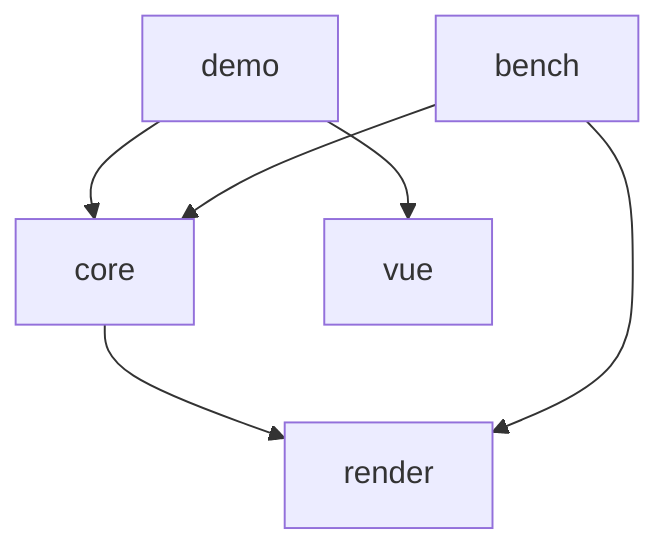

# 架构梳理 第 3 轮（architecture-round-3）

> 本文是第 3 轮优化（P6）的唯一依据：第 3 轮的全部代码改动只允许出自本文，尤其是文末「第 3 轮优化清单」。
> 范围：`packages/render`、`packages/core`、`packages/utils`、`apps/demo`、`apps/bench` 全量源码通读（2026-09-18 快照，第 2 轮优化 R2-1～R2-10 全部落地后的代码现状）。
> 背景：`.agents/analysis/layer-architecture.md` 与 `ultra-ui-sheet-gap.md` 仅作参考，未修改；`architecture-round-1.md`、`architecture-round-2.md` 用于定位前两轮优化前后的差异，同样未修改。第 1 轮（P2）10 项（round-1 §6.1～6.10）与第 2 轮（P4）10 项（round-2 §6 R2-1～R2-10，R2-8 经返工修复测量缓存失效回归）均已落地并评审通过，本文按两轮优化后的现状独立完整固化，与 round-2 的差异在相应小节以「第 2 轮后：」标注。

## 1. 总览

多包单体的 canvas 表格引擎。分层为「自研渲染引擎（render）→ 表格主体（core）→ 应用（demo/bench）」，包间只经显式公共入口（`src/index.ts`）与窄接口（`RenderHost`/`LayerHandle`/`SceneNode`/`SceneEvent`）耦合。代码量（第 2 轮后）：render 12 文件约 1.1k 行源码、core 33 文件约 5.7k 行源码（list-table.ts 主类 946 行 + scene/media/interaction/internal 四个协作模块）、utils 骨架（1 文件）、demo Vue 应用（sections 装配 + views 薄壳 + 页内冒烟）、bench headless/浏览器双入口基准（8 文件）。测试 35 个文件（render 5 + core 30）349 项，P4 返工后全过。

核心设计决策（阅读确认，第 2 轮后仍成立）：

1. **场景树窗口内建 + 三档失效**：core 只在可视窗口内建场景节点，变更经 cell/band/full 三档失效登记，帧末单帧收敛后按层消费脏区增量补画或整层重绘，由浏览器合成上屏。
2. **ScrollManager 唯一滚动状态源**：全部滚动入口收敛到一个 clamp 后广播 `(state, delta)` 的状态机，`ListTable` 订阅它驱动窗口更新；滚动帧为增量窗口——滚出行列摘除、滚入行列补建、存活节点原地平移；窗口 start 定位与命中定位共用二分下界内核（第 2 轮 R2-1），滚动帧成本与滚动深度、总行数均无关。
3. **结构化最小接口**：render 的 `RenderContext`/`RenderCanvas`、事件的 `DomEventLike`/`EventTargetLike`、编辑的 `TextEditorHost`/`TextEditorDoc` 全部是结构化类型（真实 DOM 类型天然满足），换取测试/headless 可注入假实现，不引 DOM 依赖。
4. **数据供给三形态叠加**：`records/columns` 数组、按格 hook（纯函数同步 O(1)）、模型事件订阅（`TableModel` + `ModelBinding` echo 防回环），经 `CellValuePipeline` 统一取值。
5. **图片无闪协议**：cell 级 `MediaCache` LRU + URL 级 `ImageService` 窗口化加载（idleQueue 就绪队列补位 + 引用裁剪收窄调度扫描面，第 2 轮 R2-7），就绪位图同步可查，首帧直接画位图；未就绪且在占位延迟内连占位都不画。

第 2 轮优化后的量化基线（headless，`apps/bench/results/bench-2026-09-17T20-44-19-412Z.json`）：TTFF P50 0.6ms、稳态滚动平均 FPS 21467.7、JS 侧帧耗时 P95 0.07ms、稳态/hover 单帧 body 失效面积/视口 0.950、body full 次数 0/0/0。第 3 轮任何优化以此基线对照防退化。

## 2. 模块划分

### 2.1 packages/render —— 自研 canvas 渲染引擎

公共入口 `src/index.ts`：仅显式导出 `createRenderHost`、`SceneNode`、类型（`RenderHost`/`LayerHandle`/`LayerKind`/`Invalidation`/`Region`/`RenderHostOptions`/`SceneNodeInit`/`SceneEventListener`/`SceneEvent` 等）。**第 2 轮后：package.json dependencies 块已整体移除（R2-3），render 成为真正的零依赖底层**——src 零 import 任何 `@infinite-table/*` 与第三方运行时依赖。

| 文件 | 职责 | 关键点 |
| --- | --- | --- |
| `src/render-host.ts` | `CanvasRenderHost`：`RenderHost` 窄接口唯一实现 | `createLayer` 幂等（同 kind 复用），建层同时调 `eventSystem.invalidateRoots()` 失效层根缓存；`flush()` 按 `LAYER_ORDER`（ground→body→media→sky）逐层消费；`mount()` 按 `LAYER_ORDER` 用 `insertBefore` 插到首个已挂载的更上层之前，惰性创建的层 DOM 叠放与声明 z 序一致；`measure` 缺省用惰性测量画布；`destroy` 取消挂起帧、解绑事件、清池、摘 canvas |
| `src/frame-scheduler.ts` | 帧调度：多次 `requestFrame` 收敛到同一帧 | `Set<FrameTask>` 去重 + 单 handle；宿主用稳定引用 `flushTask` 保证同帧多次失效只 flush 一次；非浏览器环境退化 `setTimeout(16)` |
| `src/invalidation/invalidation-queue.ts` | 失效队列：按层收集三档失效并合并，帧末 `drain` 出重绘计划 | 常量 `CELL_SPREAD=10`（cell 失效四边外扩防残影）、`MAX_BANDS=8`（超限升级 full）；`LAYER_CONSUMPTION`：ground `band-full-only`、body/media `regions`、sky `always-full`，`Record<LayerKind,…>` 让 TS 强制补全新层 |
| `src/layers/canvas-layer.ts` | 单层 canvas：一棵场景树 + 一个失效队列 | `flush()` → `render(plan)`：full 时 `clearRect` + `paintTree`；regions 时逐 region `clip` + `clearRect` + `paintTree(root, ctx, dirty)`（cull 裁剪跳过不相交子树）；`translateBy` blit 快路径与 `setSize` 均带「预留能力：当前 core 无调用方」显式注释，仅测试覆盖 |
| `src/pool/canvas-pool.ts` | 离屏 canvas 池：按物理像素宽高分桶复用 | `maxSize=16`，供 blit 自拷贝等短生命周期离屏画布 |
| `src/scene/scene-node.ts` | 场景树节点：局部坐标 + children 顺序绘制 | `visible`/`pickable`（false 时命中穿透、子节点仍可命中）；`paint` 是子类覆盖点；`on/off/handleEvent` 场景事件监听（Set，派发期退订安全）；`removeChild` 用 `indexOf+splice`（O(子节点数)——R2-5 后滚动帧仅剩清扫摘除与表头容器单节点重挂两类调用，见 §6 R3-1 的成本来源分析） |
| `src/scene/paint.ts` | 绘制遍历 `paintTree` | 先绘自身再按 children 顺序（后画在上）；cull 提供时整棵子树包围盒不相交即跳过；每节点一对 `save/restore` + `translate` |
| `src/scene/hit-test.ts` | 命中测试 | 从 children 末尾倒序递归，返回最深层、绘制最靠上的可拾取节点 |
| `src/events/event-system.ts` | 事件系统：DOM 事件归一化为场景事件 | 指针/滚轮/键盘/触摸 11 类；坐标减 `getBoundingClientRect`；触摸取 `changedTouches[0]`；命中自顶向下跨层（sky→media→body→ground 的 root 序），命中后沿 parent 链冒泡；键盘不命中，从最顶层根派发；`rootsCache` 缓存层根数组、`invalidateRoots` 由宿主建层时通知失效。**第 2 轮后（R2-9）：`wheel` 与 `SceneEventType` 对应成员已注释标注「预留事件：当前无场景级订阅方，滚轮由宿主直连容器」** |
| `src/region.ts` | 矩形代数 | `intersects`/`union`/`spread`/`ceil`/`clip`/`equals`，纯函数 |
| `src/types.ts` | 公共类型 | `LayerKind` 四层；`Invalidation` 三档（cell 可带 `prevRegion` 双包围盒）；`RenderContext`/`RenderCanvas` 结构化最小子集；`LayerHandle.setSize/translateBy` 带预留标注 |

测试在 `tests/`（镜像 src 结构），`fake-canvas.ts` 提供假画布。

### 2.2 packages/core —— 表格主体

公共入口 `src/index.ts`：显式导出 `ListTable`、`ScrollManager`、`SheetModel`、`ModelBinding`、取值/样式/布局/主题/选区/交互/编辑/图片/浮动对象全量公共 API 与类型。package.json 仅声明 `@infinite-table/render`。

**主类与协作模块（第 1 轮 6.6 拆分形态，第 2 轮后现状）**

| 文件 | 职责 | 关键点 |
| --- | --- | --- |
| `src/list-table.ts`（946 行） | ListTable：公共 API、装配（构造/几何变更/滚动主循环）、refreshCell、样式投影 | 构造顺序：主题 → 几何 → `CellValuePipeline` → 冻结数 clamp + 合并区校验 → host（注入或缺省创建，`ownHost` 记归属）→ body/sky 两层 → `ImageService` → `InertiaScroller` → `InteractionOverlay` → ScrollManager 视口/内容尺寸 → `onScroll` 订阅 → 图片窗口先就位 → `ModelBinding` → `EditManager` → `bindInteractionEvents` → `rebuildScene` + body full → 插件注册。内部成员统一标注 `@internal`（公共 API 以 src/index.ts 导出为准）；协作模块以 ListTable 实例为参数只触碰 `@internal` 成员。**第 2 轮后：`resolveStyle` 已补 `@internal` 标注（R2-4）；新增 `@internal headerGroup` 成员（R2-5，body 表头容器，恒为 root 末子节点）** |
| `src/list-table-scene.ts`（513 行） | 场景全量重建与滚动帧增量窗口 | `rebuildScene`（清树重算窗口、分带建格：滚动带 → 部分可见合并区 → 冻结列带 → 冻结行带 → 冻结角 → 表头容器挂 root 末子）；`updateSceneWindow` 五步增量（① sweepWindowNodes 摘滚出/存活平移（图片格清扫时回调 `releaseRef`，R2-7）→ ② 新滚入行整行降序补建 → ③ 存活行补建滚入列（降序）+ 左侧溢出存活格升序重挂 → ④ 主格窗外但区间部分可见的合并主格补建 → ⑤ 表头增量维护在容器内进行，bodyChanged 时容器单节点重挂树尾，R2-5）；**z 序契约以文档注释固化在 `updateSceneWindow` 头部（R2-6）：三条规则 + 步骤 ③ 扫描口径边界，标注「改动步骤 ②③⑤ 前必读」**；`textOverflowLimitX`/`overflowSourceCol` 溢出右界支撑；`appendCell` 带已存在守卫并返回是否新建 |
| `src/list-table-interaction.ts`（430 行） | 交互接线 | 指针/触摸/键盘/contextmenu 场景事件接线（双击进编辑走指针事件流 detectDoubleTap）、拖选/resize 会话/填充柄、`cellAt`/`cellRectInViewport`/`ensureCellVisible` 命中与跟随、`refreshOverlay`（空浮层零开销） |
| `src/list-table-media.ts`（142 行） | media 层与 ImageService 接线 | media 层惰性创建、`appendImageCell`（无闪协议执行点）、`refreshImageCell`、`onImageServiceLoad`（位图写回 + MediaCache 回填 + cell 定向失效）、`updateImageWindow`（视口外扩 240px 谓词） |
| `src/list-table-internal.ts`（29 行） | 共享常量与纯辅助 | `HEADER_COORD=-1`、`assertMergesWithinBoundary`；**cellKey 无本地实现——自 `cell-range.ts` 转出维持协作模块既有 import 路径（R2-2 后 cellKey 全仓唯一定义在 cell-range）** |

**状态与纯逻辑**

| 文件 | 职责 | 关键点 |
| --- | --- | --- |
| `src/scroll-manager.ts` | 唯一滚动状态源 | `scrollTo` clamp 到 `[0, max]`，位置未变不广播；`setContentSize/setViewportSize` 后自动回夹 |
| `src/grid-layout.ts` | 网格几何纯函数 | 行/列前缀和 offsets（支持逐行高覆盖）；**共享二分下界内核 `lowerBoundIndex`（第 2 轮 R2-1）：`computeColWindow`/`computeRowWindowFromOffsets` 的 start 定位与 `findIndexAt`（`findRowAt`/`findColAt` 命中）复用同一内核，「并列取右端」语义一致，滚动帧窗口计算与命中定位均为 O(log n)**；end 短程扫描保留；冻结可滚动区窗口 `computeScrollable*(FromOffsets)`（滚动位置换算回全量坐标后夹到滚动区）；层坐标 `resolveCellX/resolveCellY(FromOffsets)`；`unionRegions`。`computeRowWindow`/`computeScrollableRowWindow`（等行高版）/`resolveCellY`（等行高版）当前仅公共出口与测试触达，无生产调用方 |
| `src/cell-value.ts` | `CellValuePipeline` 取值管线 | 基础值优先级 model > records[field] > undefined（rowCount 兜底）；`resolveText` 末端过 `resolveDisplayValue`；`resolveValue` 不过 hook（checkbox 态、编辑初值口径） |
| `src/selection.ts` | `SelectionState` 选区状态机 | `ranges[]`（start 锚点/end 焦点，可反向）+ `focus`；拖选/整行整列/全选/多段 `selectCells`/`addRange`（Ctrl 加选）；`emitDepth` 防重入广播；`applyExternal` 不广播防回环；shift 扩展锚点取末段 start |
| `src/hover-state.ts` | `HoverState` | 悬停格跟踪，地址未变不广播 |
| `src/keyboard-navigation.ts` | 键盘导航纯函数 | `nextActiveCell`（方向/Tab，越界夹取）；`revealAxis` 单轴滚动跟随最小位移 |
| `src/resize.ts` | 行列 resize 纯逻辑 | `hitResizeHandle` 阈值带内边缘二分定位（`firstEdgeAtLeast` 下界）；`ResizeSession` 起始尺寸 + 位移夹取（MIN 20）；能力开关 `canResizeCol/canResizeRow` |
| `src/touch-scroll.ts` | 触控滚动 | `TouchScrollTracker` 最近 4 点采样；`InertiaScroller` 16ms 基准摩擦 0.95 幂次衰减，双轴低于 0.05px/ms 停止；帧调度与时间源可注入 |
| `src/fill-handle.ts` | 填充柄交互原语 | 焦点段解析、柄方点几何（8px 骑角点）、命中；`FillHandleDownEvent`/`FillDragEndEvent`（内核不产生填充值） |
| `src/cell-range.ts` | 合并区间数据结构 | `CellRange` 归一化/包含/跨冻结边界判定；`MergeCellMap` 构造时归一化 + 重叠抛错，`byCoord` 数值 key 逐格索引；**`cellKey`（`row * 2^21 + col`，`CELL_KEY_COL_BITS=21` 常量与边界注释）是全仓唯一定义（第 2 轮 R2-2），list-table-internal 转出共享** |

**渲染内容与样式**

| 文件 | 职责 | 关键点 |
| --- | --- | --- |
| `src/cell-node.ts` | `CellNode` 场景节点 | paint 顺序：背景 → 内容（自定义 renderer 或 `BUILTIN_CELL_RENDERERS[cellType]`）→ 逐边边框；**文本测量宽缓存按「font 串 + text 值」命中（第 2 轮 R2-8 返工后口径）：style 引用变化只重算 font 串并与缓存比较、font 串变了才使宽度失效重测，style/text 均未变的热路径零字符串分配——可观测语义与「font+text 键」一致**；边框 `paintEdge` 支持 solid/dashed/dotted/double |
| `src/cell-renderer.ts` | 内置渲染器 | `renderTextCell`：对齐 × 垂直、padding 内缩、textOverflow ellipsis（二分前缀）/clip、未设置时 Excel 式溢出、`textWrap` 逐字贪心断行（`\n` 强制分段）、下划线/删除线；`renderCheckboxCell` 方框+勾选实心块。注意 `renderTextCell` 每次绘制仍自行调 `cellStyleFont(style)` 组装 font 串（§6 R3-2） |
| `src/cell-style.ts` | 结构化样式与投影 | `CellStyle` 全字段；`projectCellStyle` 逐字段覆盖、边框逐边独立合并、返回新对象；`cellStyleFont` 组装 CSS font 串 |
| `src/theme.ts` | 主题系统 | `defaultTheme`（几何 + body/header 两分区 token）；`extendsTheme(override, base)` 按键浅展开深覆盖 |

**编辑链路**

| 文件 | 职责 | 关键点 |
| --- | --- | --- |
| `src/editing/edit-manager.ts` | `EditManager` 编辑状态唯一源 | 可编三级判定；同格幂等、异格先提交；提交顺序：取值 → 关浮层 → 写回 → refreshCell → emitChange → 选区移动 → 焦点归还；`followAnchor` 逐帧对齐锚定格、滚出视口按 Enter 语义自动提交；`detachedHost` 离屏兜底 |
| `src/editing/text-editor.ts` | DOM 浮层文本编辑器 | 单行 input/多行 textarea；DOM 依赖收敛在最小结构接口；open/moveTo（不重挂载不抢焦点）/getValue/close（幂等）；Esc/Enter/Tab 拦截后回调 |
| `src/editor-registry.ts` | `EditorRegistry` | 注册表 + 格级路由（route hook 优先于列定义 editor）；`CellEditor` 接口目前是占位 |
| `src/model-binding.ts` | `ModelBinding` | 订阅外部模型变更 → 局部刷新；`writeBack` 期间 `echoDepth` 吞 echo 防回环 |
| `src/sheet-model.ts` | `SheetModel` | 内置内存坐标模型（`TableModel` 实现）：二维数组存取、写值同步广播、`setRowCount` 扩缩 |

**图片与浮动对象**

| 文件 | 职责 | 关键点 |
| --- | --- | --- |
| `src/media/image-service.ts`（431 行） | `ImageService` URL 级资源服务 | 状态机 idle→loading→ready/error；`request` 登记 cell 引用（`refs` Map，字符串 key）；idleQueue 窗口内 idle 待加载队列，`pump` 按登记序消费补位、出队惰性清理；`updateWindow(谓词)` 单趟重估条目：窗口内 idle 入队、滚出 loading 取消降级（generation 代际丢弃迟到结果）、**取消降级后引用已空的条目直接脱离跟踪面（第 2 轮 R2-7）**；**新增 `releaseRef(url, cell)` 引用裁剪原语（R2-7）：格滚出被清扫时由宿主接线移除单格引用，idle/error 态且引用裁光的条目随即脱离跟踪面；带 `onSettled` 的浮动对象引用对其免疫（生命周期跟随对象本身）**——滚动帧窗口调度扫描面从 O(累计条目) 收窄到 O(活跃窗口引用)；LRU 双预算（256MB/1000 条）逐出优先窗口外；`hasResource` 纯查询不动 LRU 序；`placeholderDelay` 80ms；`setUrlResolver` 鉴权钩子；error 必触发 `onImageError` |
| `src/media/media-cache.ts` | `MediaCache` cell 级位图 LRU | 泛型，Map 迭代序即 LRU 序，bytes/count 双预算逐出 |
| `src/media/image-cell-node.ts` | `ImageCellNode` media 层节点 | 无闪协议执行点：无位图且未到 `placeholderAfter` 本帧不画；有位图画白底+fit 位图；超时画确定性灰底占位；`viewportClip` 与 body 视口求交裁剪 |
| `src/media/draw-image.ts` | media 共享绘制助手 | 确定性占位、fit 语义（图片格与浮动对象共用） |
| `src/float/float-object-layer.ts` | `FloatObjectLayer` 格上浮动对象 | 承载容器挂 sky root 末尾（层内最顶）；独立对象树；锚点经注入 `FloatGeometry` 换算层坐标，`syncPositions` 滚动/结构变更后帧级重排 + sky full 失效；add/remove/update cell 定向失效（update 带 prevRegion）；图片经共享 `ImageService`（`onSettled` 回调链路，引用不受 releaseRef 裁剪）；`onChange` 抛变更；`getAt` 倒序命中 |
| `src/plugin.ts` | `TablePlugin` 接口 | `mount(table)`/`unmount?`，注册即生效、销毁逆序卸载；实现仍在规划包 packages/plugins |

**交互浮层**

| 文件 | 职责 | 关键点 |
| --- | --- | --- |
| `src/interaction-overlay.ts` | `InteractionOverlay` sky 浮层 | `OverlayNode`（pickable:false 穿透）paint：整体 clip 到 bodyViewport → hover 三级 → 选区多段裁剪 → 填充柄 → resize 指示线；`update(content)` 返回是否有内容，调用方仅在（或曾在）有内容时提交 sky full 失效；选区/hover 颜色为模块内常量（非主题 token） |

### 2.3 packages/utils —— 表格域专用工具

`src/index.ts` 仅导出 `UTILS_PACKAGE_NAME` 常量（第 1 轮 6.5 按回退案保留，避免 lint no-empty-file），是骨架包。无任何包 import 其内容；**第 2 轮 R2-3 后 render/package.json 的声明已删除，全仓对 utils 的 package.json 声明归零**，utils 成为零依赖、零消费方的纯骨架（保留理由：DEV-STANDARDS 规划的表格域专用工具收口位）。

### 2.4 apps/demo —— 浏览器演示与冒烟

Vue 3 应用（vite-plus 构建）。结构：`App.vue`（hash 路由左侧菜单 7 项 + `?smoke=1` 冒烟模式直挂五演示区并跑 `runSmoke`）→ `views/*.vue` 薄壳 → `sections/*.ts` 演示装配（真实逻辑所在）：`data-forms`（三形态 + DemoModel 防回环计数）、`display`（10 万行/冻结/合并/逐边边框/自定义渲染/checkbox/主题 extends，像素锚点常量集中顶部）、`interaction`（拖选/hover/resize/键盘/触控/批量更新/contextmenu/onScrollFrame）、`media`（格内图片 + 浮动对象，`demoLoadImage` 本地 40ms 假加载）、`editing`（SheetModel 编辑闭环 + API 按钮）、`sheet`（样式三级覆盖链矩阵/\n 多行合并区/填充柄预置选区/运行时冻结合并切换/editCellOnEnter 重建/`window.__SHEET_DEMO__` 调试句柄）。

公共件：`mount.ts` 的 `mountTable`（容器 + ListTable + 滚轮接线）、`addButton/addStatus/createSection`、`demoLoadImage`。**第 2 轮后（R2-10）：滚轮接线（`attachWheel`，返回退订函数）与 dpr 解析（`resolveDpr`，冒烟模式锁 1）收敛为 `mount.ts` 单一导出，`mountTable` 与 `components/InfiniteTable.vue` 共用**；`InfiniteTable.vue` 在 `onUnmounted` 调退订并 `table.destroy()`。滚轮接线/dpr 锁定逻辑全仓单份。

`smoke.ts` 页内冒烟：五演示区逐项断言（32 项）——层 canvas 就位与首帧像素、三形态取值、防回环计数、像素级显示能力、合成事件交互全链路、图片加载与无闪回滚、浮动对象跟随、编辑闭环；结果写 `window.__SMOKE__` 与 `document.title`。`scripts/smoke.mjs`：vp build → preview（固定端口 54173）→ playwright-cli 打开 `?smoke=1` → 轮询结果 → 退出码。

### 2.5 apps/bench —— 量化基准

headless（`bun src/headless.ts`：`NoopCanvas`/`NoopContext` 绘制 no-op、手动帧泵数组、`FakeEventTarget` 手工派发 pointermove）与 browser（`src/main.ts`：真实 canvas + rAF，报告上页面 + `window.__BENCH_REPORT__`）双入口共用同一份场景逻辑（`scenarios.ts` 只依赖 `BenchEnv` 抽象）。三个场景：TTFF（构造+首帧 flush，P50 ≤ 80ms）、稳态滚动 FPS（10 万行 × 300 帧 × 120px，≥55fps）、失效面积收敛（稳态滚动/hover 并发 body 面积 ≤ 1× 视口、full 次数必须为 0；快跳无 full）。`invalidation-meter.ts` 装饰器包装 `RenderHost` 拦截 `submitInvalidation` 按层计量，帧间 `drain`。`thresholds.ts` 集中达标口径，报告 JSON 落档 `results/` 作防回归基线，未达标非零退出。

### 2.6 规划位与工程底座

`packages/formulas`（公式引擎）、`packages/plugins`（官方插件）为规划目录，无代码。根 `vite.lib.config.ts` 统一库构建（ESM，`@infinite-table/*` 外部化）；`scripts/check-core-deps.ts` 扫描 core 的 @visactor 依赖（import 正则 + package.json 声明双向）。

## 3. 依赖关系

### 3.1 代码实际依赖边（以 package.json 声明 + src 实际 import 双重核实）



- **core → render**：唯一真实的包间代码边（src 18 处 import，全部指向 `@infinite-table/render`）。core 全部经 render 公共入口触达：`createRenderHost`（list-table 构造）、`SceneNode`（cell-node/image-cell-node/interaction-overlay/float-object-layer/list-table-scene 的表头容器）、类型（`Region`/`RenderContext`/`LayerHandle`/`SceneEvent`/`RenderImageSource` 等）。render 对 core 零感知，方向单向。
- **core → utils / render → utils**：均为零（R2-3 后声明与 import 双侧为零）。
- **utils**：零依赖、零消费方。
- **@cat-kit/core**：全仓零 import、零 package.json 声明。
- **应用侧**：demo 依赖 core + vue（devDep `@vitejs/plugin-vue`）；bench 依赖 core + render（经 `InvalidationMeter.wrap` 装饰 `RenderHost` 计量，窄接口可装饰性的实例）。
- **第 2 轮后依赖图与 round-2 的差异**：round-2 §3.1 中的虚线「render -.未消费声明.-> utils」已随 R2-3 消除，依赖图中不存在任何与功能耦合不符的边。

### 3.2 禁止依赖核查（本节为 P5 任务要求的实际核查结论）

1. **core 无 `@visactor/*` 引用**：`grep -rn "@visactor" packages apps scripts` 全仓仅命中 `scripts/check-core-deps.ts` 自身的禁用正则字符串；本轮实跑 `bun run check:deps` 输出「check:deps 通过：packages/core 对 @visactor/* 零依赖」。DEV-STANDARDS「零 vrender」在源码与依赖声明两侧均成立。
2. **无 `export *` 转售公共 API**：`grep -rn "export \*" packages/*/src apps/*/src` 零命中（唯一命中是 core/index.ts 与 utils/index.ts 的禁令注释）。三个包入口全部显式逐名导出，符合 DEV-STANDARDS。
3. **render 零依赖核查**：`packages/render/package.json` 无 dependencies 块；render/src 对 `@infinite-table/*` 与第三方运行时依赖零 import（R2-3 落地后复核）。

### 3.3 层内耦合结构

- render 包内：`render-host` 是唯一组合根（持 scheduler/pool/eventSystem/layers 表）；`CanvasLayer` 依赖 `InvalidationQueue`/`CanvasPool`/`paintTree`/region 工具；事件系统经 `rootsTopDown` 回调取层根（缓存复用），与层集合解耦。层集合扩散点三处：`LayerKind`（types）、`LAYER_ORDER`（render-host）、`LAYER_CONSUMPTION`（invalidation-queue），`Record` 类型让编译器强制补全。
- core 包内：`list-table.ts` 是唯一组合根，其余模块要么是被调用的纯逻辑/状态机（不反向依赖 list-table），要么经构造期闭包注入（`EditManagerInit`/`OverlayGeometry`/`FloatGeometry`/`EditWriteTarget` 全部是注入式回调，模块不 import list-table）。协作四模块（scene/media/interaction/internal）以 ListTable 实例为参数、只触碰 `@internal` 成员、不进公共入口；`plugin.ts` 是唯一 import list-table 类型的非协作模块（`TablePlugin.mount(table: ListTable)`）。模块间 import 方向：scene → media（appendImageCell）、scene/interaction/media → internal、internal → cell-range（cellKey 唯一定义所在，无更底层依赖，全仓无 import 环）。
- 应用侧：demo/bench 只触达 core 公共入口 + render 的 `createRenderHost`。

## 4. 核心数据流

### 4.1 滚动主链路（ScrollManager → 增量窗口 → 分层 band 失效）

```text
入口（多归一）                        状态收敛                          渲染后果
滚轮（宿主 attachWheel 接线）   ┐
触控 touchmove（TouchScrollTracker）├─→ ScrollManager.scrollBy/scrollTo
惯性 InertiaScroller 每帧       │      （clamp 到可滚动内容；位置未变不广播）
键盘 revealAxis 跟随           │              │ (state, delta) 广播
程序化 scrollTo/setScrollTop…  ┘              ▼
                                    ListTable.onScroll(delta)
                                    1. updateSceneWindow()（增量窗口五步）：
                                       computeScrollable*(FromOffsets) 求新窗口
                                       （start 二分定位，R2-1，O(log n)）→
                                       ① sweepWindowNodes：滚出行列节点摘除出索引，
                                         存活数据格/图片格原地平移（x/y 重算，零重建）；
                                         图片格摘除时回调 imageService.releaseRef（R2-7）
                                       ② 新滚入行整行补建（滚动区列降序 → 冻结列降序）
                                       ③ 存活行补建滚入列（降序）+ 可溢出进新列区的
                                         左侧存活格升序重挂（保「越靠左越后画」）
                                       ④ 主格窗外但区间部分可见的合并主格补建
                                       ⑤ 表头增量维护在 headerGroup 容器内
                                         （平移/摘除/补建）；bodyChanged 时容器
                                         单节点重挂树尾（R2-5，保「表头最上」）
                                       构造与 applyGeometryChange 仍走全量 rebuildScene
                                    2. delta.dy≠0：body（及已建的 media）提交一条横带 band
                                       （y 从 列头高+冻结行高 起，覆盖行号列/冻结列/滚动区）
                                       delta.dx≠0：纵带（x 从 行号列宽+冻结列宽 起）
                                       ——冻结角与对侧冻结区永不重绘
                                    3. updateImageWindow()：窗口化加载调度（划入提权/滚出取消）
                                    4. floatLayer.syncPositions()（有浮动对象时，sky full）
                                    5. refreshOverlay()（sky：选区/hover 随新窗口几何重算）
                                    6. scrollFrameListeners 非空 → requestFrame(scrollFrameTask)
                                       （稳定引用，同帧多次滚动只广播一次）
```

滚动位置语义：定义在「可滚动内容」（总内容扣除冻结区）上；`toContentX/Y` 做视口→内容换算（冻结区内不加滚动量）。

### 4.2 多 region 失效与重绘（render 主循环）

```text
core（各处）submitInvalidation(kind, inv)
  → InvalidationQueue.push：
      full：清空队列置 full 位
      cell：双包围盒 union（有 prevRegion）→ spread(10px) → ceil 像素对齐 →
            被既有 band 覆盖则丢弃 → 与既有 cell 去重后登记
      band：吸收并删除相交 cell → 去重登记 → 数量 >8 升级 full
  → CanvasLayer.invalidate → scheduleFlush（宿主稳定 flushTask）→
FrameScheduler（单帧收敛：Set 去重任务，一帧一次）
  → flush：按 LAYER_ORDER 逐层 CanvasLayer.flush()
      → queue.drain() 出 RepaintPlan：
          sky 恒整层（always-full）；ground 只出 band；body/media 出 band+cell regions
      → render(plan)：full：setTransform(dpr) + clearRect + paintTree
                      regions：逐 region clip + clearRect + paintTree(root, ctx, dirty)
                               （cull：子树包围盒不相交整棵跳过）
  → 分层 canvas 由浏览器合成上屏
```

同帧多源失效（多张图片同帧加载完成、批量更新）天然被队列收敛；`batchUpdate` 在 core 侧先把多次 `refreshCell` 的 region 收集合并为一次 band 提交，再经队列二次收敛。

### 4.3 编辑提交回写

```text
触发：双击/双触（pointerup 事件流 detectDoubleTap：同格、≤400ms、≤10px）
      或 API startEdit / editCellOnEnter 下的 Enter
  → ListTable.startEdit：选区落格 + ensureCellVisible → EditManager.startEdit
      可编三级判定：EditorRegistry.resolveEditor（route hook → 列 editor 声明）
                    ∧ options.resolveEditable(col,row)
                    ∧ writeTarget.canWrite（model 形态恒可写；records 需列有 field 且行对象存在）
  → createTextEditor（input/textarea）open：挂 container、按 cellRectInViewport 定位、
      初值 = pipeline.resolveValue（基础值口径，不过 resolveDisplayValue）、聚焦
  → 编辑中滚动：onScrollFrame → followAnchor 逐帧 moveTo 对齐锚定格；
      锚定格滚出视口（cellRect null）→ commitEdit('down') 自动提交不丢内容
  → 提交 Enter/Tab（Esc 取消：close 不回写不抛事件）
      commitEdit：editor.getValue → writeTarget.write
        ├─ model 形态：ModelBinding.writeBack（echoDepth++ 吞模型 echo 防回环）
        └─ records 形态：record[field] = value
      → refreshCell（cell 级失效，含溢出新旧区与来源格联动）→ emitChange(onCellChange,
        col/row/oldValue/newValue) → moveSelection（Enter 下移 / Tab 右移）→ 焦点归还容器
外部模型变更（不经表格）：model.onCellChange → ModelBinding（非 echo 期放行）
  → refreshCell 局部刷新；表格回驱 updateCell 同走 writeBack + refreshCell
```

### 4.4 图片窗口化加载（无闪协议 + 引用裁剪）

```text
rebuildScene/updateSceneWindow → appendCell：resolveCellImage(col,row) 命中
  → body 节点只画背景/边框（文本留空，不参与溢出）
  → appendImageCell：media 层惰性创建（首个图片格出现时）→ 建 ImageCellNode
      （placeholderAfter = now + placeholderDelay；bodyViewport 裁剪传入）
  → 取图序：MediaCache.get("image:col:row:WxH") → ImageService.getBitmap(url)
      ├─ 命中：setBitmap 首帧直接画位图（滚动回访无闪；cache miss 时回填 MediaCache）
      └─ 未命中：imageService.request(url, cell) 登记引用 + 入 idleQueue
  → 每次滚动 updateImageWindow：窗口 = 可视区域外扩 240px
      单趟重估跟踪面条目（R2-7 后 = 活跃窗口引用 + ready 条目 O(1) 状态检查）：
      窗口内 idle 入 idleQueue 提权；滚出的 loading 取消降级（generation 丢弃迟到结果，
      引用已空则脱离跟踪面）；pump 按 idleQueue 登记序补位（并发 ≤10）
  → 格滚出窗口被清扫：sweepWindowNodes 回调 releaseRef(url, cell)（R2-7）
      移除单格引用；idle/error 且引用裁光 → 条目脱离跟踪面；
      带onSettled 的浮动对象引用免疫（滚回后 onSettled 不丢）
  → 滚回窗口：appendImageCell 的 request 重登记引用（MediaCache/服务命中即无闪）
  → 加载完成：startLoad 回调（代际校验）→ ready 入 LRU（bytes 估算 W×H×4，
      双预算 256MB/1000 条，优先逐出窗口外）→ onImageLoad(e)
  → ListTable.onImageServiceLoad：写回引用该 URL 的可见格节点 + 回填 MediaCache
      → media 提交 cell 级失效（node 全包围盒；同帧多图由失效队列收敛）
```

浮动对象图片走同一 `ImageService`（`request` 的 `onSettled` 回调链），加载完成只定向失效该对象区域。

### 4.5 交互浮层与事件

```text
DOM 事件（container）→ EventSystem 归一化（场景坐标 + 触点/键位；层根缓存复用）
  → 命中：sky→media→body 逐层 hitTest（浮层节点 pickable:false 穿透，实际总命中 body；
      表头容器 pickable:false，未命中表头子节点时穿透到数据格）
  → 命中节点沿 parent 链冒泡 → body root 监听器分派：
      pointerdown：编辑中点外先提交 → resize 手柄命中（4px 阈值，二分）开 ResizeSession
                  → 填充柄命中开 fillDrag 会话 → 左上角全选 / 列头整列 / 行号整行 /
                  数据格 beginDrag（ctrlMultiSelect 开启且 Ctrl/Cmd 时 addRange）
      pointermove：resize 拖拽只更新 sky 指示线（提交在 pointerup 一次生效）
                  → fillDrag 跟踪终点格 → 拖选 updateDrag + ensureCellVisible
                  → 其余 hoverState.set（地址未变不广播）
      pointerup：resize 落地（setColWidth/setRowHeight → applyGeometryChange 全量重建
                  + onCol/RowResizeEnd）→ fillDrag 抛 onFillDragEnd（内核不写值）
                  → detectDoubleTap
      contextmenu / touch* / keydown（sky root 监听，编辑中让位给编辑器）
  → selection/hoverState onChange → refreshOverlay → InteractionOverlay.update
      （有内容→sky full；曾有过内容现在没有→补一次 full 清残影；全程零 body 重绘）
```

### 4.6 几何变更（resize/冻结/合并运行时）

`setColWidth/setRowHeight/setFrozen*/setMergeCells` → 重算 offsets 与冻结区尺寸 → `applyGeometryChange`：ScrollManager 视口/内容尺寸重设（自动回夹）→ `rebuildScene` 全量重建 + body full（media 已建则同样 full）→ `updateImageWindow` → float 同步 → overlay 刷新。合并区/冻结数变更先过 `assertMergesWithinBoundary` 校验（跨冻结边界抛错保持原状）。

## 5. 关键实现细节

1. **四层 canvas 与实际用量**：`LayerKind` 四层，core 只创建 body、sky，media 惰性（首个图片格出现时），ground 全仓从未创建——实际 2~3 个 canvas。sky 独立 backing store 的收益被真实消费：hover/选区/resize/填充柄全走 sky 整层重绘，body 零牵连（bench 场景 3 断言此性质）；media 收益真实（图片 onload 只重绘引用格）。`mount()` 按 `LAYER_ORDER` `insertBefore`，惰性创建的 media 正确插到 sky 之前。
2. **失效合并三档**：cell 归一化（双包围盒 union + 10px 外扩 + 像素对齐去重）、band 吸收相交 cell、band > 8 升 full、full 吸收一切；按层消费策略差异（ground 只 band、sky 恒 full、body/media 逐 region）。cell 失效外扩 10px 与 `paintTree` cull 配合防增量补画边缘残影。
3. **单帧收敛的稳定引用模式**：FrameScheduler 用 `Set<FrameTask>` 去重，宿主与 core 各持稳定任务引用（`flushTask`/`scrollFrameTask`），同帧多次触发只执行一次。
4. **滚动帧增量窗口（本架构最大热点路径，两轮优化后的形态）**：滚动帧成本组成——窗口计算 O(log n)（R2-1 二分）、存活节点 x/y 平移 O(窗口格数)（零重建零分配）、滚入建格 O(滚入格数)、滚出摘除 O(滚出格数 × 窗口子节点数)（`removeChild` 的 `indexOf+splice`，§6 R3-1 的优化对象）、表头维护在容器内 O(表头数)，容器重挂 O(1) 单节点（R2-5）。z 序等价性由三条规则保持（R2-6 已固化为 `updateSceneWindow` 头部契约注释）：整行列降序补建、左侧溢出存活格升序重挂、新建数据格后表头容器重挂树尾。
5. **body 表头容器（第 2 轮 R2-5）**：`headerGroup` 恒为 body root 末子节点，「表头最上」从每帧维护收敛为不变结构；容器自带全表包围盒且 `pickable:false`（paintTree cull 与 hitTest 都按节点自身包围盒判定，零尺寸容器会让表头被剔除或无法命中；pickable:false 使未命中表头子节点时穿透数据格）。
6. **列级样式投影缓存（第 1 轮 6.3）**：`resolveStyle`（`@internal`，R2-4）两级执行——token+列级合成按列缓存（`columnStyles`），仅按格 hook 返回非空才做第二级投影；同列未命中 hook 的全部数据行共享同一投影对象（CellStyle 全仓按不可变约定使用）。
7. **数值格索引 key（第 1 轮 6.4 + 第 2 轮 R2-2）**：`cellNodes`/`imageCellNodes`/`MergeCellMap.byCoord` 均用 `row * 2^21 + col` 数值 key；实现唯一定义在 `cell-range.ts`（边界：col < 2^21、row < 2^32 内唯一精确；表头 -1 坐标不入索引），list-table-internal 转出共享。`ImageService.refs` 仍用 `${col}:${row}` 字符串 key（请求路径，非滚动热路径，§6 R3-4 评估记录）。
8. **MediaCache LRU 双缓存体系 + 引用裁剪（第 2 轮 R2-7）**：URL 级（ImageService 内嵌，服务并发/取消/预算/idleQueue 补位/releaseRef 裁剪）+ cell 级（MediaCache，key 含格尺寸，滚动重建时命中即首帧无闪）。两层 LRU 均利用 Map 迭代序实现。cell 级 key 含 `WxH`：格尺寸变化自然 miss 重算，避免拉伸旧位图。滚动帧调度扫描面 = 活跃窗口引用（idle/error 无引用条目即时出跟踪面）+ ready 条目 O(1) 状态检查。
9. **CellNode 文本测量缓存（第 2 轮 R2-8 返工后口径）**：命中判定按「font 串 + text 值」——style 引用变化只重算 font 串比较，font 串变才使宽度失效重测；style/text 均未变的热路径零字符串分配。可观测语义与「font+text 键」一致（font 或 text 任一变化即重测），返工修复了首版「仅 text 变化重测」在「有效 font 变化而 text 不变」下的陈旧宽缺陷。
10. **主题 extends 派生与三级覆盖链**：`extendsTheme(override, base)` 基于 base 按键覆盖，body/header 分区浅展开；落到格样式经 `resolveStyle` 三级投影：主题分区 token → 列级 `style` 片段（textWrap 旗标并入主题层）→ 按格 `resolveCellStyle`。
11. **Excel 式文本溢出**：未设 textOverflow/textWrap 的左对齐 text 格向右溢出到相邻空格（`textOverflowLimitX` 扫 `isEmptyTextCell` 确定右界；冻结带不越带界；空文本格自身不扫描、非空格走廊 O(走廊长) 每格一次）；`refreshCell` 对新旧 `textMaxX` 双包围盒失效，并联动左侧溢出来源格（变空/变非空/保持为空三情形重算来源格右界）。
12. **无闪协议三条件**：`hasResource/getBitmap` 同步可查；未就绪在 `placeholderDelay`（80ms）内连占位都不画；加载完成 cell 定向失效单帧切换。error 态必触发 `onImageError`。
13. **防回环三处**：ModelBinding `echoDepth`；SelectionState `emitDepth` + `applyExternal` 不广播；InteractionOverlay `overlayHadContent`（浮层清空时补一次 full 后不再空转重绘）。
14. **合并区布局**：`MergeCellMap` 逐格索引 O(1) 查所属区间；被覆盖格不建节点，主格按覆盖带取完整尺寸；主格在窗口外但区间部分可见时补建（增量窗口的 keepCell 条件同样保留这类主格）；合并格取值/命中/失效全部路由到主格。
15. **结构化最小接口与测试注入**：render `RenderContext/RenderCanvas`、事件 `DomEventLike/EventTargetLike`、编辑 `TextEditorElement/Host/Doc`、bench `BenchEnv`、各模块 `ImageLoader/measureText/scheduleFrame/now` 全部可注入。35 个测试文件不依赖真实 canvas/DOM（`stub-host`/`fake-canvas`/`fake-editor-dom`/`recording-context`）；bench headless 同理跑完整表格逻辑。
16. **预留面（均带显式标注）**：`CanvasLayer.translateBy`（池化自拷贝 + L 形暴露带，未来滚动快路径接入点）与 `LayerHandle.setSize` 当前 core 无调用方、仅测试覆盖；ground 层注册路径存在但从未使用；`CellEditor` 接口为占位；场景 `wheel` 事件归一化派发但无订阅方（R2-9 已标注口径）。
17. **事件坐标与 DOM 解耦**：EventSystem 每次派发 `getBoundingClientRect` 换算；触摸取 `changedTouches[0]`；键盘不命中直接从最顶层根派发——headless 的 `FakeEventTarget` 仅需三成员即可驱动全部交互逻辑。

## 6. 第 3 轮优化清单

> 每项含改动范围与预期正向论证（性能/结构/可维护性至少一项）。P6 实施时逐项落地、逐项按 R3-4 的统一验证手段证明无退化；发现退化即回滚并记录。现状基线见 §1 末尾（bench-2026-09-17T20-44-19-412Z.json）。
>
> **本轮口径说明**：前两轮共 20 项优化落地后，本轮对全部热点路径（滚动帧、失效收敛、图片调度、命中定位、编辑回写、事件派发）与包结构做了全量复查。总体判断：**架构主干（分层失效、增量窗口、唯一状态源、窄接口、依赖单向）已达到设计目标且有两轮量化基线背书，剩余可论证的正向优化收敛为 2 项低风险微优化（R3-1/R3-2）**；其余复查中识别的候选项经逐项评估后判定「预期收益低于改动/接口成本或与既有契约冲突」，作为「评估后不实施」记录在 R3-3，防止后续轮次重复排查。因此本轮**不宣布「已达收敛状态」**（R3-1/R3-2 仍为可正向实施项），但也明确：两项实施完成并通过验证后，在现有需求边界（spec 非目标：不新增功能、不改变对外 API 行为）内架构即达收敛。

### R3-1 滚动帧清扫逐节点 removeChild → 批量摘除原语

- **现状**：`updateSceneWindow` 步骤 ① 的 `sweepWindowNodes` 对每个滚出节点单独调 `parent.removeChild(node)`——`SceneNode.removeChild` 含 `indexOf + splice`，单节点 O(子节点数)。R2-5 消除表头重挂后，这是滚动帧上剩余的最大数组操作项：bench 口径（1280×720 视口、100px 列宽、32px 行高）每帧滚出约 4 行 × 14 列 ≈ 56 个数据格，body root 子节点约 320 个（窗口数据格 + 表头容器），单帧约 56 × 320 ≈ 1.8 万次 `indexOf` 比较 + 56 次 `splice` 尾部搬移；宽表/高视口下按 O(滚出格数 × 窗口格数) 放大。该成本计入 bench 稳态滚动 JS 帧耗时 P95 0.07ms（占比可观）。
- **改动范围**：`packages/render/src/scene/scene-node.ts`（新增批量摘除原语，如 `removeChildren(predicate)`：写指针单趟原地压实、保序、O(children) 一次完成，返回被摘除节点；`children` 相对顺序不变，z 序语义不受影响）；`packages/core/src/list-table-scene.ts`（`sweepWindowNodes` 收集滚出节点后按父节点一次性批摘——数据格与图片格父节点不同，各批一次；存活平移与 `onSweep` 回调时序保持「摘除后回调」不变）。补测试：`packages/render/tests/scene/scene.test.ts`（批量摘除保序、只摘命中项、parent 置空）；全量回归 + bench 对照。
- **正向论证**：性能——滚动帧清扫从 O(滚出 × 窗口) 降为 O(窗口)，与 R2-1/R2-5 同方向的滚动帧热点收尾；语义等价（单趟压实保序），不改任何 z 序契约。
- **风险评估**：低。改动局限在 SceneNode 一个原语 + sweep 一处接线；既有 z 序/窗口测试（横向滚动增量补建保溢出 z 序、带内按列降序建节点、表头容器断言）直接护航。
- **实施记录（P6，2026-09-18）**：
  - 实际改动范围：`packages/render/src/scene/scene-node.ts`（新增 `removeChildren(predicate)` 批量摘除原语：写指针单趟原地压实、保序、O(children) 一次完成，返回被摘除节点并置空其 parent）；`packages/core/src/list-table-scene.ts`（`sweepWindowNodes` 收集滚出节点后按父节点一次批摘——数据格（body root）与图片格（media root）父节点不同各批一次，命中判定用 Set O(1) 查询；media 未建（parent 为 null）时跳过摘除只出索引，与原逐节点 `parent?.removeChild` 等价；存活平移与 `onSweep` 时序保持「摘除后回调」不变）。测试侧：`packages/render/tests/scene/scene.test.ts` 补 2 项（批量摘除保序压实、只摘命中项、parent 置空；无命中返回空数组且 children 原样）。
  - 正向论证：性能——滚动帧清扫从 O(滚出 × 窗口子节点数) 降为 O(窗口子节点数)（§「现状」的 bench 口径约 56 × 320 ≈ 1.8 万次 indexOf 比较/帧 → 单趟约 320 次判定），滚动帧剩余的最大数组操作项收尾；语义等价（单趟压实保序），未触碰 R2-6 z 序契约的步骤 ②③⑤。
  - 无退化说明：既有 z 序/窗口测试（横向滚动增量补建保溢出 z 序、带内按列降序建节点、表头容器断言）与全量回归直接护航；bench 稳态/hover body 失效面积 0.950、full 0/0/0 与基线逐项持平。
  - 验证命令及结果：`bun run typecheck` 退出 0；`bun run test` 351 项全过（含新增 2 项）；`bun src/headless.ts`（apps/bench）三场景达标，同代码复跑 3 次 JS 侧帧耗时 P95 0.06/0.07/0.07ms、稳态滚动平均 FPS 21577.8/20730.8/20361.8（基线 0.07ms / 21467.7，处噪声带内；实施后首次运行 P95 0.08ms / FPS 17910.1 为预热离群，复跑即回基线带）。

### R3-2 renderTextCell font 串复用节点缓存（消除同帧重复组装）

- **现状**：R2-8 后 `CellNode.measureTextWidth` 已缓存 font 串（style 引用未变时复用，不重复走 `cellStyleFont` 组装），但 `renderTextCell` 每次绘制仍独立调用 `cellStyleFont(style)`——同一节点同一次 paint 内对同一 style 纯函数算两遍。结构化字体字段（fontStyle/fontWeight/fontSize/fontFamily 任一给出）时每次组装含数组 + join 分配（每文本格每次重绘一次）；缺省主题（`style.font` 直给）走早退分支零分配、不受影响。同一纯函数同一入参在同帧算两遍属重复计算（SMELLS 重复代码的变体）。
- **改动范围**：`packages/core/src/cell-node.ts`（font 串推导收敛为单一私有路径：paint 时推导一次，测量缓存与渲染器入参共用；`CellRenderTarget` 增加可选 `font` 字段传递推导结果）；`packages/core/src/cell-renderer.ts`（`renderTextCell` 优先使用入参 `font`，缺省回退 `cellStyleFont(style)`——自定义渲染器不感知该字段，向后兼容）。补断言：font 串与绘制实际生效值一致（结构化字段样式下不重复推导）。
- **正向论证**：性能（次要）——结构化字体样式下每文本格每次重绘省一次串组装与分配；结构——同帧内「测量 font = 绘制 font」由同一推导保证，消除两处口径漂移的可能；改动局限于单文件。
- **风险评估**：低。`CellRenderTarget.font` 为可选新增字段，公共类型向后兼容；测量语义（R2-8 口径）不变。
- **实施记录（P6，2026-09-18）**：
  - 实际改动范围：`packages/core/src/cell-node.ts`（font 串推导收敛为单一私有路径 `resolveFont`——沿用 R2-8「style 引用变化只重算比较」缓存口径，`measureTextWidth` 改调之；`paint` 把测量路径已推导的缓存串经新增入参带给渲染器，非内置 text 路径传 undefined，零新增分配）；`packages/core/src/cell-renderer.ts`（`CellRenderTarget` 增可选 `font` 字段；`renderTextCell` 改 `ctx.font = font ?? cellStyleFont(style)`，自定义渲染器不感知该字段，向后兼容）。测试侧：`packages/core/tests/cell-node.test.ts`（StubContext 记录测量/绘制时刻生效 font，补 1 项断言：结构化字段样式下测量与绘制 font 同源一致均为唯一推导结果、style/text 未变重绘零重复推导）；`packages/core/tests/cell-style.test.ts` 补 1 项（入参 `font` 优先直接生效、不按 style 重组装）。
  - 正向论证：性能（次要）——结构化字体样式下每文本格每次重绘省一次 `cellStyleFont` 串组装与数组 join 分配（缺省 `style.font` 早退分支不受影响）；结构——同帧「测量 font = 绘制 font」由同一推导保证，消除两处口径漂移的可能。
  - 无退化说明：`CellRenderTarget.font` 为可选新增字段（公共类型向后兼容）；测量语义（R2-8 口径）不变——既有 renderTextCell 字体/对齐/溢出/换行全部断言与全量回归通过。
  - 验证命令及结果：`bun run typecheck` 退出 0；`bun run test` 353 项全过（含新增 2 项）。

### R3-3 评估后不实施项（复查记录，防止后续重复排查）

以下候选项在本轮逐项评估后判定不实施；除非需求边界变化（spec 非目标解除）或基线显著退化，后续轮次无需重新排查。

1. **滚动容器化平移（content-offset 容器，存活节点零触碰）**：把滚动区数据格收进一个 y=-scrollTop 的容器节点，滚动帧对存活节点零操作。评估：这是 `translateBy` 预留路径的等价替代，属于坐标系结构性重构——`resolveCellX/Y`、溢出右界、合并主格补建、图片窗口谓词、overlay 几何、R2-6 z 序契约全部要重推；而收益仅是省去存活节点 O(窗口) 的 x/y 数值赋值（纯内存写，headless P95 0.07ms 中占比小，浏览器端瓶颈在栅格化而非 JS）。收益低于改动与回归风险，**不实施**；`translateBy` 预留标注维持原状。
2. **paintTree 逐节点 save/restore → setTransform**：每节点一对 save/restore + translate 可换成绝对 setTransform。评估：headless NoopContext 下只是调用次数变化；真实 canvas 上 320 节点 × save/restore 约几十微秒、低于测量噪声；且会绕过 ctx 状态栈语义（脏区 clip 与节点变换的叠加需要逐处重推）。收益低于风险，**不实施**。
3. **SceneEvent 对象复用（派发零分配）**：每次 DOM 事件分配一个 SceneEvent。评估：监听器可能持留事件引用（冒烟与交互代码读 `event.originalEvent`），改为可变复用会引入语义陷阱；pointermove 频率下分配量低于噪声。风险大于收益，**不实施**。
4. **ImageService refs 字符串键统一为数值 cellKey**：请求路径（非滚动热路径）的模板串分配；改动横切 `ImageService` 对 `CellRef` 的泛型语义（浮动对象锚点同走此路径）与既有 12+4 项语义断言。收益微小，**不实施**。
5. **refreshOverlay 内 `selection.snapshot` getter 重复取用**：每次取用分配一个快照对象，单次调用取 2~3 次。低于测量噪声，收益不抵改动，**不实施**。
6. **list-table.ts（946 行）进一步拆分**：主类是唯一组合根，现有 946 行按「构造/查询 API/选区/resize/冻结合并/事件/编辑」分节注释清晰，6.6 已拆出四个协作模块承担场景/媒体/交互/内部辅助；再拆（如按公共 API 分组）只会增加间接层、降低「一处看全装配」的可读性。判定现有规模未达「难以安全修改」（SMELLS 巨型文件的判断口径），**不实施**。
7. **packages/utils 骨架包删除**：utils 是 DEV-STANDARDS 规划的表格域专用工具收口位（规划包），删除属项目结构决策而非优化，超出 spec 非目标边界，**不实施**。
8. **InteractionOverlay 颜色常量接入主题 token**：属新增对外能力（主题字段扩展），spec 非目标「不新增功能、不改变对外 API 行为」排除，**不实施**。

### R3-4 每项优化的统一验证手段（无退化证明口径，同 round-1 §6.11 / round-2 R2-11）

- 全量单测：`bun run test`（vitest，35 个测试文件）。
- 类型与构建：`bun run typecheck`（tsc -b）、`bun run build`。
- 静态检查：`bun run lint`（vp lint + check:deps）。
- 性能防回归：`apps/bench` headless（`bun src/headless.ts`，三场景阈值：TTFF P50 ≤ 80ms、滚动 ≥55fps、body 失效面积 ≤1× 视口、full=0）+ 浏览器入口；demo 冒烟 `bun run smoke`（apps/demo 下，32 项断言含像素级）。基线对照 §1 末尾（results/bench-2026-09-17T20-44-19-412Z.json：TTFF P50 0.6ms、FPS 21467.7、JS 帧耗时 P95 0.07ms、面积 0.950、full 0/0/0）。
- 每项优化记录：改动 diff、上述命令结果、与基线 bench 报告对比；退化即回滚并记入本文（P6 实施时补「实施记录」小节，格式同 round-1 §6 / round-2 §6）。
- 实施顺序建议：R3-1（滚动帧热点，bench 可测）→ R3-2（微优化，单测护航）；两项均低风险，无需单独隔离验证，但保持逐项提交、逐项跑 R3-4 全套命令。

### R3-4 统一验证手段（P6 收尾执行记录，2026-09-18）

- 全量单测：`bun run test` —— 35 个测试文件 / 353 项全部通过（P4 返工后 349 → 新增 R3-1 批量摘除断言 2 项、R3-2 font 单一推导断言 2 项；无既有断言删除）。
- 类型与构建：`bun run typecheck`（tsc -b）退出 0；`bun run build` 退出 0。
- 静态检查：`bun run lint`（vp lint 0 告警 0 错误 + check:deps 通过）。
- 性能防回归：`bun src/headless.ts`（apps/bench）三场景全部达标，对比基线 results/bench-2026-09-17T20-44-19-412Z.json——TTFF P50 0.7ms（基线 0.6ms）、稳态滚动平均 FPS 21046.0（基线 21467.7）、JS 侧帧耗时 P95 0.07ms（持平）、稳态/hover body 失效面积 0.950（持平）、full 次数 0/0/0（持平）；TTFF/FPS 差异处于同代码复跑噪声带内（本轮同代码 3 连跑 TTFF 0.5~0.7ms、FPS 20361.8~21577.8），无一项退化。本轮报告 results/bench-2026-09-17T21-46-41-187Z.json。浏览器入口经 playwright-cli 驱动（apps/bench `vp build` + `vp preview` + 页面加载完成后读取 `window.__BENCH_REPORT__`）实测 passed=true（TTFF P50 10.0ms、稳态滚动平均 FPS 60.0、JS 侧帧耗时 P95 0.30ms、面积 0.950、full 0/0/0，三场景达标）。demo 冒烟 `bun run smoke`（apps/demo）32 项断言全部通过（含像素级显示能力、图片加载与无闪回滚、浮动对象跟随）。
- 实施顺序：R3-1 → R3-2（按清单顺序；R3-1 实施后先行跑 typecheck / test / headless bench 确认无退化再进 R3-2）；R3-3 为「评估后不实施」记录项，无代码改动。2 项全部落地，无一项回滚。
