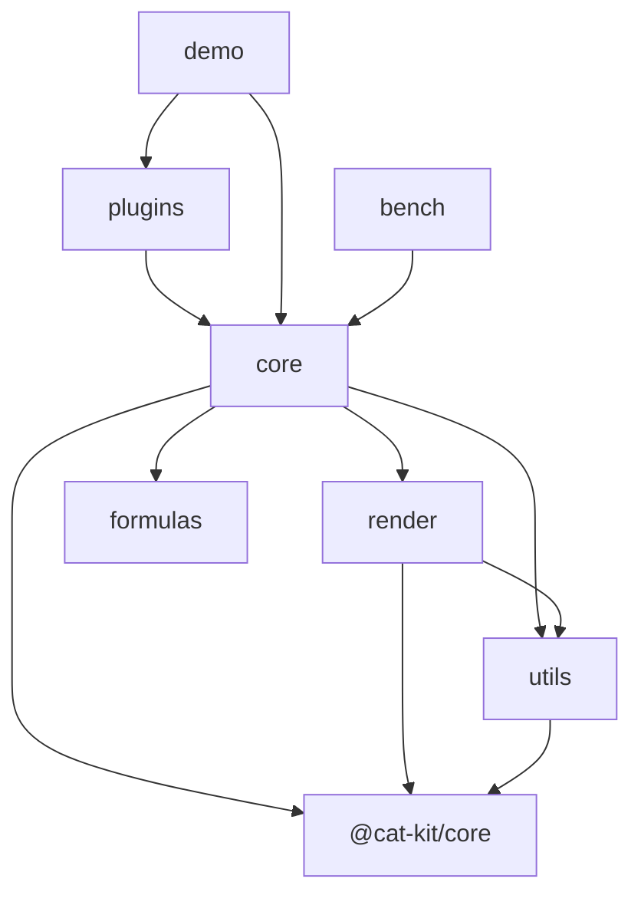

# 代码地图

## 树

> `packages/render`、`packages/core`、`packages/utils` 骨架已建（P1 工程底座）；`packages/formulas`、`packages/plugins` 与 `apps/` 仍为规划目录；`vtable-core/` 为旧代码，仅作迁移参考，迁移完成后删除。

```text
infinite-table/
├── packages/            # monorepo 主体
│   ├── render/          # 自研表格渲染引擎（场景树/分层/多 region 失效/事件/池化，骨架已建）
│   ├── core/            # 表格主体（ListTable/状态机/事件/布局/主题，骨架已建）
│   ├── formulas/        # 规划：公式引擎（全新，无旧代码对应）
│   ├── plugins/         # 规划：插件（custom-cell-style、invert-highlight 等）
│   └── utils/           # 表格域专用工具（骨架已建）
├── apps/
│   ├── demo/            # 规划：开发演示与浏览器冒烟
│   └── bench/           # 规划：性能基准（TTFF/滚动 FPS/失效面积，docs/perf-redesign M0 要求）
├── vtable-core/         # 旧代码（从 @visactor/vtable 精简，69k 行），迁移参考，待删除
│   └── src/
│       ├── scenegraph/  # 场景图与渲染代理（vrender 耦合最深，重写时仅参考行为）
│       ├── state/       # 交互状态机（hover/select/resize/frozen/sort 等）
│       ├── event/       # 事件系统
│       ├── layout/      # 布局与 cell-range
│       ├── core/        # 表格基类与工具
│       ├── data/        # 数据源
│       ├── edit/        # 编辑器
│       ├── plugins/     # 插件机制
│       ├── themes/      # 主题
│       ├── components/  # tooltip/title/empty-tip
│       └── ts-types/    # 公共类型
└── docs/
    └── perf-redesign/   # 重构调研与设计文档（01-08）
```

## 模块

| 模块 | 路径 | 职责 | 主要入口 |
| --- | --- | --- | --- |
| render | `packages/render` | 自研 canvas 渲染引擎：场景树、四层 canvas、多 region 失效、事件、canvas 池 | `src/index.ts` |
| core | `packages/core` | 表格主体：ListTable、ScrollManager 唯一滚动状态源、状态机、布局、主题 | `src/index.ts` |
| formulas（规划） | `packages/formulas` | 公式引擎：解析、依赖图、计算 | `src/index.ts` |
| plugins（规划） | `packages/plugins` | 插件机制与官方插件 | `src/index.ts` |
| utils | `packages/utils` | 表格域专用工具（通用工具优先 @cat-kit/core） | `src/index.ts` |
| vtable-core（旧） | `vtable-core` | 旧代码迁移参考，只读 | `src/index.ts` |

## 依赖



> 规划依赖方向：render 与 core 之间只经窄接口（RenderHost）耦合；formulas 不依赖 render。

## 关键路径

无（仅有包骨架，渲染主循环尚未实现）。规划中的渲染主循环：ScrollManager 滚动/交互 → 三档失效登记（cell/row-band/full）→ render 各层按策略消费脏区（blit/增量补画/整层重绘）→ 单帧收敛合成上屏。
