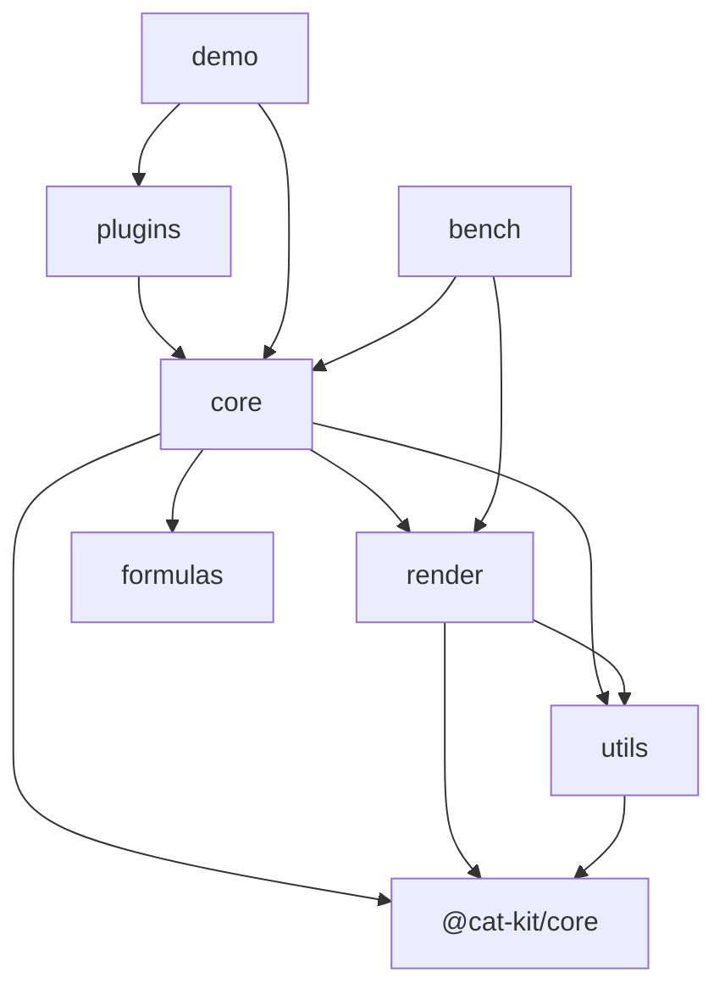

# 代码地图

## 树

> `packages/render` 已实现（P2 渲染引擎）；`packages/core` 已实现表格骨架（P3：ListTable/ScrollManager/虚拟滚动窗口/行列头/数据供给三形态）、交互（P5：选区/hover/行列 resize/键盘导航/触控惯性滚动/批量更新/contextmenu/onScrollFrame）、扩展点（P6：主题系统/编辑器注册表/插件注册路径）与图片能力（P7：L2 media 层格内图片、ImageService 窗口化加载、cell 级位图 LRU、无闪协议、FloatObjectLayer 浮动对象层）；`packages/utils` 骨架已建（P1 工程底座）；`apps/bench` 已实现（P9 量化基准：TTFF/滚动 FPS/失效面积）；`apps/demo` 已实现（P8 浏览器演示与冒烟）；`packages/formulas`、`packages/plugins` 仍为规划目录；`vtable-core/` 为旧代码，仅作迁移参考，迁移完成后删除。

```text
infinite-table/
├── packages/            # monorepo 主体
│   ├── render/          # 自研表格渲染引擎（场景树/四层 canvas/三档失效/事件/池化，RenderHost 窄接口）
│   ├── core/            # 表格主体（ListTable/状态机/事件/布局/主题，骨架已建）
│   ├── formulas/        # 规划：公式引擎（全新，无旧代码对应）
│   ├── plugins/         # 规划：插件（custom-cell-style、invert-highlight 等）
│   └── utils/           # 表格域专用工具（骨架已建）
├── apps/
│   ├── demo/            # 开发演示与浏览器冒烟（数据三形态/显示/交互/图片与浮动对象四演示区）
│   └── bench/           # 量化基准（TTFF/滚动 FPS/失效面积，docs/perf-redesign 口径，headless + 浏览器双入口）
├── vtable-core/         # 旧代码（从 @visactor/vtable 精简，69k 行），迁移参考，待删除
│   └── src/
│       ├── scenegraph/  # 场景图与渲染代理（vrender 耦合最深，重写时仅参考行为）
│       ├── state/       # 交互状态机（hover/select/resize/frozen/sort 等）
│       ├── event/       # 事件系统
│       ├── layout/      # 布局与 cell-range
│       ├── core/        # 表格基类与工具
│       ├── data/        # 数据源
│       ├── edit/        # 编辑器
│       ├── plugins/     # 插件机制
│       ├── themes/      # 主题
│       ├── components/  # tooltip/title/empty-tip
│       └── ts-types/    # 公共类型
└── docs/
    └── perf-redesign/   # 重构调研与设计文档（01-08）
```

## 模块

| 模块 | 路径 | 职责 | 主要入口 |
| --- | --- | --- | --- |
| render | `packages/render` | 自研 canvas 渲染引擎：场景树、四层 canvas、多 region 失效、事件、canvas 池 | `src/index.ts` |
| core | `packages/core` | 表格主体：ListTable、ScrollManager 唯一滚动状态源、状态机、布局、主题（默认主题 + extends 派生）、编辑器注册表/插件注册路径（预留）、图片（ImageService 窗口化加载 + MediaCache 位图 LRU + media 层无闪协议）与 FloatObjectLayer 浮动对象层 | `src/index.ts` |
| formulas（规划） | `packages/formulas` | 公式引擎：解析、依赖图、计算 | `src/index.ts` |
| plugins（规划） | `packages/plugins` | 插件机制与官方插件 | `src/index.ts` |
| utils | `packages/utils` | 表格域专用工具（通用工具优先 @cat-kit/core） | `src/index.ts` |
| bench | `apps/bench` | 量化基准（07 §1.1-1.2 口径）：TTFF/滚动 FPS/失效面积场景，headless（bun，假画布 + 手动帧泵）与浏览器（真实 canvas + rAF）共用同一份场景逻辑，JSON 报告落档 `results/` 作防回归基线 | `src/headless.ts`、`src/main.ts` |
| demo | `apps/demo` | 浏览器演示与冒烟：数据供给三形态、显示（10 万行虚拟滚动/行列头/冻结/合并/逐边边框/自定义渲染/checkbox/主题 extends）、交互（拖选/整行整列/hover/resize/键盘/触控/批量更新/contextmenu/onScrollFrame）、图片与浮动对象四演示区；`?smoke=1` 页内逐项断言写 `window.__SMOKE__`，`scripts/smoke.mjs` 构建 + preview + playwright-cli 驱动出退出码 | `src/main.ts`、`scripts/smoke.mjs` |
| vtable-core（旧） | `vtable-core` | 旧代码迁移参考，只读 | `src/index.ts` |

## 依赖



> 规划依赖方向：render 与 core 之间只经窄接口（RenderHost）耦合；formulas 不依赖 render。

## 关键路径

render 侧主循环已实现：`submitInvalidation` 三档失效登记（cell/row-band/full，按层合并）→ FrameScheduler 单帧收敛 → 各层按策略消费脏区（ground 仅 band/full、body/media 逐 region 增量补画、sky 整层重绘；`translateBy` 走 blit 自拷贝 + 暴露带补画）→ 四层 canvas 由浏览器合成上屏。core 侧滚动链路已实现（P3）：ScrollManager 唯一滚动状态源 → ListTable 重建可视窗口场景（窗口外行列不进场景树）→ body 层 band 失效登记接入上述 render 主循环；core 侧交互已实现（P5）：选区状态机（拖选/整行整列/shift 扩展/回驱防递归）与 hover、resize 指示线绘制在 sky 浮层（不触发 body 重绘），键盘导航滚动跟随、触控惯性滚动（InertiaScroller）、batchUpdate 合并为单次 band 失效、contextmenu 事件与 onScrollFrame 帧级同步。core 侧图片链路已实现（P7）：`resolveCellImage` 命中的格在 L2 media 层建 ImageCellNode（body 格只画背景/边框）→ 未就绪经 ImageService 窗口化请求（视口+240px 余量，滚出取消、划入提权），placeholderDelay 内不画占位 → 加载完成位图写回节点 + cell 级 MediaCache，逐格 cell 定向失效（同帧多图由失效队列收敛合并）→ 滚动重建时 LRU/ImageService 命中即首帧直接画位图（无闪）；FloatObjectLayer 浮动对象挂 sky 层最顶，锚点经 resolveCellX/resolveCellYFromOffsets 换算，滚动帧 syncPositions 帧级跟随，变更经 onChange 事件抛出由宿主入库。
