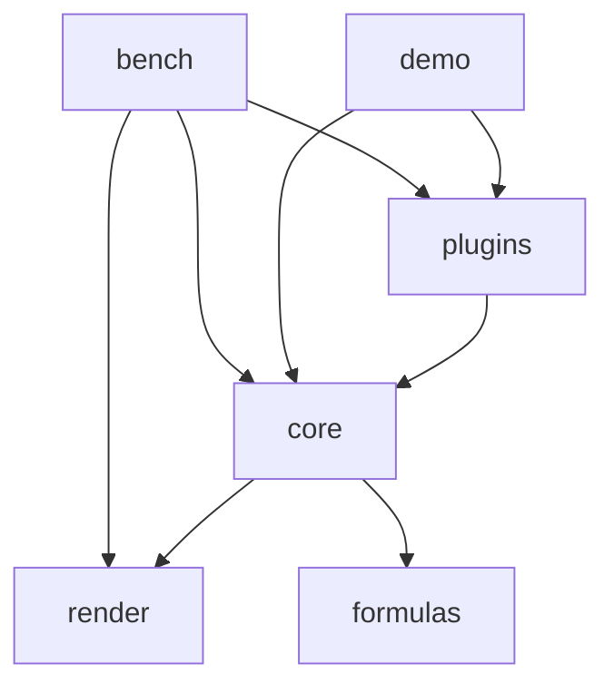

# 代码地图

## 树

> `packages/render` 已实现（P2 渲染引擎）；`packages/core` 已实现表格骨架（P3：ListTable/ScrollManager/虚拟滚动窗口/行列头/数据供给三形态）、交互（P5：选区/hover/行列 resize/键盘导航/触控惯性滚动/批量更新/contextmenu/onScrollFrame）、扩展点（P6：主题系统/编辑器注册表/插件注册路径）与图片能力（P7：L2 media 层格内图片、ImageService 窗口化加载、cell 级位图 LRU、无闪协议、FloatObjectLayer 浮动对象层）；`packages/utils` 骨架已建（P1 工程底座）；`packages/plugins` 骨架已建（S2：包形态 + 插件契约转出，首批 sheet 插件见 S3）；`apps/bench` 已实现（P9 量化基准：TTFF/滚动 FPS/失效面积）；`apps/demo` 已实现（P8 浏览器演示与冒烟）；`packages/formulas` 仍为规划目录。包 exports 三条件（types/dev/import→dist，仓内 apps 走 dev 源码条件）与 happy-dom 挂载安全单测已落地（S5）。

```text
infinite-table/
├── packages/            # monorepo 主体
│   ├── render/          # 自研表格渲染引擎（场景树/四层 canvas/三档失效/事件/池化，RenderHost 窄接口）
│   ├── core/            # 表格主体（ListTable/状态机/事件/布局/主题，骨架已建）
│   ├── formulas/        # 规划：公式引擎（全新，无旧代码对应）
│   ├── plugins/         # 官方插件承载（插件契约转出 + sheet 插件已实现：SheetStore/填充生成/选区同步/公式显示/键位预设/多 sheet 实例池/撤销栈；接口面红线见 docs/plugin-interface-map.md）
│   └── utils/           # 表格域专用工具（骨架已建）
└── apps/
    ├── demo/            # 开发演示与浏览器冒烟（数据三形态/显示/交互/图片与浮动对象/编辑/sheet 六演示区）
    └── bench/           # 量化基准（TTFF/滚动 FPS/失效面积，口径出自已删除的 perf-redesign 文档，headless + 浏览器双入口）
```

## 模块

| 模块 | 路径 | 职责 | 主要入口 |
| --- | --- | --- | --- |
| render | `packages/render` | 自研 canvas 渲染引擎：场景树、四层 canvas、多 region 失效、事件、canvas 池 | `src/index.ts` |
| core | `packages/core` | 表格主体：ListTable、ScrollManager 唯一滚动状态源、状态机、布局、主题（默认主题 + extends 派生）、编辑（编辑器注册表 + EditManager 编辑生命周期：可编三级判定/提交回写/取消 + DOM 浮层文本编辑器 + 编辑中滚动跟随与滚出视口自动提交 + SheetModel 内置 sheet 式内存坐标模型；插件注册路径仍预留）、图片（ImageService 窗口化加载 + MediaCache 位图 LRU + media 层无闪协议）与 FloatObjectLayer 浮动对象层 | `src/index.ts` |
| formulas（规划） | `packages/formulas` | 公式引擎：解析、依赖图、计算 | `src/index.ts` |
| plugins | `packages/plugins` | 官方插件承载：插件契约（TablePlugin）具名转出 + sheet 插件（SheetStore 参考坐标模型含 asModel 模型适配、generateFill 填充生成与 bindFillGeneration 接线、bindSelectionSync 选区双向同步、createFormulaDisplay 公式显示、excelKeymapPreset 键位预设、SheetBook 多 sheet 实例池、UndoStack/bindCellChangeUndo 撤销栈），只依赖 core 公开入口（红线见 `docs/plugin-interface-map.md`） | `src/index.ts` |
| utils | `packages/utils` | 表格域专用工具（通用工具优先 @cat-kit/core） | `src/index.ts` |
| bench | `apps/bench` | 量化基准（口径出自 perf-redesign 07 §1.1-1.2，文档已删仅存 git 历史）：TTFF/滚动 FPS/失效面积场景 + sheet 场景（S5：切 sheet 全量重建/逐格写/大块粘贴 batchUpdate 收敛/冻结切换，阈值防回归），headless（bun，假画布 + 手动帧泵）与浏览器（真实 canvas + rAF）共用同一份场景逻辑，JSON 报告落档 `results/` 作防回归基线 | `src/headless.ts`、`src/main.ts` |
| demo | `apps/demo` | 浏览器演示与冒烟：数据供给三形态、显示（10 万行虚拟滚动/行列头/冻结/合并/逐边边框/自定义渲染/checkbox/主题 extends）、交互（拖选/整行整列/hover/resize/键盘/触控/批量更新/contextmenu/onScrollFrame）、图片与浮动对象、单元格编辑（SheetModel/双击/键盘/API/滚动跟随对照）、sheet 电子表格（对标 ultra-ui playground 组件形态：图标工具栏+弹层族/公式栏+函数建议+引用拾取/底部 tabs+重命名删除/三套右键菜单+冻结/查找替换弹层/CSV/插入浮动图片/数据结构观察区/顶部 toast/`window.__SHEET_DEMO__` 调试句柄）六演示区；`?smoke=1` 页内逐项断言写 `window.__SMOKE__`，`scripts/smoke.mjs` 构建 + preview + playwright-cli 驱动出退出码 | `src/main.ts`、`scripts/smoke.mjs` |

## 依赖



> 规划依赖方向：render 与 core 之间只经窄接口（RenderHost）耦合；formulas 不依赖 render。@cat-kit/core 为通用工具建议源（见 DEV-STANDARDS），当前全仓零 import、零声明，上图不画；render 对 utils 零依赖、core 已删未消费的 utils 声明（round-1 §6.5）。

## 关键路径

render 侧主循环已实现：`submitInvalidation` 三档失效登记（cell/row-band/full，按层合并）→ FrameScheduler 单帧收敛 → 各层按策略消费脏区（ground 仅 band/full、body/media 逐 region 增量补画、sky 整层重绘）→ 分层 canvas 由浏览器合成上屏（ground 层 core 从未创建、media 惰性创建，实际 2~3 个 canvas；`translateBy` blit 自拷贝 + 暴露带补画已在 CanvasLayer 实现但 core 无调用方，为预留能力）。core 侧滚动链路已实现（P3，round-1 §6.2 增量化）：ScrollManager 唯一滚动状态源 → ListTable 维护可视窗口场景（构造/几何变更全量重建；滚动帧增量更新：滚出行列摘除、滚入行列补建、存活节点原地平移，窗口外行列不进场景树）→ body 层 band 失效登记接入上述 render 主循环；core 侧交互已实现（P5）：选区状态机（拖选/整行整列/shift 扩展/回驱防递归）与 hover、resize 指示线绘制在 sky 浮层（不触发 body 重绘），键盘导航滚动跟随、触控惯性滚动（InertiaScroller）、batchUpdate 合并为单次 band 失效、contextmenu 事件与 onScrollFrame 帧级同步；合并格命中路由主格（cellAt 经 masterOf，点按即整块选中、编辑浮层跨满合并包围盒）、填充柄拖拽轴锁定目标（副轴夹回锚定段跨度，角点裸命中与横向漂移不产生侧向填充）+ 扩展区虚线预览 + 边缘驻留帧级自动滚动、拖拽结束抛锚定段与目标范围（填充生成在 plugins 侧，写后选区扩展到源区∪新区）。core 侧图片链路已实现（P7）：`resolveCellImage` 命中的格在 L2 media 层建 ImageCellNode（body 格只画背景/边框）→ 未就绪经 ImageService 窗口化请求（视口+240px 余量，滚出取消、划入提权），placeholderDelay 内不画占位 → 加载完成位图写回节点 + cell 级 MediaCache，逐格 cell 定向失效（同帧多图由失效队列收敛合并）→ 滚动重建时 LRU/ImageService 命中即首帧直接画位图（无闪）；FloatObjectLayer 浮动对象挂 sky 层最顶，锚点经 resolveCellX/resolveCellYFromOffsets 换算，滚动帧 syncPositions 帧级跟随，变更经 onChange 事件抛出由宿主入库。core 侧编辑链路已实现（editing P2）：双击（指针事件流判定，鼠标/触控统一）或 `startEdit` 触发 → EditManager 可编三级判定（editor 声明/路由 ∧ 格级 editable ∧ 有回写目标）→ 文本编辑浮层挂表格容器、按锚定格视口矩形定位（初值取 resolveValue 基础值），编辑中订阅 onScrollFrame 逐帧对齐锚定格、滚出视口按 Enter 语义自动提交 → Enter/Tab 提交（records 改行对象 field / model 经 ModelBinding.writeBack）并移动选区、Esc 取消不回写 → 提交后本格 cell 级失效并抛 `onCellChange`（oldValue/newValue）。
