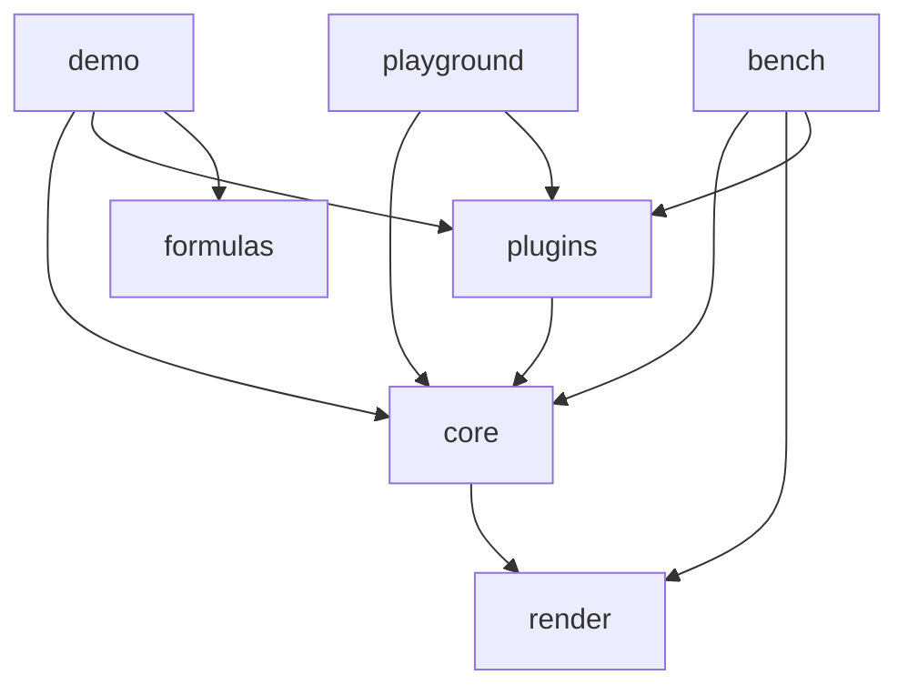

# 代码地图

## 树

> `packages/render` 已实现（P2 渲染引擎）；`packages/core` 已实现表格骨架（P3：ListTable/ScrollManager/虚拟滚动窗口/行列头/数据供给三形态）、交互（P5：选区/hover/行列 resize/键盘导航/触控惯性滚动/批量更新/contextmenu/onScrollFrame）、扩展点（P6：主题系统/编辑器注册表/插件注册路径）、图片能力（P7：L2 media 层格内图片、ImageService 窗口化加载、cell 级位图 LRU、无闪协议、FloatObjectLayer 浮动对象层）与图表格位图路由（chart-support P2：插件离屏出图经 cell 级 MediaCache blit，无闪同图片）；`packages/utils` 骨架已建（P1 工程底座）；`packages/plugins` 骨架已建（S2：包形态 + 插件契约转出，首批 sheet 插件见 S3）；`apps/bench` 已实现（P9 量化基准：TTFF/滚动 FPS/失效面积）；`apps/demo` 已实现（P8 浏览器演示与冒烟）；`packages/formulas` 已实现公式引擎（tokenizer/Pratt parser/evaluator + 49 个内置函数与元数据注册表 + 依赖图 DependencyGraph 与容错引用扫描器 scan-refs；边界：无数组公式，循环检测护栏由宿主负责）。包 exports 三条件（types/dev/import→dist，仓内 apps 走 dev 源码条件）与 happy-dom 挂载安全单测已落地（S5）。

```text
infinite-table/
├── packages/            # monorepo 主体
│   ├── render/          # 自研表格渲染引擎（场景树/四层 canvas/三档失效/事件/池化，RenderHost 窄接口）
│   ├── core/            # 表格主体（ListTable/状态机/事件/布局/主题，骨架已建）
│   ├── formulas/        # 公式引擎 v1（地址/错误码/tokenizer/Pratt parser/evaluator + 49 内置函数注册表，数值经 @cat-kit/core $n 精确运算）
│   ├── plugins/         # 官方插件承载（插件契约转出 + sheet 插件已实现：SheetStore/填充生成/选区同步/公式显示/键位预设/多 sheet 实例池/撤销栈/xlsx 导出；chart 插件已实现：声明解析/Chart.js 按需加载/插件工厂/离屏出图与 L2 media 位图管线接线；接口面红线见 docs/plugin-interface-map.md）
│   └── utils/           # 表格域专用工具（骨架已建）
└── apps/
    ├── demo/            # 开发演示与浏览器冒烟（数据三形态/显示/交互/图片与浮动对象/单元格图表/编辑/sheet/报表只读快照 八演示区）
    ├── bench/           # 量化基准（TTFF/滚动 FPS/失效面积 + sheet 场景（含大批量初始化写 + 大样式池），口径出自已删除的 perf-redesign 文档，headless + 浏览器双入口）
    └── playground/      # ultra-ui sheet 引擎替换演练场（USheet 源码直连 + veltra-grid 适配层换 VTable 为本仓引擎，file: 链 ../ultra-ui）
```

## 模块

| 模块 | 路径 | 职责 | 主要入口 |
| --- | --- | --- | --- |
| render | `packages/render` | 自研 canvas 渲染引擎：场景树、四层 canvas、多 region 失效、事件、canvas 池、DPR 缺省取运行环境值 + 运行期跟随（window resize + matchMedia resolution 双通道探测，变化后重设全部已建层并整层重绘） | `src/index.ts` |
| core | `packages/core` | 表格主体：ListTable、ScrollManager 唯一滚动状态源、状态机、布局、主题（默认主题 + extends 派生）、交互（选区/hover/行列 resize/键盘导航/触控惯性滚动/批量更新/contextmenu/onScrollFrame/非主键按下不改选区/editPickMode 编辑拾取模式）、扩展点（主题系统/编辑器注册表/插件注册路径）与图片能力（L2 media 层格内图片、ImageService 窗口化加载、cell 级位图 LRU、无闪协议、FloatObjectLayer 浮动对象层：节点不可拾取事件穿透 + body 视口裁剪 + 指针路由命中优先的点选/拖拽交互——选中环 2px #2170E7（ultra-ui 口径）、拖拽跟随、抬起按对象左上角反查落点格换算新锚点经 onDragEnd 抛宿主写回、isReadonly 可选中不拖拽）与图表格路由（chart-support P2：插件注入 chartMediaResolver，离屏出图位图经 cell 级 MediaCache LRU blit 上屏，滚动滚回命中直贴无闪、内容/尺寸/DPR 换 key 失效重建）；视口原地 resize（构造后 `resize()` 调整视口尺寸：宿主画布重设 + 几何变更路径收敛，滚动/选区保留、实例不重建）；编辑（编辑器注册表 + EditManager 编辑生命周期：可编三级判定/提交回写/取消 + DOM 浮层文本编辑器 + 编辑中滚动跟随与滚出视口自动提交 + 编辑会话锚定格内容隐藏 + SheetModel 内置 sheet 式内存坐标模型；插件注册路径仍预留）；Excel 式溢出（缺省未设 textOverflow 时按对齐方向溢出：left 右溢/right 左溢/center 双向；走廊 = 文本实际跨越的列边界——按内容盒与对齐锚点求文本左右缘（测量经节点缓存 `measureTextWidthWith` 复用）后向溢方向收边，遇首个非空格提前停，合并/图片/图表/自定义渲染/checkbox/wrap/空白串均算非空阻断，不越冻结列带边界；溢出源节点重挂树尾后画于同条带全部走廊节点，全量重建/滚动增量/refreshCell 三路径同规范序；refreshCell 邻居变空/变非空双向联动来源格走廊即时收敛）；溢出走廊覆盖范围内纵向线条跳画（WPS 口径，P3：走廊内部标记驱动 right 共享边跳画，走廊末端/走廊外照画，显式纵向边框同规则；sheet-ux-fixes-3 起走廊按文本缘收边，短文本不再把右侧空白区的竖线一并跳画） | `src/index.ts` |
| formulas | `packages/formulas` | 公式引擎：单元格/区域地址与表名解析、7 错误码、tokenizer、Pratt parser（3 字母列限消歧 Sheet2 vs 引用）、evaluate（FormulaResolver 宿主取值接口，四则走 @cat-kit/core $n）、49 个内置函数与元数据注册表（分类/描述/参数签名/易失性，支持自定义注册）、依赖图 DependencyGraph（公式格静态引用边：单格 O(1) 点查 + 区域按表线性扫；affectedBy 传递闭包标脏；易失/未知名表注册 volatile；removeSheet 整表清边）、ast-refs 静态遍历（引用收集/易失判定）、scan-refs 容错引用扫描（编辑中半截公式不抛错，染色框用）。边界：无数组公式，循环检测由宿主护栏 | `src/index.ts` |
| plugins | `packages/plugins` | 官方插件承载：插件契约（TablePlugin）具名转出 + sheet 插件（SheetStore 参考坐标模型含 asModel 模型适配、cell meta 命名空间（setCellMeta/getCellMeta/entriesCellMeta/clearCellMeta + 独立 meta-change 事件）与模型侧读取（getEffectiveStyle 基础/列级/格级逐字段合成、getDisplayValue 可注入显示链）、snapshot/restore 全量快照与灌回（九字段 cells/styles/merges/frozen/rowHeights/colWidths/images/meta/selection；值/样式/尺寸/meta 经 Store.rebuild 灌回单次汇总广播，images/selection 随快照携带由宿主接线 FloatObjectLayer/applyExternalSelection 应用）、generateFill 填充生成与 bindFillGeneration 接线（含 autoComplete 双击填充柄：resolveAutoFillTarget 按相邻列连续数据块末行向下填充）、bindSelectionSync 选区双向同步、createFormulaDisplay 公式显示、excelKeymapPreset 键位预设、SheetBook 多 sheet 实例池、UndoStack/bindCellChangeUndo 撤销栈、buildBorderPresetCells 边框预设展开、xlsx 导出引擎化（sheetToWriteSheet：Store + 合并/行列尺寸/浮动图列表 → hucre WriteSheet 纯映射，值/样式经 getDisplayValue/getEffectiveStyle 读取、numFmt 四类 → 格式码、浮动图锚定按当前行列尺寸换算 P7 口径 + decodeDataUrlImage data:URL 字节解码；产物纯数据可进 worker）），依赖 core 公开入口与 hucre（仅 xlsx 导出映射；红线见 `docs/plugin-interface-map.md`）；chart 插件骨架（`src/chart/`：parseChartDeclaration 单元格图表声明解析——柱/折/面积/饼四类，area 归一 line+fill、饼图取首数据集、非法声明显式容错不抛错；loadChartJs 动态 import 按需加载 Chart.js——独立分包，`scripts/assert-chart-chunk.mjs` 构建断言守主产物零 chart.js 代码；createChartPlugin 插件工厂——TablePlugin 契约经 core 注册路径挂载，resolveCellChart 读格声明 + getChartSpec 解析入口；chart-support P2 出图通路已落 L2 media：renderChartBitmap 离屏同步出图（responsive/animation 双关 + 显式 devicePixelRatio，scratch→产物双画布先 blit 后 destroy）、chartContentKey 声明内容 key、mount 注入 `table.chartMediaResolver`——位图经 core cell 级 MediaCache LRU 命中首帧直贴（滚动滚回无闪）、同 key 并发出图单飞、声明内容/尺寸/DPR 变更自然换 key 失效重建） | `src/index.ts` |
| utils | `packages/utils` | 表格域专用工具（通用工具优先 @cat-kit/core） | `src/index.ts` |
| bench | `apps/bench` | 量化基准（口径出自 perf-redesign 07 §1.1-1.2，文档已删仅存 git 历史）：TTFF/滚动 FPS/失效面积场景 + sheet 场景（S5：切 sheet 全量重建/逐格写/大块粘贴 batchUpdate 收敛/冻结切换；P9：大批量初始化写 + 大样式池 1/5/10 万行 × 12 列 × 20 色池批量写吞吐与 band 收敛，口径对齐下游 sheet-big-data，阈值防回归；chart-support P5：图表格滚动 FPS 与失效面积收敛（稳态滚动收敛/快跳/滚回 cell 级缓存命中直贴/数据变更 cell 失效重绘，headless 经 Chart.js 最小绘制需求假画布跑真实出图通路）），headless（bun --conditions dev，假画布 + 手动帧泵）与浏览器（真实 canvas + rAF）共用同一份场景逻辑，JSON 报告落档 `results/` 作防回归基线 | `src/headless.ts`、`src/main.ts` |
| demo | `apps/demo` | 浏览器演示与冒烟：数据供给三形态、显示（10 万行虚拟滚动/行列头/冻结/合并/逐边边框/自定义渲染/checkbox/主题 extends）、交互（拖选/整行整列/hover/resize/键盘/触控/批量更新/contextmenu/onScrollFrame）、图片与浮动对象、单元格图表（`sections/chart.ts`：chart 插件经构造 plugins 启用，格内声明柱/折/面积/饼四类基线图表，Chart.js 离屏出图落 L2 media cell 级缓存，长列表滚动滚回无闪、内容换 key 失效重绘）、单元格编辑（SheetModel/双击/键盘/API/滚动跟随对照）、sheet 电子表格（对标 ultra-ui playground 组件形态：图标工具栏+弹层族/公式栏（formulas 注册表驱动的函数建议+分类面板+calltip+光标入括号）+公式组合会话（显式 'bar'/'engine' 会话：画布点选/拖选把引用插入编辑目标光标处、容器 keydown 路由键入、多参数 `,` 累计、被编辑格拾取全程保持选区态（core setSelectionAnchor 选区锚点；引擎会话另叠 EDITING_CELL_COLOR 绿框），core editPickMode 驱动）+引用染色框（编辑公式时 scanFormulaReferences 提取引用 → core setHighlightRanges 画循环色板边框，仅活跃表）/底部 tabs+重命名删除/三套右键菜单（正文含「设置数据格式」子菜单，右键落点在选区外先改选）+冻结/查找替换弹层/CSV/xlsx 导入导出（hucre；导出映射走 plugins sheetToWriteSheet 公开能力——含浮动图锚定导出，demo 侧装配浮动对象列表与 data:URL 字节；`sections/sheet/xlsx.ts` 装配层 + `xlsx.worker.ts` module worker 承担 readXlsx/writeXlsx 重 CPU 段与导入方向 hucre→纯数据映射（demo 自用内联 worker），主线程只留 Store/book/DOM；移植 ultra-ui 映射：整本导出/导入重建 SheetBook、尺寸高水位收敛 2000×256 硬顶）+numFmt 侧车显示通道（`format.ts` 四格式，book.ts 按 sheet 持稀疏 Map，仅影响显示）/插入浮动图片/数据结构观察区/顶部 toast/`window.__SHEET_DEMO__` 调试句柄；求值经 `sections/sheet/evaluator.ts` 依赖图脏标记增量失效（store value 事件 → notifyValueChange 更新图边 + affectedBy/易失集标脏）+ 按格缓存 + 循环护栏 #CYCLE!）、报表式只读快照渲染（`sections/report.ts`，meta 迁移参考形态：九字段快照 fixture → restore 全量灌入 SheetStore → readonly 渲染——resolveEditable/canResizeCol/Row 恒 false、不接填充/撤销写路径，行列头关闭，浮动图与选区经 restore wiring 接线 floatObjects/applyExternalSelection，`window.__REPORT_DEMO__` 调试句柄）八演示区；`?smoke=1` 页内逐项断言写 `window.__SMOKE__`，`scripts/smoke.mjs` 构建 + preview + playwright-cli 驱动出退出码 | `src/main.ts`、`scripts/smoke.mjs` |
| playground | `apps/playground` | ultra-ui sheet 引擎替换演练场（replace-vtable-roadmap 第 1 级灰度的落地形态）：ultra-ui 的 USheet（`@veltra/sheet` Vue 组件层，file: 链 `../ultra-ui` 仓 + veltra-dev 源码条件直连）+ Sheet 模型（`@veltra/sheet-core` core/）保持不动，vite alias 把 `@veltra/sheet-core/grid` 整模块替换为本仓 `src/veltra-grid/`（SheetGrid 门面：TableModel 直挂 ultra Sheet（基础值=公式原文口径/setCellValue 走模型命令栈/cell-change 转发）、样式投影（pt→px/边框五线型映射 + 铬观主题）、选区双向（读段取焦点段 + applyExternalSelection 防回环 + 合并包围盒 + 整行/整列回推 spansAll 扩满全轴使表头带进引擎选区高亮 + 活动格可视左缘（resolveSelectionActive 对齐，回推不拽视口）+ 越界段钳制对齐 ultra-ui + 不可见滚动跟随 + fx 引用拾取手势收敛）、编辑（引擎 EditManager ↔ onEditStart/End 公式栏镜像）、merge/frozen/content-reset/axis/meta/image-change 事件接线、wrap 行高动态重估（cell-change/wrap 样式与轴样式切换/列宽拖拽 → 去重行集合微任务一次冲刷，`wrap-height.ts` 估算，只升不降）、填充柄（plugins bindFillGeneration + 模型批量写）、customLayout 按格分发（ADR-0004：`cell-layout.ts` 把 Text/Rect 基础形态布局对象映射为引擎格渲染器，仅 body 格分发、undefined 回落默认渲染、不写模型不进快照）、undo/redo/Ctrl+A 键位、滚轮（shift 换轴）、ResizeObserver 直连引擎原地 resize（滚动/选区保留、不 teardown 重建实例，`window.__PG__` 另暴露 ListTable 实例标记/重建计数））；页面移植 ultra-ui playground sheet 基础页（跨表公式/自定义函数 DOUBLE/合并/填充序列/浮动图/自定义渲染锚点格），`window.__PG__` 调试句柄（含 customAnchors 锚点信息）；`scripts/pg-spec.mjs` playwright-core 交互回归（26 项：公式编辑/撤销重做/值编辑/拖选/合并包围盒/右键三分类/跨表联动/填充柄/fx 拾取/键盘导航/wrap 行高重估/容器 resize 自适应/Ctrl+A 全选表头带高亮/整列回推表头带高亮/整行回推不拽视口/自定义渲染锚点格/浮动图拖拽锚点写回/只读浮动图拖拽不生效/跨冻结合并区（合并生效/选中编辑命中主格/绘制无重复无缺失）/表头点击不跳转（视口不动/焦点落被点轴 × 可视数据带）/DPR 清晰度（CDP 变更 deviceScaleFactor：已建层物理尺寸跟随、滚动/选区/实例不变；未显式传 dpr 建表缺省取环境值）/Excel 式溢出（body 主题去强制 ellipsis：超宽左对齐文本右邻空格可见字形；右对齐向左溢、右侧干净）/反向拖选（向上/先下后上越锚/向左：引擎与模型同段、锚点=按下格、不塌缩不跳变）/编辑退出溢出渲染（五路径退出编辑 200ms 内源格与走廊像素恢复、互锁无悬挂、滚动往返无残影）/走廊竖线+填充柄光标（走廊按文本缘收边断言：走廊内无纵向线条、末端竖线在、横线照常；柄悬停/按下/拖拽 crosshair、移出恢复、无选区不出现）/零报错） | `src/main.ts`、`src/veltra-grid/index.ts` |

## 依赖



> 规划依赖方向：render 与 core 之间只经窄接口（RenderHost）耦合；formulas 不依赖 render，core 也不依赖 formulas（求值接线在 apps 宿主侧）。@cat-kit/core 为通用工具建议源（见 DEV-STANDARDS），当前仅 formulas 声明依赖（$n 精确数值运算），上图不画；hucre（xlsx 读写引擎，纯 ESM 零依赖）由 plugins（xlsx 导出映射）与 demo（导入导出装配）声明依赖，上图不画；chart.js（canvas 图表库，MIT，唯一传递依赖 @kurkle/color）由 plugins（chart 插件按需加载，动态 import 独立分包）声明依赖，上图不画；render 对 utils 零依赖、core 已删未消费的 utils 声明（round-1 §6.5）。playground 另经 file: 链接外部仓 `../ultra-ui` 的 @veltra/sheet、@veltra/sheet-core、@veltra/styles（veltra-dev 源码条件直连，bun 拷贝式快照），@veltra/* 传递依赖（@veltra/desktop 等）与 @cat-kit/core 由该仓 node_modules 解析，不进上图。

## 关键路径

render 侧主循环已实现：`submitInvalidation` 三档失效登记（cell/row-band/full，按层合并）→ FrameScheduler 单帧收敛 → 各层按策略消费脏区（ground 仅 band/full、body/media 逐 region 增量补画、sky 整层重绘）→ 分层 canvas 由浏览器合成上屏（ground 层 core 从未创建、media 惰性创建，实际 2~3 个 canvas；`translateBy` blit 自拷贝 + 暴露带补画已在 CanvasLayer 实现但 core 无调用方，为预留能力）。core 侧滚动链路已实现（P3，round-1 §6.2 增量化）：ScrollManager 唯一滚动状态源 → ListTable 维护可视窗口场景（构造/几何变更全量重建；滚动帧增量更新：滚出行列摘除、滚入行列补建、存活节点原地平移，窗口外行列不进场景树）→ body 层 band 失效登记接入上述 render 主循环；core 侧交互已实现（P5）：选区状态机（拖选/整行整列/shift 扩展/回驱防递归）与 hover、resize 指示线绘制在 sky 浮层（不触发 body 重绘），键盘导航滚动跟随、触控惯性滚动（InertiaScroller）、batchUpdate 合并为单次 band 失效、contextmenu 事件与 onScrollFrame 帧级同步；合并格命中路由主格（cellAt 经 masterOf，点按即整块选中、编辑浮层跨满合并包围盒）、填充柄拖拽轴锁定目标（副轴夹回锚定段跨度，角点裸命中与横向漂移不产生侧向填充）+ 扩展区虚线预览 + 边缘驻留帧级自动滚动、拖拽结束抛锚定段与目标范围（填充生成在 plugins 侧，写后选区扩展到源区∪新区）、双击柄抛 FillHandleDoubleClickEvent（连击窗口内第二次抬起且无扩展才抛，与拖拽结束互斥；双击自动填充在 plugins 侧 autoComplete）；宿主高亮区域 setHighlightRanges 画 sky 浮层四边细条框（公式引用染色框通道，随滚动同内容源重绘）；选区锚点 setSelectionAnchor 令编辑拾取会话中被编辑格持续保持选区绘制（选区样式同 token、合并格按整块包围盒，会话结束即清恢复常规选区）。core 侧图片链路已实现（P7）：`resolveCellImage` 命中的格在 L2 media 层建 ImageCellNode（body 格只画背景/边框）→ 未就绪经 ImageService 窗口化请求（视口+240px 余量，滚出取消、划入提权），placeholderDelay 内不画占位 → 加载完成位图写回节点 + cell 级 MediaCache，逐格 cell 定向失效（同帧多图由失效队列收敛合并）→ 滚动重建时 LRU/ImageService 命中即首帧直接画位图（无闪）；FloatObjectLayer 浮动对象挂 sky 层最顶，锚点经 resolveCellX/resolveCellYFromOffsets 换算，滚动帧 syncPositions 帧级跟随，变更经 onChange 事件抛出由宿主入库；浮动图交互（P4，对齐 ultra-ui image-layer）：指针路由命中优先（list-table-interaction 的 pointerdown 在选区/编辑提交前先经 floatLayer.getAt——命中即点选选中并开启拖拽会话、事件不落入单元格选区，未命中清除图片选中），选中态画 2px #2170E7 外扩环（对齐 VTable selectionStyle.cellBorderColor），拖拽超 3px 阈值后对象随指针平移，抬起以对象左上角视觉位置反查落点格（FloatGeometry.cellAtPoint 注入，与选区命中同口径）换算新锚点（from 平移 + 落点余量 clamp 0、to 同 delta 保跨度）经 onDragEnd 抛宿主写回模型，落点在行列头带/空白或原地放下回弹原锚点布局，isReadonly 可选中查看不启用拖拽。core 侧编辑链路已实现（editing P2）：双击（指针事件流判定，鼠标/触控统一）或 `startEdit` 触发 → EditManager 可编三级判定（editor 声明/路由 ∧ 格级 editable ∧ 有回写目标）→ 文本编辑浮层挂表格容器、按锚定格视口矩形定位（初值取 resolveValue 基础值），编辑中订阅 onScrollFrame 逐帧对齐锚定格、滚出视口按 Enter 语义自动提交 → Enter/Tab 提交（records 改行对象 field / model 经 ModelBinding.writeBack）并移动选区、Esc 取消不回写 → 提交后本格 cell 级失效并抛 `onCellChange`（oldValue/newValue）。本轮体验收口（直写）：`SceneEvent` 透传 `button`、onPointerDown 非主键直接 return（右键按下不再塌缩选区，宿主在 contextmenu 里对选区外落点自行改选）；`ListTable.editPickMode` 编辑拾取模式（编辑中点选/拖选其它格不提交会话、选区照常流动、双击进编辑与填充柄让位，宿主经 onSelectionChange 消费拾取段）；FloatObjectNode `pickable: false`（指针事件穿透浮动图片）+ FloatObjectLayerInit.bodyViewport 绘制裁剪（滚动跟随平移进表头带/行号列的部分不画）；编辑会话 emitStart/emitEnd 接线 `setCellContentHidden`（锚定格内容隐藏含溢出走廊，appendCell 装配时按当前会话重放）。S9-P1 DPR 清晰度：render-host 构造缺省 dpr 取运行环境 `window.devicePixelRatio`（无 window 回落 1），window resize + matchMedia resolution 双通道探测 DPR 变更后以新 dpr 重设全部已建层物理尺寸并整层重绘（滚动/选区/实例不动），`resize` 显式传参同步内部 dpr；core 构造与 `resize()` → `host.resize` 链路透传宿主环境 dpr。S9-P5 Excel 式溢出（设计依据 `docs/overflow-rendering-research.md` §7）：走廊计算双向化——`textOverflowLimits` 按对齐方向出层坐标 `[minX, maxX]` 走廊（left 右溢/right 左溢/center 双向，center 两壁皆阻断才不溢），`renderTextCell`/`CellNode` 以 `textMinX` 扩双向 clip、对齐锚点恒在源格；z 序不变量——全量重建 `remountOverflowSources` 与增量窗口 `canonicalizeRowOverflowOrder` 把溢出源按行内列升序重挂树尾（左溢源不再被走廊格反盖出「表格线压字」伪影），`refreshCell` 节点获得溢出即重挂；溢出联动双向化——`overflowSourceColRight` 补右侧来源反查，邻居变空/变非空时两侧来源格走廊即时收敛，失效区并入双向走廊。走廊竖线跳画（sheet-ux-fixes-2 P3，WPS/Luckysheet 口径，推翻 S9-P5「覆盖式」取舍；sheet-ux-fixes-3 收紧走廊端点）：`corridorCols` 为 `textOverflowLimits` 的列号扫描主体——走廊按「文本缘」（内容盒 `cellContentBox` + 对齐锚点 `cellTextAnchorX` 与 `renderTextCell` 同源，测量经节点缓存 `measureTextWidthWith` 复用）向溢方向逐列收边，列边界须落在文本缘内才纳入，超宽文本仍扫至阻断格（Luckysheet 剩余需宽 / Univer 累计列宽至文本宽同口径），阻断判定口径不变，场景侧 `markRowCorridorInterior` 先清后标行内走廊内部标记（`CellNode.corridorInterior` = 覆盖本格走廊的最大右端列号；两源对溢共享空段时同格多走廊覆盖取最大者），全量重建（`remountOverflowSources` 末尾逐行）/滚动增量（`canonicalizeRowOverflowOrder` 行内）/`refreshCell`（本格或联动来源走廊伸缩即整行重标，标记不随 contentHidden 变化）三路径同口径；CellNode right 共享边仅当边两侧格同处同一走廊内部才绘制（溢出源格朝走廊侧竖边一并跳画，替代旧「right 边先于内容绘制」覆盖式分支），走廊末端与走廊外照画，上下横边/背景/内容不受影响，用户显式纵向边框同规则；窗外源格无节点不渲染文本，其走廊段照常画线。
