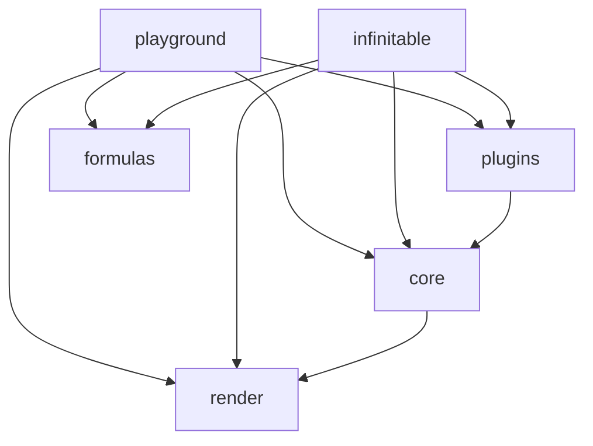

# 代码地图

只做定位：找模块、找路径、找依赖方向。行为口径与实现细节看代码、测试与 `docs/`，不写进本文件。

## 树

```text
infinitable/
├── packages/            # monorepo 主体
│   ├── render/          # 自研 canvas 渲染引擎（场景树/四层 canvas/三档失效/事件/池化）
│   ├── core/            # 表格主体（ListTable/滚动/交互/编辑/溢出/图片与浮动对象）
│   ├── formulas/        # 公式引擎（tokenizer/Pratt parser/求值/49 内置函数/依赖图）
│   ├── plugins/         # 官方插件（TablePlugin 契约 + sheet 插件族 + chart/print/watermark 插件）
│   └── infinitable/     # 统一发布包（npm 单包 infinitable，re-export 四层）
└── playground/          # 唯一应用：示例总览 + 页内 vs VTable 对比 + 量化基准 + 冒烟自检
```

## 模块

| 模块 | 路径 | 职责 | 主要入口 |
| --- | --- | --- | --- |
| render | `packages/render` | 自研 canvas 渲染引擎：场景树、四层 canvas、多 region 失效、federated 事件、canvas 池化 | `src/index.ts` |
| core | `packages/core` | 表格主体：ListTable、滚动（ScrollManager 唯一滚动源）、布局、主题、交互、编辑、Excel 式溢出、图片/图表/浮动对象、插件注册路径 | `src/index.ts` |
| formulas | `packages/formulas` | 公式引擎：地址与错误码、tokenizer、Pratt parser、evaluate、49 内置函数注册表、依赖图与容错引用扫描 | `src/index.ts` |
| plugins | `packages/plugins` | 官方插件承载：TablePlugin 契约具名转出 + sheet 插件族 + chart/print/watermark 插件 | `src/index.ts` |
| infinitable | `packages/infinitable` | 唯一 npm 发布包：入口 re-export 四层，vp build 整体打成自包含 dist（chart 保持动态分包、@cat-kit/core 外部化），`scripts/build-types.mjs` 装配类型树并改写跨包说明符；发版走 `scripts/release/publish.mjs` + `.github/workflows/release.yml`（tag v* 触发 OIDC trusted publishing） | `src/index.ts` |
| playground | `playground` | 唯一应用（Vue 3 + vite MPA：index 示例 + bench.html 基准）：示例总览、vs VTable 页内对比、量化基准、冒烟自检 | `src/main.ts`、`bench.html`、`src/views/CompareView.vue`、`src/bench/headless.test.ts` |

## 模块内检索

定位到目录级。模块内部加删文件不算地图变更，文件清单以盘上为准。

### core — `packages/core/src`

- 主体与装配：`list-table*.ts`
- 滚动：`scroll-manager.ts`、`touch-scroll.ts`；画布内建滚动条（浮层绘制 + 指针命中/拖拽会话）`scrollbar.ts`
- 交互：`list-table-interaction.ts`、`selection.ts`、`keyboard-navigation.ts`、`resize.ts`、`fill-handle.ts`；sky 浮层 `interaction-overlay.ts`
- 编辑：`editing/`、`editor-registry.ts`、`sheet-model.ts`、`model-binding.ts`
- 溢出与绘制：`grid-layout.ts`、`cell-node.ts`、`cell-renderer.ts`、`shared-edges.ts`（设计依据 `docs/overflow-rendering-research.md`）
- 图片/图表/浮动对象：`list-table-media.ts`、`media/`、`float/float-object-layer.ts`（含浮动图缩放/旋转变换会话）
- 主题与扩展点：`theme.ts`、`plugin.ts`；插件可写引擎预留位（chartMediaResolver、underlay/overlay painter）在 `list-table.ts`

### render — `packages/render/src`

`scene/` 场景树、`layers/` 分层 canvas、`invalidation/` 失效登记、`events/` federated 事件、`pool/` canvas 池、`frame-scheduler.ts` 帧调度、`render-host.ts` RenderHost 窄接口

### formulas — `packages/formulas/src`

`address.ts`、`errors.ts`、`tokenizer.ts`、`parser.ts`、`evaluator.ts`；内置函数注册表 `functions/`；依赖图 `dependency-graph.ts`；静态引用 `ast-refs.ts`；编辑中容错扫描 `scan-refs.ts`。边界：无数组公式，循环检测由宿主护栏

### plugins — `packages/plugins/src`

- sheet 插件族 `sheet/`：SheetStore 参考模型、快照、填充生成、选区同步、公式显示、键位预设、多 sheet 实例池、撤销栈、边框预设、xlsx 导出（映射 hucre，产物纯数据可进 worker）
- chart 插件 `chart/`：声明解析、Chart.js 按需加载、插件工厂、离屏出图；`scripts/assert-chart-chunk.mjs` 构建断言守 chart.js 不进主产物
- print 插件 `print/`：headless 分页引擎（fitpage/fixrows 双模式）+ 页面 HTML 构建（页眉页脚占位符）+ iframe 打印输出与 DOM 预览薄壳；数据经 PrintSource 抽象供数
- watermark 插件 `watermark/`：文字平铺水印，挂 core 顶层 overlay 绘制预留位（锚定视口）
- 接口面红线：`docs/plugin-interface-map.md`

### playground — `playground`

- 示例：`src/sections/**` 十演示区（新增 print、watermark）；`?smoke=1` 页内自检写 `window.__SMOKE__`
- vs 对比：`src/views/CompareView.vue` + `src/bench/vs/`（@visactor/vtable 仅进本页动态分包；`?vsrun=1` 报告模式）
- 基准：`src/bench/headless.test.ts` 并入 `vp test run`（headless 回归，无独立命令）+ `bench.html` 浏览器入口，10 场景 JSON 落档 `results/`
- 脚本（npm script 收敛，按需直跑）：`scripts/smoke.mjs`（构建 + preview + 冒烟断言）、`scripts/vs.mjs`（体积实测 + 对比落档）

## 依赖


```mermaid
graph TD
    core --> render
    plugins --> core
    infinitable --> render
    infinitable --> core
    infinitable --> formulas
    infinitable --> plugins
    playground --> core
    playground --> render
    playground --> plugins
    playground --> formulas
```

- render 与 core 只经 RenderHost 窄接口耦合；formulas 与 core 互不依赖，求值接线在 playground 宿主侧
- infinitable 为发布层：devDependencies 挂四内部包（workspace:*，仅构建期），产物自包含不再依赖 @infinitable/*；playground 仍直接吃各内部包源码
- 不入图的外部依赖：@cat-kit/core（formulas，$n）、hucre（plugins xlsx 导出 + playground 装配）、chart.js（plugins 动态分包）、@visactor/vtable 与 vue（仅 playground，不进任何 packages）
- 包 exports 三条件 types/dev/import → dist；仓内 playground 走 dev 条件直接吃源码

## 关键路径

跨模块链路一链一行；模块内部主流程看代码入口。

- render 主循环：三档失效（cell/row-band/full）→ FrameScheduler 单帧收敛 → 各层按策略消费脏区 → 合成上屏；core 的滚动/交互/图片/批量更新都汇入这条失效语言
- core 滚动窗口：ScrollManager 唯一滚动源 → ListTable 增量维护可视窗口场景 → band 失效进 render 主循环
- chart 出图：plugins 离屏出图 → 注入 core `chartMediaResolver` → cell 级 MediaCache blit 上屏，与格内图片同一管线
- 水印上屏：plugins 平铺 painter → 注入 core `setOverlayPainter`（ground 层 `setUnderlayPainter` 同构）→ 对应层整层失效，锚定视口不随滚动平移
- formulas 求值：宿主（playground 装配）经 FormulaResolver 驱动求值；依赖图标脏由宿主消费
- sheet 装配：playground 把 plugins（SheetStore/键位/撤销/导出）、core、formulas 接成电子表格示例
